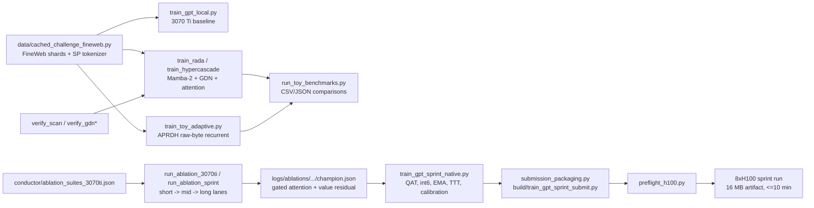

# Small-Model Training and Apple-Silicon ML Systems Research

This is a language-model research workspace spanning efficient training, architecture and optimizer experiments, educational implementations, and native Apple-silicon inference and training.

**Primary result: [`PAPER_2026-08_Recipe_Dependent_Rankings.md`](PAPER_2026-08_Recipe_Dependent_Rankings.md)** —
*Method Orderings in Language-Model Screens Are Properties of the Measurement, Not the Methods.*
A controlled attempt to replicate one of this workspace's own short-horizon architecture
comparisons, which does not reproduce it: holding architectures, optimizers and data fixed, the
ranking changes places under a change of token budget, learning-rate horizon, batch size,
evaluation metric, task difficulty, training budget, cost basis, kernel maturity or hardware.
The per-job run records behind every table are committed under `nanolab/out/`.

The main tracks are:

- **[`Rust_MLKit/`](Rust_MLKit/)** — Rust, Metal, MLX, and Core ML implementations for Apple silicon, including native Gemma inference, custom GPU kernels, decode benchmarks, and ports of the strongest experimental architectures.
- **[`nanolab/`](nanolab/)** — a clean, instrumented small-LM lab where architectural and training choices are exposed as CLI flags, with attention, Mamba-2, Gated DeltaNet, minGRU, hybrid interleavings, SFT, STaR, and diffusion experiments, plus a multi-query associative-recall probe (`nanolab/mqar.py`) for the in-context retrieval axis that held-out cross-entropy does not exercise.
- **`parameter-golf/`** — a *local-only* working clone of the OpenAI Parameter Golf challenge repository. It is excluded from this repository (see Credits And Provenance); the original trainers, verification scripts, and packaging tooling built on top of it are published here under [`Rust_MLKit/`](Rust_MLKit/).
- **[`experiment-notes/`](experiment-notes/)** and **[`research/`](research/)** — experiment records, benchmark results, and reproducible study manifests across all tracks.
- **[`learning-notes/`](learning-notes/)** and [`modern-small-lm-training-guide.md`](modern-small-lm-training-guide.md) — first-principles notes and a practical guide to modern small-model training.

For a quick CPU-only introduction, run `python -m nanolab.train --preset cpu_smoke`. For the Apple-silicon stack, start with [`Rust_MLKit/README.md`](Rust_MLKit/README.md).

## Notes

### Learning Notes

The **[ML From Scratch learning notes](learning-notes/00-README.md)** are a 25-chapter path from the basic language-model objective to modern model architecture and systems work. The explanations are grounded in measurements and implementations from this workspace rather than presented as isolated theory.

- Start with **[what a language model is](learning-notes/01-ml-from-scratch.md)**, then build up through [transformers and attention](learning-notes/02-transformer-and-attention.md), the [modern architecture stack](learning-notes/03-modern-architecture-stack.md), and [sequence mixers](learning-notes/04-sequence-mixers.md).
- Study training mechanics through [optimizers and schedules](learning-notes/05-optimizers-and-schedules.md), [precision and GPU execution](learning-notes/06-precision-and-gpu.md), [quantization and compression](learning-notes/07-quantization-and-compression.md), and the consolidated [experiments and results](learning-notes/08-experiments-and-results.md).
- Deeper chapters work through backpropagation, Muon/Newton–Schulz, RoPE, SSM recurrences, distributed training, evaluation methodology, scaling laws, diffusion language models, and real debugging failures.
- **[Build-it-yourself exercises](learning-notes/24-build-it-yourself-exercises.md)** turn the material into runnable experiments, while the **[reading list and concept map](learning-notes/25-reading-list-and-connections.md)** connects each topic to primary sources.

The **[modern small-LM training guide](modern-small-lm-training-guide.md)** is the practical companion: it organizes the ideas into a training workflow backed by the readable, configurable implementations in [`nanolab/`](nanolab/).

### Training and Experiment Notes

The **[experiment suite index](experiment-notes/00-INDEX.md)** is the lab notebook for the workspace. Each note records why an experiment was run, its setup and hardware, measured results, failures, evidence strength, artifacts, and what should—or should not—be concluded.

- **[Training ablations](experiment-notes/00-INDEX.md#training)** cover Muon and learning-rate tuning, auxiliary heads, depth/width tradeoffs, gated attention, value residuals, adaptive raw-byte models, and planned H100 follow-ups.
- **[Nanolab studies](experiment-notes/00-INDEX.md#nanolab)** track mixer quality, the recurrent-to-attention token-budget crossover, optimizer bake-offs, GPU throughput, chunk-parallel kernels, long 128M runs, and diffusion conversion. The 2026-08 GH200 campaign adds a µP/standard-parametrization tuning control, a wall-clock-matched board, a hybrid ratio-and-placement sweep, sequence length at 2048, and a 405-run recall grid across task difficulty and training budget — recorded in [`docs/EXPERIMENT_BACKLOG_2026-08-26.md`](docs/EXPERIMENT_BACKLOG_2026-08-26.md) and summarised in [`MASTER_ARCHITECTURAL_KB.md`](MASTER_ARCHITECTURAL_KB.md).
- **[Gemma Metal studies](experiment-notes/00-INDEX.md#gemma-metal)** document native and MLX decode performance, speculative decoding, parity debugging, kernel roofline analysis, prompt caching, and product-path decisions on Apple silicon.
- **[Architecture Metal studies](experiment-notes/00-INDEX.md#arch-metal)** record native Metal training throughput, kernel variants, validation BPB, and the tradeoff between the fastest and highest-quality configurations.

## Credits And Provenance

This workspace builds directly on third-party code, which remains the property of its authors:

- `parameter-golf/` is a clone of [openai/parameter-golf](https://github.com/openai/parameter-golf), the official challenge repository. The baseline `train_gpt.py`, `train_gpt_mlx.py`, the `data/` preprocessing pipeline, and the `records/` leaderboard submissions are upstream work by OpenAI and challenge participants.
- `modded-nanogpt/` is an unmodified clone of [KellerJordan/modded-nanogpt](https://github.com/KellerJordan/modded-nanogpt), the NanoGPT speedrunning project that inspired the challenge. It is kept as a reference only.

**Neither clone is redistributed here.** `parameter-golf/` and `modded-nanogpt/` are local working directories, excluded from this repository, so no upstream code is vendored into it. To reproduce the challenge work, clone [openai/parameter-golf](https://github.com/openai/parameter-golf) yourself and place it alongside this checkout.

Everything else described below — every `train_*`, `run_*`, `verify_*`, packaging, and preflight script — is original work written on top of that clone, plus two small local patches to upstream `train_gpt.py` (disable `torch.compile` and enable fallback SDPA backends so it runs on Windows/consumer GPUs).

The pieces that are published in this repository live under `Rust_MLKit/`:

| Script | Published at |
| --- | --- |
| `train_gpt_sprint_native.py` | [`Rust_MLKit/arch_01_gated_value_resid/`](Rust_MLKit/arch_01_gated_value_resid/), [`Rust_MLKit/arch_02_value_resid/`](Rust_MLKit/arch_02_value_resid/) |
| `submission_packaging.py` | [`Rust_MLKit/arch_01_gated_value_resid/`](Rust_MLKit/arch_01_gated_value_resid/) |
| `train_toy_adaptive.py` | [`Rust_MLKit/arch_03_aprdh_adaptive/`](Rust_MLKit/arch_03_aprdh_adaptive/) |
| `verify_scan.py`, `verify_gdn.py` | [`Rust_MLKit/reference/verification/`](Rust_MLKit/reference/verification/) |

The remaining single-GPU adaptation and ablation drivers (`train_gpt_local.py`, `run_local.py`, `train_rada.py`, `train_hypercascade.py`, `run_ablation_*.py`, `preflight_h100.py`) ran inside the local clone and are not published here.

## Parameter Golf Track

- Ports the official 8xH100 competition trainer to a single RTX 3070 Ti via `train_gpt_local.py`, with fully env-var-driven hyperparameters and smoke/short/baseline/full presets in `run_local.py`.
- Implements Mamba-2 (SSD) and Gated DeltaNet (GDN) blocks in pure PyTorch — no external CUDA kernels — with correct ZOH discretization, FP32 recurrence, and chunk-parallel scans, and composes them with attention into hybrid stacks (`train_rada.py`, `train_hypercascade.py`).
- Verifies the custom recurrences numerically against brute-force references (`verify_scan.py`, `verify_gdn.py`, `verify_gdn_wy.py`).
- Builds an experimental adaptive raw-byte architecture ("APRDH") with a single weight-shared block reused recurrently, projected GDN with a custom autograd function, DeepSeek-style MLA, span-based patching, an n-gram hash "engram" memory, and Gumbel-routed compute controllers (`train_toy_adaptive.py`).
- Runs a conductor-driven ablation pipeline (`run_ablation_3070ti.py`, `run_ablation_sprint.py`) over eight suites defined in `conductor/ablation_suites_3070ti.json`, with staged short/mid/long lanes, CSV/JSON summaries, and champion selection — locally identifying gated attention + value residual as the best architecture variant.
- Maintains a single-file H100 submission trainer (`train_gpt_sprint_native.py`) with QAT, mixed int6/int8 per-row quantization, GPTQ-style clip search, EMA weights, sliding-window and test-time-training evaluation, logit calibration sweeps, and zstd/lzma artifact packing under the 16 MB budget, plus packaging and preflight tooling for submission.

### Challenge Constraints

The competition objective is a form of L(N) optimization: the lowest FineWeb validation loss for a fixed parameter budget, unconstrained by architecture. Concretely:

- The final model artifact (weights + code) must compress to under 16 MB.
- Training must finish in under 10 minutes on 8xH100 SXM GPUs.
- Scoring is tokenizer-agnostic bits-per-byte on a fixed FineWeb validation split.

Local BPB on a 3070 Ti does not predict H100 ranking, so the local scripts are explicitly correctness and relative-comparison harnesses: they keep the data pipeline, quantization, and evaluation identical to the sprint path while shrinking batch sizes, sequence lengths, and step counts to fit 8 GB of VRAM.

## Experiments

### 1. Local Adaptation (`train_gpt_local.py`, `run_local.py`, `train_toy.py`, `run_smoke_test.py`)

A fork of the upstream baseline with every change marked by `# LOCAL:` comments. Adds `SKIP_COMPILE`, gradient-accumulation overrides, small train/val batch settings, and wallclock-cap removal so the 9-layer/512-dim baseline trains on one consumer GPU. `run_local.py` provides `smoke` (5 steps), `short` (200 steps), `baseline` (2,000 steps), and `full` (5,000 steps) presets.

### 2. Hybrid SSM/Attention Architectures (`train_rada.py`, `train_hypercascade.py`, `run_hypercascade.py`, `run_rada.py`, `run_seeds.py`)

- **RADA** (Recursive Algorithm Discovery Architecture): hybrid blocks wrapping either a Mamba-2 SSD mixer or attention, plus Gated DeltaNet, DeepSeek MLA, SwiGLU, and multi-token prediction (MTP).
- **HyperCascade / DeltaHybrid**: layer types configurable per-position via a `LAYER_TYPES` env var (`mamba`, `gdn`, `attn`), following the DeltaNet-hybrid recipe (6x GDN + 2x attention + MTP + EMA). All blocks share U-Net skips, x0 skip, ReLU² MLP, and residual scaling; optimization splits Muon (2D matrices) from Adam (scalars, embeddings, SSM params).
- `run_hypercascade.py` defines toy (128-dim), small (256-dim), and medium (competition-scale 512-dim) configs plus ratio/order/d_state ablations; `run_seeds.py` repeats any config across seeds and summarizes `val_bpb`.
- `verify_scan.py`, `verify_gdn.py`, and `verify_gdn_wy.py` check the chunk-parallel SSD scan and delta-rule recurrence against sequential references to 1e-5 tolerance.

### 3. Adaptive Raw-Byte Architecture (`train_toy_adaptive.py`, `run_toy_adaptive.py`, `run_toy_benchmarks.py`, `compile_patches_to_sp.py`)

An experimental byte-level model ("APRDH") built around one shared adaptive block applied recurrently (2–5 passes), combining a projected Gated DeltaNet with an exact chunked dual scan implemented as a custom `torch.autograd.Function`, MLA with top-k latent routing, span-mixer patching over byte spans, a tiny n-gram hash memory ("engram"), fast-weight adapters, and a marginal-gain compute controller with budget penalties. Training hardening includes gradient-spike skip/rollback, soft-to-hard Gumbel routing schedules, and tau floors. `run_toy_benchmarks.py` runs the preset matrix (`toy_aprdh_v0`, `toy_aprdh_risky`, `toy_aprdh_engram_risky`, plus RADA/DeltaHybrid baselines) and writes CSV/JSON comparisons.

### 4. Sprint Trainer And Ablation Pipeline (`train_gpt_sprint_native.py`, `train_gpt_sprint_core.py`, `run_ablation_*.py`, `preflight_h100.py`)

The submission-oriented track, mirroring techniques from the public leaderboard:

- `train_gpt_sprint_native.py` — a self-contained trainer with GQA attention (QK norm, RoPE, FlashAttention-3), SmearGate, bigram hash embeddings, value embeddings, value residual, gated attention, U-Net skips, Muon + Adam, QAT, per-row int6 quantization with mixed precision categories, GPTQ-lite clip search, EMA weight averaging, sliding-window evaluation, legal test-time training (TTT) evaluation, and temperature/softcap logit calibration.
- `train_gpt_sprint_core.py` — **not in this repository.** A compatibility layer that patched the native trainer for local Windows runs (SDPA fallback for FlashAttention, timing breakdowns, optional MicroTitans memory and calibration sweeps). No such file and no `titan` symbol exists here; `arch_01_gated_value_resid/` holds only `train_gpt_sprint_native.py` and `submission_packaging.py`. It left with an extracted nested repo (see commit `3e5aed5`) and is recorded here only so the reference is not mistaken for present code — Titans-style test-time memory is **not** implemented anywhere in this workspace.
- `run_ablation_3070ti.py` / `run_ablation_sprint.py` — conductor scripts that execute the suites in `conductor/ablation_suites_3070ti.json` through staged short/mid/long lanes, rank candidates by calibrated BPB, and emit per-stage summaries plus a `champion.json`. The local architecture ladder selected **gated attention + value residual** as champion (calibrated BPB 1.9847 at the long stage, 2 seeds, ~1.34 MB artifact).
- `submission_packaging.py` / `pack_submission_trainer.py` — flatten the native trainer into a single `build/train_gpt_sprint_submit.py` with a FlashAttention fallback prelude.
- `preflight_h100.py` — validates data paths, the packaged submission, and code-size accounting before paying for an 8xH100 run.

## Repository Map

```text
.
|-- Rust_MLKit/                      # native Apple-silicon ML systems work
|   |-- gemma-metal/                 # Rust + Metal Gemma inference and benchmarks
|   |-- crates/tessl/        # reusable Metal runtime components

### Crate naming

The Metal GEMM/runtime crates are named `tessl`. They were renamed from
`metal-runtime` / `arch02-metal-native`; dated audits, `DECISIONS.md`,
`experiment-notes/` and `docs/kernel_hardening_evidence.json` still use the old
names and were deliberately **not** rewritten, since they record what was true
when they were written.

| directory | package | lib |
|---|---|---|
| `Rust_MLKit/crates/tessl/` | `tessl` | `tessl` |
| `Rust_MLKit/arch_02_value_resid/metal-native/` | `tessl-arch02` | `tessl_arch02` |

The `arch_02_value_resid/metal-native/` directory keeps its name (it is the
arch_02 experiment's trainer), and the `METAL_NATIVE_*` / `METAL_RUNTIME_*`
environment variables are unchanged so existing scripts keep working.

See [`Rust_MLKit/docs/gemm_architecture.md`](Rust_MLKit/docs/gemm_architecture.md)
for the GEMM kernel-selection path, the cooperative-accumulator gate, and how to
verify and benchmark it.
|   |-- arch_01_gated_value_resid/   # gated-attention + value-residual port
|   |-- arch_02_value_resid/         # value-residual Rust/Metal/MLX implementations
|   `-- arch_03_aprdh_adaptive/      # adaptive raw-byte architecture research
|-- learning-notes/                  # first-principles ML notes (25 chapters) mapped to golf experiments
|   |-- 00-README.md                 # notes overview and recommended reading path
|   |-- build_html.py                # stitches markdown notes into search-enabled offline HTML page
|   `-- ml-notes.html                # single-page compiled book with TOC and scroll-spy
|-- modded-nanogpt/                  # unmodified clone of KellerJordan/modded-nanogpt (reference)
|-- nanolab/                         # pedagogical 128M training, SFT, STaR, and diffusion package
|   |-- train.py                     # single-GPU training loop (BF16, grad accum, MFU logging)
|   |-- model.py                     # modern transformer stack (RoPE, RMSNorm, QK-norm, SwiGLU)
|   |-- mixers.py                    # pluggable mixers (attention, mamba2, gdn, mingru, mla)
|   |-- sft.py                       # Phase-2 Supervised Fine-Tuning reasoning loop
|   |-- reason.py                    # structured schema JSON decoding & free-form reasoning
|   |-- diffusion.py                 # Phase 3 AR-to-diffusion conversion and block-causal decoding
|   `-- star.py                      # Phase-3 STaR bootstrap reasoning loop
|-- parameter-golf/                  # LOCAL ONLY, not in this repo: clone of openai/parameter-golf
|   |-- train_gpt.py                 # upstream baseline (locally patched for Windows/no-compile)
|   |-- train_gpt_mlx.py             # upstream Apple Silicon baseline
|   |-- data/                        # upstream FineWeb download + tokenizer pipeline
|   |-- records/                     # upstream leaderboard submissions
|   |-- train_gpt_local.py           # single-GPU (RTX 3070 Ti) adaptation
|   |-- run_local.py                 # smoke/short/baseline/full local presets
|   |-- train_rada.py                # RADA: Mamba-2 + GDN + MLA hybrid trainer
|   |-- train_hypercascade.py        # DeltaHybrid: configurable mamba/gdn/attn stacks
|   |-- run_hypercascade.py          # toy/small/medium configs + ratio/order ablations
|   |-- run_seeds.py                 # multi-seed runner with val_bpb summaries
|   |-- verify_scan.py               # SSD chunk-parallel scan correctness tests
|   |-- verify_gdn.py                # Gated DeltaNet correctness tests
|   |-- verify_gdn_wy.py             # delta-rule chunkwise (WY) benchmark/tests
|   |-- train_toy_adaptive.py        # APRDH adaptive raw-byte recurrent architecture
|   |-- run_toy_adaptive.py          # APRDH presets (v0 / risky / engram_risky)
|   |-- run_toy_benchmarks.py        # cross-architecture toy benchmark harness
|   |-- compile_patches_to_sp.py     # SentencePiece tokenizer training helper
|   |-- train_gpt_sprint_native.py   # single-file H100 submission trainer
|   |-- train_gpt_sprint_core.py     # local/Windows compatibility + sweep layer
|   |-- train_gpt_sprint.py          # sprint entrypoint
|   |-- run_toy_3070ti.py            # local sprint correctness harness
|   |-- run_ablation_3070ti.py       # staged ablation conductor (local trainer)
|   |-- run_ablation_sprint.py       # staged ablation conductor (sprint trainer)
|   |-- conductor/                   # ablation suite manifests (8 suites)
|   |-- submission_packaging.py      # single-file submission builder
|   |-- pack_submission_trainer.py   # packaging entrypoint
|   |-- preflight_h100.py            # pre-submission validation
|   |-- artifacts/                   # per-run final_model.pt / .int6.ptz exports
|   `-- logs/                        # run logs, ablation summaries, champion.json
|-- scripts/                         # Qwen 27B inference stack (Apple Silicon)
|   |-- serve_qwen.py                # OpenAI-compatible server (MTP / DFlash / AR backends)
|   |-- run_qwen_inference.py        # one-shot generation, mode-selectable
|   |-- bench_qwen38.py              # multi-arm throughput benchmark + verdict
|   |-- test_bench_qwen38.py         # benchmark regression suite (no models, no network)
|   |-- bench_agents.py              # CLI coding-harness comparison (prompt size, AST-verified)
|   |-- test_bench_agents.py         # harness regression suite (no agents, no server)
|   |-- dflash_guard.py              # losslessness gate for every dflash entry point
|   `-- download_qwen.py             # model/bundle fetcher
|-- docs/
|   `-- qwen_mlx_dflash_guide.md     # setup, measured benchmarks, coding-agent wiring
|-- experiment-notes/                # indexed results from training and Metal experiments
|-- research/                        # machine-readable study and optimizer manifests
|-- bench/                           # cross-track benchmark artifacts
|-- out/                             # generated experiment outputs
`-- sync_to_obsidian/                # helper scripts that move workspace .md notes to an Obsidian vault
```

Note: the map above shows the full local workspace. `parameter-golf/`, `modded-nanogpt/`, and `sync_to_obsidian/` are local-only and absent from this repository. Inside the local `parameter-golf/` clone, `git status` shows upstream `.md` files as deleted because the `sync_to_obsidian/` scripts relocate workspace notes into an Obsidian vault.

## Local Qwen Coding Agent

`scripts/` runs **Qwen3.8-27B** locally on Apple Silicon and exposes it to a terminal coding agent.
Measured on M5 Pro 64 GB (2026-08-16): the official MTP drafter gives **2.26x lossless speedup**
(34.56 tok/s vs 15.26 AR, 91.2% acceptance). The cross-applied Qwen3.6 DFlash drafter manages only
1.17x — acceptance falls from 80.5% on 3.6 to 53.5% on 3.8 — so MTP is the default.

3.8-native **DSpark** drafters were evaluated 2026-08-17 (`mlx-dspark`, lossless — verified
byte-identical against AR). On a clean run MTP still wins: **36.91 vs 31.20 tok/s** (paired
*t* = 18.1, df = 2, p ≈ 0.003; AR 16.92), and the 8-bit pair is slower still at 23.50 while
accepting *below* its published figure.
DSpark accepts more per round (3.79 vs 2.81) and is nonetheless slower — a 1.36B drafter costs more
per round than MTP's 239 MB head saves. **MTP is retained.** See `docs/qwen_mlx_dflash_guide.md`
§4b-iii.

```bash
python3 scripts/download_qwen.py --model all-recommended
python3 scripts/serve_qwen.py --backend mlx-vlm --port 8000    # MTP speculative

uv tool install kon-coding-agent                                  # kon coding agent
```

Day to day, two shell functions in `~/.zshrc` cover it — `qq` starts the server if needed, waits,
then runs kon (36 s cold from `qq` to answer):

```bash
qq                      # interactive
qq -p "your task"       # one-shot
qwen-stop               # unload the model, frees ~15 GB
```

Single-file edit tasks land in **~53 s**. Harness choice matters more than model speed here: cold
prefill runs at ~100 tok/s regardless, so prompt size sets the wall clock. kon sends ~3k tokens
(125 of them its actual system prompt); oh-my-pi sends ~39k and took ~13 min for the same work.
Five harnesses measured by `scripts/bench_agents.py`, correctness verified by AST rather than by
what the agent claimed — see guide §6a.

Full setup, benchmark tables, and the harness's correctness gates:
[`docs/qwen_mlx_dflash_guide.md`](docs/qwen_mlx_dflash_guide.md).

## Parameter Golf Experiment Flow



## Parameter Golf Prerequisites

- Python with PyTorch (CUDA build), NumPy, SentencePiece, Hugging Face Hub/datasets, tqdm, tiktoken (see `parameter-golf/requirements.txt`)
- An NVIDIA GPU; the local scripts are tuned for an RTX 3070 Ti with 8 GB VRAM
- The scripts were developed in a conda environment named `cuda_torch_env` on Windows

## Parameter Golf Setup

Install dependencies and download the cached FineWeb dataset with the 1024-token SentencePiece vocabulary:

These steps run inside the upstream clone, which is not part of this repository — clone it first:

```bash
git clone https://github.com/openai/parameter-golf
cd parameter-golf
pip install -r requirements.txt
python data/cached_challenge_fineweb.py --variant sp1024 --train-shards 1
```

This populates `./data/datasets/fineweb10B_sp1024/` and `./data/tokenizers/`. Pass a higher `--train-shards` for longer runs.

## Parameter Golf Commands

Smoke-test the local trainer (5 steps):

```bash
python run_smoke_test.py
```

Local baseline presets:

```bash
python run_local.py smoke      # 5 steps, verify everything works
python run_local.py short      # 200 steps, see a loss curve
python run_local.py baseline   # 2000 steps, proper local baseline
python run_local.py full       # 5000 steps, best local result
```

Hybrid architecture experiments:

```bash
python run_hypercascade.py toy_attn          # pure attention control
python run_hypercascade.py toy_gdn_hybrid    # 3 GDN + 1 attention
python run_hypercascade.py toy_deltahybrid   # GDN hybrid + MTP
python run_seeds.py small_deltahybrid        # full mash-up across 3 seeds
```

Verify the custom recurrence kernels:

```bash
python verify_scan.py
python verify_gdn.py
python verify_gdn_wy.py
```

Adaptive raw-byte toy runs and benchmarks:

```bash
python run_toy_adaptive.py toy_aprdh_v0
python run_toy_benchmarks.py
```

Sprint-path ablations and submission packaging:

```bash
python run_toy_3070ti.py --help            # local sprint correctness harness
python run_ablation_sprint.py --help       # staged ablation conductor
python pack_submission_trainer.py          # build build/train_gpt_sprint_submit.py
python preflight_h100.py                   # validate before an 8xH100 run
```

Reasoning, SFT, and STaR (in the `nanolab` companion):

```bash
# Prep reasoning dataset (falls back to synthetic if offline)
python3 -m nanolab.sft_data --dataset gsm8k --max_examples 2000

# Supervised fine-tuning for thinking
python3 -m nanolab.sft --base_run run128m_fineweb_2k --run sft128m_gsm8k --steps 800

# Inference with schema-constrained JSON & reasoning
python3 -m nanolab.reason --run sft128m_gsm8k --special --question "Is the sky blue? Give your confidence."

# Bootstrapping reasoning correctness with STaR
python3 -m nanolab.star --base_run sft128m_gsm8k --dataset gsm8k --rationalize --rounds 3 --samples 4
```

## Important Implementation Notes

- All hyperparameters across trainers are env-var driven (e.g. `NUM_LAYERS`, `MODEL_DIM`, `ITERATIONS`, `LAYER_TYPES`, `SEED`), so launchers configure runs purely through the environment.
- The Mamba-2 and GDN blocks are deliberately pure PyTorch (no `mamba-ssm`/Triton dependencies); FP32 is used inside the recurrences for numerical stability, and `SKIP_COMPILE=1` is auto-forced when SSM layers are present.
- Artifact compression matches the competition pipeline: int8 or per-row int6 quantization plus zlib/zstd, with `.ptz` exports written alongside raw `.pt` checkpoints under `artifacts/`.
- `train_gpt_sprint_core.py` installs a `flash_attn_interface` fallback backed by SDPA so the FlashAttention-3 submission code also runs on consumer Windows GPUs.
- Local results are correctness signals only — local BPB on a 3070 Ti does not predict the 8xH100 leaderboard ranking.

## Core Technologies

- PyTorch (CUDA, DDP, custom `autograd.Function`, optional `torch.compile`)
- Muon optimizer (Newton-Schulz orthogonalization) + Adam
- Mamba-2 SSD, Gated DeltaNet, DeepSeek MLA, multi-token prediction
- SentencePiece BPE tokenization over FineWeb
- Quantization-aware training, int6/int8 export, GPTQ-lite clip search, zstd/lzma packing
- MLX (upstream Apple Silicon baseline)
