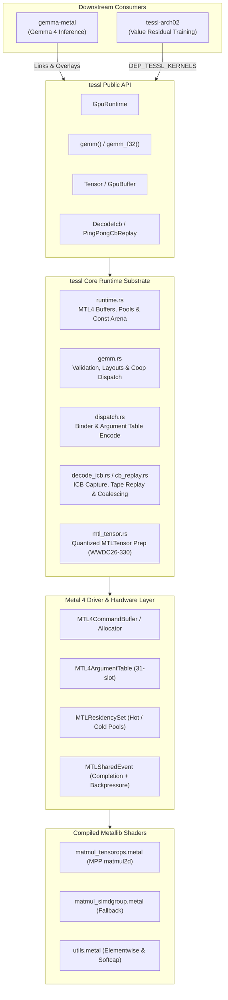
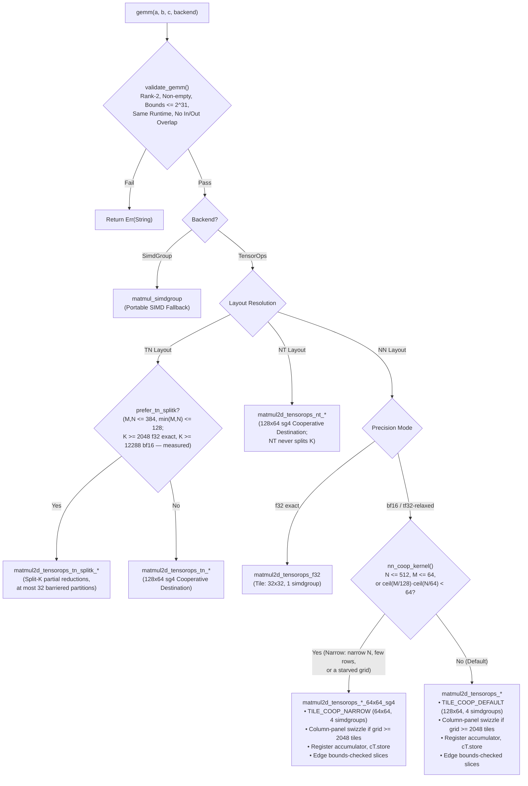
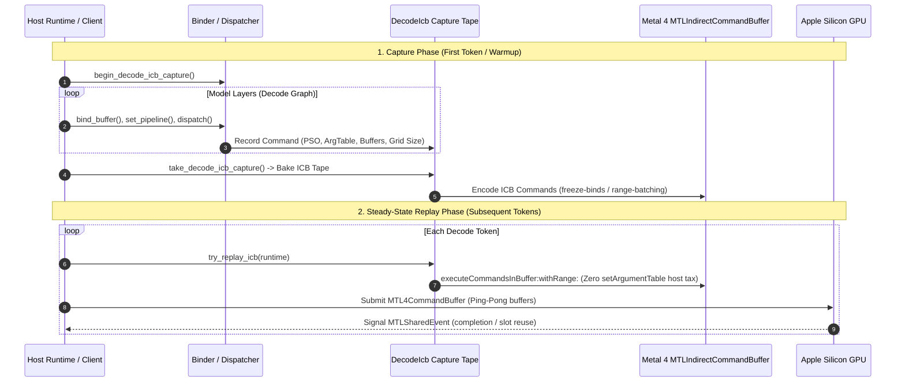

# tessl

**Low-overhead, asynchronous Metal 4 encode and GEMM runtime for Apple Silicon**, built on Metal Performance Primitives (MPP) TensorOps `matmul2d`.

`tessl` serves as the high-performance GPU substrate for neural network inference and training on Apple Silicon (e.g., [`gemma-metal`](../../gemma-metal/) and [`tessl-arch02`](../../arch_02_value_resid/metal-native/)).

---

## Key Highlights

- **Pure Metal 4 Architecture:** Built strictly for Metal 4 (`MTL4CommandBuffer`, `MTL4ComputeCommandEncoder`, `MTL4ArgumentTable`, `MTLResidencySet`). Legacy `MTLCommandQueue` and classic command buffer paths are deliberately absent.
- **Hardware-Accelerated GEMM:** Native integration with MPP TensorOps `matmul2d` across NN, TN, and NT layouts in `f32`, `bf16` (with `f32` accumulate), and `tf32-relaxed` precision modes.
- **Cooperative Register Accumulators:** High-throughput cooperative destination kernels (`get_destination_cooperative_tensor`) holding `f32` accumulators in GPU registers across the entire $K$-reduction, eliminating device memory round-trips for NN, TN, NT, and accumulating paths.
- **In-Kernel Grid Swizzling & Bounds Checking:** Column-panel tile swizzling for large grids ($\ge 2048$ tiles) bounding operand rereads, combined with origin-shifted slice bounds checking for ragged edges.
- **Bounded Asynchronous Execution Pipeline:** Packed command encoding with bump-allocated constant arenas (16 MiB), two allocator slots, and `MTLSharedEvent` synchronization. The common path keeps encoding while a peer command buffer runs; when both slots are busy, allocation applies a bounded completion wait instead of growing command-buffer state without limit.
- **Neural-Network Kernel Library:** 53 measured model-agnostic dispatches — RMSNorm, gated MLP activations, flash attention (sliding-window $h{=}128/256$, global $h{=}512$), fused RMSNorm+QKV+RoPE, MLX-format Q4 GEMV/GEMM, Q8 GEMV, KV-cache stores, embedding lookup, and softcap/argmax sampling. These were promoted out of `gemma-metal`, where they were reachable only as raw strings through an overlay metallib.
- **Opt-in Decode ICB Capture & Replay:** Low-latency Indirect Command Buffer (ICB) capture for mini and eligible E4B Hot layer graphs, with default-off freeze-binds and range-batching. Generic/full 31B graph capture and true command-buffer replay remain explicit gaps.

> [!IMPORTANT]
> **Platform Requirements:**
> - **OS:** macOS 26+
> - **Toolchain:** Xcode 26 with the Metal Toolchain component (`xcodebuild -downloadComponent MetalToolchain`).
> - **Hardware:** Apple Silicon GPU with Neural Accelerators (Apple M-series) for the MPP TensorOps path. A portable `simdgroup_matrix` fallback is available for A/B testing, but is 2–3× slower.

---

## System Architecture



---

## Module Overview

| Module | Purpose & Implementation Details |
|---|---|
| [`gemm`](src/gemm.rs) | TensorOps `matmul2d` GEMM — NN, TN, and NT layouts; plain and accumulating; `f32`, `tf32-relaxed`, and `bf16→f32`; split-$K$; register-resident cooperative accumulators (`TILE_COOP_DEFAULT`, `TILE_COOP_NARROW`, `TILE_COOP_TN_NT`, `TILE_COOP_ACCUM`); column-panel grid swizzle; Morton 1D threadgroup dispatch walk. |
| [`runtime`](src/runtime.rs) | Device initialization, Metal 4 command buffer and compute command encoder orchestration, residency sets, `Hot` / `Cold` / `Bump` buffer pools, packed binder scoping, 16 MiB bump constant arena, and `MTLSharedEvent` synchronization. |
| [`dispatch`](src/dispatch.rs) | Metal 4 argument-table binding (`MTL4ArgumentTable`), constant staging cursor tracking, and 1D / 2D / 3D dispatch helpers. |
| [`tensor`](src/tensor.rs) | Bounds-checked `GpuBuffer` / `Tensor` representations, multi-dimensional shape views, stride handling, and data types (`F32`, `F16`, `Bf16`). |
| [`ops`](src/ops.rs) | Elementwise utility launches (e.g., `softcap_f32`, activation scaling). |
| [`nn`](src/nn.rs) | Neural-network kernels promoted out of `gemma-metal`: RMSNorm (`f32`, `bf16`, fused residual-add with layer scale), gated MLP activations (SiLU, `gelu_pytorch_tanh`), Q8 GEMV, KV-cache timestep stores and ring densify. Every active raw buffer is checked for both extent and runtime ownership before encoding. KV stores additionally require an explicit logical capacity, allowing safe suballocations even though their live offsets reside on the device. |
| [`npy`](src/npy.rs) | NumPy `.npy` binary serialization for validating GPU buffer outputs directly against host CPU references. |
| [`decode_icb`](src/decode_icb.rs) | Indirect Command Buffer (ICB) capture, command stream tracing, freeze-bind argument management, and execution batching. |
| [`cb_replay`](src/cb_replay.rs) | Ping-pong command buffer replay harness for decode-heavy token generation loops. |
| [`infer_trace`](src/infer_trace.rs) | Execution tracing, timing hooks, and kernel profiling probes. |
| [`mtl_tensor`](src/mtl_tensor.rs) | Quantized `MTLTensor` preparation for WWDC26-330 — native `Int8` descriptors today, with `Int4` and `Fp8E8M0` retained as explicit planned/logical types that fail closed until the SDK bindings exist; gated behind the `quant-prep` feature. |

---

## Metal 4 Memory & Residency Hierarchy

`tessl` manages GPU memory allocations explicitly to eliminate mid-command buffer host stalls and memory thrashing.


### Memory Allocation Policies

- **`BufferKind::Hot`**: Persistent allocations (model weights, optimizer state, KV cache banks). They remain resident while a logical owner is live; after the final owner drops, removal waits for all in-flight work and the storage is retired rather than entering the reusable Cold freelist.
- **`BufferKind::Cold`**: Intermediate activations. Managed via an active freelist pool with a default 2 GiB cap (`DEFAULT_POOL_CACHE_BYTES`). Unused slabs are evicted via `removeAllocation` upon command buffer completion.
- **`BufferKind::Bump`**: Ephemeral scratch memory allocated linearly from pre-committed slabs. Bump cursors are reset at synchronization points without individual buffer deallocations.
- **Constant Arena (16 MiB)**: Eliminates per-dispatch host allocation overhead for scalars and small metadata buffers by writing directly into a shared staging buffer at naturally aligned offsets (four bytes for a scalar, sixteen for wider payloads). A scope that opens with less than 1 MiB free drains the GPU first, so the arena is rewound rather than exhausted.

> [!NOTE]
> The usual steady-state path encodes without a host wait while at least one of the two allocator slots is available. If both slots are still in flight, the runtime applies a bounded `MTLSharedEvent` wait as backpressure. Callers may also request completion explicitly through [`GpuRuntime::synchronize`](src/runtime.rs) or a waiting commit.

---

## GEMM Pipeline & Kernel Selection

The core GEMM engine in `tessl` dynamically selects the most optimal kernel based on layout, precision, and matrix geometry.



### Cooperative Destination Tile Execution

All production `bf16` and `tf32-relaxed` kernels utilize cooperative destination tensors:
1. **Register Accumulation:** `op.template get_destination_cooperative_tensor<...>()` maintains the full `f32` accumulator in hardware SIMDgroup registers across the entire $K$-reduction loop.
2. **Zero Pre-Zero Overhead:** Register accumulators are initialized via `.set(i, 0.0f)` in shader code. The host-side `zero_f32(C)` pre-pass is completely eliminated.
3. **Single Store to Memory:** Device memory $C$ is written **exactly once** (`cT.store(tC)`) at threadgroup termination.
4. **Ragged Edge Handling:** Boundary tiles use origin-shifted full-extent tensor slices (`mA.slice(...)`, `mB.slice(...)`, `mC.slice(...)`), executing the same cooperative register accumulation without dropping tail elements.
5. **Column-Panel Grid Swizzling:** For large dispatch grids ($\text{tiles}_n \times \text{tiles}_m \ge 2048$), threadgroups are swizzled into 8-tile-row bands to bound operand $B$ cache rereads, delivering $+11\%$ throughput at $4096^3$.

---

## Indirect Command Buffer (ICB) Decode Pipeline

For auto-regressive generation where kernel execution times approach dispatch
overheads, `tessl` provides an opt-in Indirect Command Buffer (ICB) capture and
tape replay path for mini and eligible E4B Hot layer graphs. The diagram below
describes that supported subset; it is not a generic/full 31B decode pipeline.
`PingPongCbReplay`'s true command-buffer encode-once path remains scaffolding.



### ICB Optimizations

All three optimizations are default-off and require explicit opt-in:

- **Freeze-Binds (`TESSL_ICB_FREEZE_BINDS=1`):** Inlines buffer bindings and threadgroup memory directly into the ICB commands, reducing host `setArgumentTable` invocations to zero at replay time.
- **Range-Batching (`TESSL_ICB_RANGE_BATCH=1`):** Coalesces contiguous command spans between execution barriers into unified `executeCommandsInBuffer:withRange:` calls.
- **Coarse Barriers (`TESSL_COARSE_BARRIERS=1`):** Elides redundant inter-command barriers when memory access footprints across successive passes are demonstrably disjoint.

---

## Performance evidence vs. PyTorch MPS and MLX

> [!CAUTION]
> No checked-in timing artifact currently satisfies the new publication schema
> and carries `status: "published"`. Every numeric result in this section is a
> historical observation from the named source snapshot, even where the prose
> describes what that run measured in the present tense. It must not be read as
> a speed claim for the current dirty tree. Re-run the gated driver on a stable
> host before making one.

### Latest checked-in result snapshot

The compact table below makes the evidence state and ratio direction explicit.
GEMM entries are throughput ratios (`tessl / comparison`, so greater than one is
faster). Attention entries are latency ratios (`tessl / comparison`, so less
than one is faster).

| Historical snapshot | Coverage and sampling | vs. torch MPS | vs. MLX |
|---|---|---:|---:|
| GEMM exact f32, rep B | 8/8 shapes; 5 rounds × 30 iterations; 10 warmups | **1.045×** | **0.999×** |
| GEMM relaxed tf32 against f32, rep B | 8/8 shapes; 5 × 30; 10 warmups | **2.145×** | **1.998×** |
| GEMM bf16→f32 accumulation, rep B | 8/8 shapes; 5 × 30; 10 warmups | **0.979×** | **2.631×** |
| Routed attention, rep C | 14/14 configs; 5 rounds × 20 iterations; 5 warmups | **0.624× latency** (~1.60× faster) | **1.150× latency** (15.0% slower) |
| Decode with 32 launches per submit, three reps | 9/9 decode configs | **0.22× latency** (~4.5× faster) | **0.91–0.97× latency** (~3–9% lower) |

Rep B's candidate-only one-off peaks were **27,734 GFLOP/s bf16**, **17,685
GFLOP/s tf32**, and **6,888 GFLOP/s exact f32**. They are same-run context, not
portable peak claims. All six GEMM comparisons breach the current hard 1.25×
paired-spread ceiling; the worst shape spread is 3.473×. Attention rep C also
breaches it, reaching 1.538× against torch and 1.785× against MLX. These gate
failures are why the snapshots remain historical even when a median is large.

Apple M5 Pro, via [`bench/paired_cross_runtime.py`](bench/paired_cross_runtime.py).
The harness interleaves the tessl and comparison lanes **round by round** rather
than running each sweep once, because two single sweeps of the identical
benchmark disagreed by 16–21% on the torch lane alone — more than most of the
differences being reported. Every geomean below covers the **whole 8-shape
ladder**; the run aborts rather than averaging over the shapes that happened to
report. Artifacts:
[`gemm_speed_ladder_m5pro.json`](bench/results/gemm_speed_ladder_m5pro.json)
(the table below) and
[`gemm_speed_ladder_m5pro_b.json`](bench/results/gemm_speed_ladder_m5pro_b.json),
an independent repeat on 2026-09-03 at the same settings.

> [!CAUTION]
> These are historical schema-v1 artifacts, not publishable evidence for the
> current tree. They contain no revision/dirty state, executable or metallib
> hashes, host/runtime/power provenance, or outer-round values. Every one of
> rep B's six comparisons has at least one shape beyond the new hard 1.25x
> paired-spread ceiling (the worst is 3.47x), and its `peak_gflops` values are
> independent one-off maxima. Preserve them as audit history; rerun the current
> driver and require its `.attempt.json` status to be `published` before making
> a current speed claim.

**Historical observation:** the aggregate medians were similar on the repeat,
all six comparisons reporting 8/8 shapes:
f32 1.071 → 1.045, tf32 2.098 → 2.145, bf16 0.999 → 0.979 against torch; and
0.979 → 0.999, 1.942 → 1.998, 2.670 → 2.631 against MLX. Every ratio moved by
less than the round-to-round spread; the gate failures above make this
descriptive history rather than current performance evidence.
The *peaks* moved as expected and as warned below — bf16 26,702 → 27,734, tf32
15,872 → 17,685, f32 6,492 → 6,888.

*Rep A historical geomean of per-shape medians, 5 alternating rounds × 30
iterations, 8 shapes:*

| Precision Mode | vs. torch MPS | worst shape | best shape | vs. MLX |
|---|---|---|---|---|
| **bf16 → f32 accumulate** | **1.00×** | 0.91× | 1.06× | 2.67× |
| **f32 exact** | **1.07×** | 0.90× | 1.62× | 0.98× |
| **tf32-relaxed** vs. their **f32** | **2.10×** | 1.61× | 2.31× | 1.94× |

| Lane | Peak GFLOP/s | at |
|---|---|---|
| `tensorops-bf16` | **26,702** | `square_4096` |
| `mps-bf16` | 26,104 | `mlp_up` |
| `tensorops-tf32` | **15,872** | `tall_k1024` |
| `mlx-bf16` | 6,850 | `tall_k1024` |
| `mlx-f32` | 6,665 | `mlp_up` |
| `mps-f32` | 6,524 | `mlp_up` |
| `tensorops-f32` | **6,492** | `mlp_down` |
| `simdgroup-f32` | 2,710 | `tall_k1024` |

> [!WARNING]
> **The bf16 row is a correction.** This table previously claimed **1.11×
> "(Outperforms MPS)"** for bf16. Re-measured over the full ladder it is
> **1.00×** (5 rounds), **1.03×** on an independent 9-round × 40-iteration
> confirmation, and **0.98×** on the 2026-09-03 repeat. tessl bf16 is at *parity*
> with torch MPS bf16, not ahead of it.
>
> The structure matters more than the geomean. Per shape, tessl bf16 wins only
> on the two smallest squares — 1.26× at 512³ and 1.34× at 1024³, both with
> per-round spreads reaching 2.15× and 3.38× — and sits at **0.86×–0.95× on
> `mlp_up`, `square_4096`, `qkv_proj` and `tall_k1024`**. The small squares are
> the dispatch-floor regime this file's own note warns about, so the geomean was
> being carried by exactly the shapes that measure host submit latency rather
> than shader throughput. On the shapes that determine training throughput,
> torch MPS bf16 is marginally ahead.

Reading the rest:

- **tf32-relaxed's 2.10×** is the one large, robust win, and it reproduces the
  previously recorded 2.01× within round-to-round noise. It is *not* a
  like-for-like comparison — see the accuracy section directly below.
- **f32 exact at 1.07×** was also close to its prior historical figure, but the
  spread is wide (0.90×–1.62×) and the win is concentrated at 512³; from 2048³ up it is
  0.92×–1.06×, i.e. parity.
- **The 2.67× over MLX bf16 says more about MLX than about tessl.** MLX's bf16
  matmul peaks at 6,850 GFLOP/s here against torch MPS's 26,104 — roughly 4×
  slower — so it is the weak baseline of the two. torch MPS is the one worth
  measuring against, and there the honest answer is parity.
- **Absolute GFLOP/s did not reproduce** the previously recorded peaks (29,022
  bf16 / 10,897 f32 / 18,040 tf32). That is the quantity the paired design
  explicitly says not to compare across runs — thermal state and background load
  move it — which is why the ratios above are the durable claim and these peaks
  are reported only as same-run context.

> [!NOTE]
> **Benchmarking rigor.**
> - **Dispatch floor.** Below ~2 GFLOP of total work, both runtimes hit a
>   ~0.25 ms host submit-and-wait floor, measuring driver dispatch latency rather
>   than shader throughput. `square_512` is near that floor and its ratios should
>   not be read as kernel performance — see the bf16 correction above for what
>   happens when they are.
> - **Clock drift.** Single-run cross-runtime benchmarks fluctuate 15–20% on
>   identical workloads under the Apple Silicon power governor. Always use a
>   paired, interleaved sweep — `bench/paired_cross_runtime.py` for cross-runtime
>   GEMM, `bench/attn_paired.py` for attention. Both retain every outer-round
>   child-reported median and run provenance (the child tools do not emit their
>   inner per-iteration timings); summary arrays are consequently named
>   `outer_round_values`, not raw iteration samples. They aggregate paired ratios
>   by medians and refuse
>   an artifact by default when any paired max/min ratio spread exceeds 1.10x;
>   the evidence-mode cap itself is bounded at 1.25x. Evidence runs require an
>   even outer-round count of at least 4 (default 6) for exact AB/BA balance,
>   plus at least 3 timed samples inside each child median. `--out` is replaced
>   atomically only after every gate passes; `<out>.attempt.json` marks the
>   latest attempt `not_published` until then, so a preserved older result
>   cannot be mistaken for the failed rerun.
>   Inherited benchmark/runtime tuning prefixes are cleared before each child;
>   the artifact records only explicit overrides and never serializes the full
>   process environment (which may contain credentials). Publishable paths under
>   the invoking user's home are normalized to `$HOME/...` while the real input
>   files are hashed. The output parent directory must already exist; the driver
>   never creates an implicit destination tree.
>
>   Thermal, power-source, and normalized load observations are provenance,
>   not acceptance gates: `pmset` is macOS-specific and does not always expose
>   a numeric thermal state, while load average is workload- and CPU-count-
>   dependent and the benchmark contributes to it. The portable enforceable
>   stability signal is the paired ratio-spread gate; the artifact states this
>   policy explicitly rather than silently treating a missing probe as healthy.
> - **Kernel-vs-kernel GEMM A/B: `bench_gemm_tnnt_tune`.** It interleaves — every
>   arm is timed once per round in exact forward/reverse order pairs, and it reports the median of
>   the *per-round ratios* plus their spread, not a ratio of two blocked medians.
>   `BENCH_ROUNDS` must be even and at least 2 (default 4). When the baseline itself
>   moves more than 10% across rounds the run fails and names the spread,
>   because that is the state in which no number
>   on the row means anything.
>
>   This bullet named `bench_gemm_coop_ab` until 2026-09-03, and that binary was
>   never in the crate — no source, no `[[bin]]`, and
>   `cargo build --bin bench_gemm_coop_ab` errors; only a stale 2026-08-30
>   executable in `target/release/` kept the name looking live. The interleaving
>   it was credited with did not exist anywhere in the Rust binaries, which both
>   used the blocked protocol this note warns against. It exists now.
>   [`tests/docs_name_real_tools.rs`](tests/docs_name_real_tools.rs) fails the
>   suite if a doc ever again names a binary that is not there.

## Flash attention

The three attention kernels had thorough correctness coverage and **no timing
lane at all**. [`bench_flash_attn`](src/bin/bench_flash_attn.rs) and
[`bench/attn_paired.py`](bench/attn_paired.py) closed that over prefill and
decode configurations at 4:1 GQA — and the measurement found the kernels were
**11× slower than torch-MPS and 20.5× slower than MLX**, geomean, with a worst
case of 271×. In the measured historical development sequence, two structural
changes, one routing change, and four throughput changes followed in that
order — each one findable only after the one before it had been.

**Historical shipping-path snapshots vs. the baselines, 5 alternating rounds
x 20 iterations over the same 10 configurations before and after. >1 means
tessl was slower in that snapshot.**

| | torch before | torch after | MLX before | MLX after |
|---|---|---|---|---|
| **Prefill** (5 configs) | 8.3x | **0.70–0.73x** | 11.1x | **0.90–0.97x** |
| **Decode** (5 configs) | 14.7x | **0.63–0.65x** | 37.9x | **1.61–1.72x** |
| **All 10** | **11.0x** | **0.67–0.69x** | **20.5x** | **1.20–1.29x** |

Ranges, not points: two reps of the same sweep minutes apart differ by 7% on the
geomean, and the reason is the subject of [a section
below](#the-decomposition-predicts-which-numbers-are-stable-and-it-is-right).

Four configurations were added afterwards to probe things the original set could
not see — two large-batch decodes (`B·H` = 1024 and 2048) for the routing rule,
one with GQA switched off to separate issued K/V traffic from unique, and one at
`Hkv = 1` to calibrate the measurement noise floor. Over all 14: **0.62–0.65x vs
torch**, **1.15–1.26x vs MLX**. Three reps:
[A](bench/results/attn_speed_routed_m5pro.json) (0.645 / 1.256),
[B](bench/results/attn_speed_routed_m5pro_b.json) (0.629 / 1.182),
[C](bench/results/attn_speed_routed_m5pro_c.json) (0.624 / 1.150, 2026-09-03),
against [before](bench/results/attn_speed_m5pro.json).

> [!CAUTION]
> Rep C is also a historical schema-v1 artifact: it records neither load nor
> code/device provenance nor outer-round values. Both comparison lanes breach
> the new hard 1.25x paired-spread ceiling (worst 1.54x vs torch and 1.78x vs
> MLX). Its ratios remain useful as an audit clue, but do not establish current
> performance; a current claim requires a newly `published` gated artifact.

> [!IMPORTANT]
> **These are the numbers from a machine that had been benchmarking for hours,
> and they are the worse of the states measured.** An earlier run of the same
> sweep on a cool machine gave prefill **0.91x**, decode **1.49x**, all-10
> **1.17x** against MLX — so the full observed range across five runs is
> 1.15–1.29x, the low end being rep C above. The whole difference sits in the
> decode configs, whose wall clock is 8–29% kernel and the rest host dispatch — see
> [below](#the-decomposition-predicts-which-numbers-are-stable-and-it-is-right),
> where that turns out to be a prediction the decomposition makes and passes.
> The loaded numbers were retained in the historical record because picking
> the cooler run would choose the flattering half of a measurement whose
> spread was understood. “Retained” is not `status: "published"` under the
> current evidence gate.

**In those historical runs, prefill measured ahead of MLX in both states**, and
`swa128_prefill_4096` measured at half MLX's wall clock or better (37.3 ms
against 82.9 loaded; 25.4 against 51.5 cool). The observed decode wall-clock
gap is decomposed next.

#### Where the remaining gap sits — and how much of it is real

The headline table times **one attention call per submit-and-wait**, because
that is what `mx.eval` and `torch.mps.synchronize` do. At decode sizes that
protocol measures the host round trip, not the kernel. On this machine a
*trivial* elementwise kernel (`mlp_gelu_tanh`, n=4096) measures **4 us batched
and 178 us solo**; the median solo dispatch is **257 us** on a cool machine and
**432 us** after hours of load — a 68% swing in the floor itself, measured by
`bench_nn_kernels` in the same states as the attention runs, and the direct
cause of the wall-clock decode ratios moving while the kernel-only ones did not.

Those two figures reconcile with the table below, and the arithmetic is the
whole reason decode's wall clock behaves as it does. The KV-split path is two
dispatches — partial then reduce — so at one launch per submit it pays **two**
round trips where MLX's single-kernel decode pays one. The submit column below
comes out at 339–470 us, i.e. ~170–235 us apiece, bracketing the one-submit cost
the elementwise kernel shows in the same states. In that historical
decomposition, decode was charged twice for a protocol a real decode loop does
not use, and that charge was levered to whatever the host was doing.

`bench/attn_tune.py --knob batched` sweeps launches-per-submit to separate the
two — 3 interleaved rounds, shipping routed path
([artifact](bench/results/attn_dispatch_split_m5pro.json)):

| config | solo | batched (32/submit) | submit | kernel share |
|---|---|---|---|---|
| `swa128_decode_1k` | 515.6 us | **46.1 us** | 470 us | 8.9% |
| `swa128_decode_4k` | 455.9 us | **47.8 us** | 408 us | 10.5% |
| `swa256_decode_4k` | 436.3 us | **64.9 us** | 371 us | 14.9% |
| `global512_decode_4k` | 570.3 us | **230.9 us** | 339 us | 40.5% |
| `swa128_prefill_2048` | 14.21 ms | 16.93 ms | — | *119.1%* |
| `swa256_prefill_2048` | 14.40 ms | 19.89 ms | — | *138.2%* |
| `global512_prefill_1024` | 5.91 ms | 8.64 ms | — | *146.3%* |

**The decodes are 85–91% command-buffer submit; `global512_decode_4k`, the
largest, is still 60%.** A real decode loop issues a whole model step into one
command buffer and syncs once per token — the batched column, not the solo one.

> [!WARNING]
> **The prefill rows are the control, and they are broken in this run — the
> batched arm is what breaks them.** They read 119–146% "kernel share", i.e.
> batching measured *slower* than not batching, which is not a physical
> quantity. Thirty-two unsynchronised prefill launches is a ~400 ms burst with
> no gap for the clocks to recover, where the solo arm syncs every 14 ms. The
> batched arm is a decomposition tool for kernels small enough that 32 of them
> fit inside a thermal envelope; at prefill sizes it measures the throttle.
>
> Run once on a genuinely cold machine it behaved: 96.5%, 99.7%, 95.8%. Three
> subsequent runs did not reproduce that, including one after a deliberate
> 10-minute idle — this hardware does not return to cold quickly. The decode
> rows, which are what the tool exists to establish, reproduce across all four
> runs (8.4–9.4%, 9.5–10.5%, 11.0–14.9%, 29.1–40.5%).
>
> The prefill claim does not rest on this tool anyway. It has independent
> support from the stability analysis below: prefill *ratios* against MLX are
> unchanged between thermal states (1.00x shift) while decode ratios move by up
> to 1.44x, which is what "prefill is kernel-dominated and decode is not"
> predicts, measured without the batched arm at all.

Re-run with submits amortized, over the 9 decode configs, three repetitions
([A](bench/results/attn_speed_decode_kernel_m5pro.json),
[B](bench/results/attn_speed_decode_kernel_m5pro_b.json),
[C](bench/results/attn_speed_decode_kernel_m5pro_c.json)) — geomeans 0.91, 0.97,
0.97 against MLX and 0.22 in all three against torch:

| | submit-and-wait | kernel only (32/submit) |
|---|---|---|
| **vs torch-MPS** | 0.59–0.60x | **0.22x** — 4.5x faster |
| **vs MLX** | 1.37–1.45x | **0.91–0.97x** |

In those runs, most of the apparent slowdown came from dispatch cost. With that
cost amortized, the historical decode snapshots measured *ahead* of MLX overall
and at every config but the D=512 pair. Per-config medians of the three reps:
`swa128_decode_4k` **0.78x**, `swa128_decode_b64_1k` 0.84x,
`swa128_decode_b32_1k` 0.86x, `swa128_decode_b8_4k` 0.89x, `swa256_decode_4k`
0.94x, `swa128_decode_1k` 0.99x, `global512_decode_4k_mqa` 1.02x.

> [!NOTE]
> The MLX geomean spread across those three reps is **6.5%** (0.91 to 0.97), and
> an earlier set of three on a cooler machine agreed to 0.3% (0.952–0.955). Both
> are real; the wider one is what this hardware does after hours of continuous
> benchmarking. The wider range was recorded rather than the tightest run,
> because
> picking the tightest run is how a 0.3% claim gets made about a 6.5%
> measurement. “Recorded” does not mean currently publishable evidence.

**The one gap in those snapshots was `global512_decode_4k`, 1.13x
kernel-only** (1.05/1.13/1.20 across the three reps). The historical control
indicated it was *not* a GQA problem: `global512_decode_4k_mha` is the same
shape with `Hkv = H`,
so it issues the same bytes through the load path while reading four times as
many unique ones, which makes it DRAM-bound by construction. It sits at
**1.14x** — the same deficit, with the GQA re-read removed. So what is left is
D=512 streaming efficiency, not redundant traffic.

The deficit is a *ratio*, and that is deliberate. Absolute throughput on this
machine moves with thermal state by more than the gap being measured: the same
kernel on the same config read **223 GB/s early in a session and 164 GB/s after
hours of continuous benchmarking**, a 35% swing. MLX moves with it (273 → 183
GB/s on the same pair of runs), which is why the paired, interleaved ratio is
the quantity reported. Measured against a pure elementwise copy on the same
machine in the same state — 245 GB/s — both sit at 67–75% of streaming, and the
gap between them is 12%.

At D=512 a simdgroup reads 2 KB per key from addresses `Hkv * D` floats apart.
The obvious next move is to make that stream contiguous by changing the KV
layout — which is what the next section did, and measured, and undid.

#### The KV layout, changed and measured and put back

The obvious explanation for that residual was the cache layout. tessl's K/V are
`[B, capacity, Hkv, D]` — sequence-major with a fixed per-batch capacity and
only the first live `Tkv` positions visited. This is what the cache *writer*
wants, since appending a token is one contiguous `Hkv*D` store. The fixed stride
also means growing `Tkv` never moves a later batch's base address. torch and MLX
both take `[B, H, S, D]`, head-major, where one simdgroup walking the key axis
issues a sequential stream instead of 2 KB blocks strided by `Hkv*D`. On a pure
DRAM stream — the `Hkv = H` control — MLX is 1.14x ahead, and a strided walk is
exactly the kind of thing that produces that.

So it was built. The KV-split kernel took explicit `(batch, head, position)`
element strides — so it no longer knew which layout it was serving at all — and
the benchmark uploaded K/V in whichever order was under test while keeping the
canonical order for the f64 reference, so a layout experiment could not turn
into a silent correctness change. **Both layouts scored bit-identical against
the reference**, on every decode config.

Then it was crossed against the head-block policy, three interleaved rounds,
because the two mechanisms could be substitutes — `all` already gives a
*threadgroup* a contiguous read of the whole `[Hkv][D]` row per key, and
head-major would only change which simdgroup inside it issues which part:

| config | seq-major | head-major |
|---|---|---|
| `swa128_decode_4k`, block=one | 0.0461 | 0.0458 |
| `swa128_decode_4k`, block=group | **0.0389** | 0.0400 |
| `swa256_decode_4k`, block=group | **0.0464** | 0.0474 |
| `global512_decode_4k`, block=all | 0.1606 | 0.1596 |
| `global512_decode_4k_mha`, block=all | 0.5873 | 0.5838 |

**No cell shows a head-major advantage, including `block=one` where the layout
has to do the work alone.** The scale to read those differences against comes
from `global512_decode_4k_mqa`, added for the purpose: at `Hkv = 1` the two
layouts are *byte-identical* arrangements, and it still measured 0.0948 against
0.0918 — a **3.2%** spread between two runs of provably the same memory. The
largest layout effect anywhere in the table is 0.6%, five times smaller than the
noise floor on a case where the true effect is exactly zero.

So the layout parameter was **removed** rather than shipped. It was correct and
it was measured, but a decode-only layout switch that measures as noise is API
surface plus a footgun — the row-parallel and tiled kernels still index
sequence-major, so a head-major buffer reaching them would read as plausible
garbage. What survives is this section and the `mqa` config, so nobody has to
run the experiment twice.

> [!NOTE]
> This gap was smaller than it looked and shrank three times as the measurement
> improved. It read as "1.5x, and the GQA re-read is the cause" until the no-GQA
> control was added; the control then showed the same deficit without GQA, which
> retired the traffic explanation. Two of the three fixes below came out of
> chasing it and helped everywhere *except* there.

#### The decomposition predicts which numbers are stable, and it is right

The same wall-clock sweep was run four times: twice on a cool machine and twice
after hours of continuous benchmarking. The geomean against MLX ranged
**1.16x to 1.29x** over the ten shared configs — and *where* it moved is the
point:

| config | cool | loaded | shift | kernel share |
|---|---|---|---|---|
| `swa128_prefill_2048` | 0.9x | 0.9x | 1.00x | 96% |
| `swa256_prefill_2048` | 0.9x | 0.9x | 1.00x | 100% |
| `global512_prefill_1024` | 1.6x | 1.8x | 1.12x | 96% |
| `global512_decode_4k` | 1.4x | 1.5x | 1.07x | 29–41% |
| `swa128_decode_1k` | 1.7x | 2.0x | 1.18x | 8–9% |
| `swa128_decode_4k` | 1.5x | 1.8x | 1.20x | 10% |
| `swa256_decode_4k` | 1.6x | 2.3x | **1.44x** | 11–15% |

The kernel-dominated configs moved a mean of **1.04x**; the dispatch-dominated
ones moved **1.22x**. That is the decomposition making a falsifiable prediction —
a ratio that is 96% kernel should not care about host state, one that is 8%
kernel should track it — and the prediction holding. It is also the independent
support for the prefill shares, which the batched arm can only measure on a cold
machine: whatever their exact value, those three ratios do not move, and ratios
that do not move with host state are not made of host time. Over six kernel-only
repetitions spanning both states the decode geomean stayed inside **0.91–0.97x**
— a 6.6% band against the wall clock's 16%.

Which is why the kernel-only number is the one to design against, and the
wall-clock number is quoted as a range. The submit floor is not tessl's to
control, and the KV-split path pays two submits to MLX's one, so it is levered
to whatever the host is doing.

> [!WARNING]
> **The batched arm found three defects in the measurement before it found
> anything about the kernels**, and every one of them had produced a
> plausible-looking number.
>
> 1. `attn_paired.py` plumbed `BENCH_ATTN_BATCHED` to the Python lane but not
>    the Rust one, so it compared tessl at batch=1 against MLX at batch=32 and
>    reported **11.6x**. Both lanes now echo the batch they ran and the driver
>    refuses to form a ratio across different batching.
> 2. A 10-config batched geomean was published at **1.1x vs MLX** and would not
>    reproduce — repeat runs gave 1.1x, 1.4x and 1.7x. A geomean mixing prefill
>    (where batching changes nothing) with decode (where it removes 88% of the
>    clock) answers no single question; the decode-only figure above reproduces
>    to 1.5% across three runs, and the mixed one is gone.
> 3. `attn_paired.py` recorded only *ratios*, so when a geomean moved there was
>    no way to say which lane had moved. Both lanes' absolute medians now travel
>    with every ratio, in the printout and in the artifact.

### What was wrong, and what replaced it

Both *structural* causes were visible at the dispatch in [`nn.rs`](src/nn.rs): a grid of
`ceil(Tq/BR) × B·H` threadgroups of **32 threads**, with the inner loops guarded
by `row_valid = lid < BR`.

**1. Decode was starved of parallelism.** No split over the KV axis, so
single-sequence decode launched `B·H` threadgroups — **8** for
`global512_decode_4k` — each walking a 4,096-key history serially, and at
`Tq = 1` only **one lane in 32** was row-valid. The slowdown tracked threadgroup
count almost monotonically: 8 → 271×, 16 → 47×, 32 → 27×, 256 → 10×.

→ [`flash_attn_decode.metal`](kernels/flash_attn_decode.metal), FlashDecoding:
one simdgroup per KV chunk, so the grid is `n_chunks × B·H`. Each chunk emits
`(m, l, acc[D])` and a second pass combines them with the exact rescale.

**2. Prefill had grid but not throughput.** `swa128_prefill_4096` launched
16,384 threadgroups and was still 4.8× slower than MLX, so occupancy was not the
binding constraint there — **8 of 32 lanes doing scalar FMAs** was. It ran at
**241 GFLOP/s, 3.7% of this machine's own f32 GEMM peak**, against MLX at 998.

→ [`flash_attn_rows.metal`](kernels/flash_attn_rows.metal): one simdgroup per
query *row*, lane `L` owning four consecutive head dims per step. Prefill went to
**1499–2261 GFLOP/s**, 9.4–29.7× faster than the tiled kernel — 23–35% of this
machine's f32 GEMM peak, from 3.7%:

| Config | tiled | row-parallel, tuned | speedup | GFLOP/s |
|---|---|---|---|---|
| `swa128_prefill_2048` | 109.1 ms | 11.4 ms | 9.6× | 236 → 2261 |
| `swa128_prefill_4096` | 257.3 ms | 27.4 ms | 9.4× | 234 → 2198 |
| `swa256_prefill_2048` | 133.3 ms | 12.4 ms | **10.7×** | 193 → 2077 |
| `global512_prefill_1024` | 170.3 ms | 5.7 ms | **29.7×** | 50 → 1499 |

Both new kernels share one design, and three properties do the work:

- **every lane is live**, and the K/V reads are coalesced across the simdgroup —
  `float4` per lane in the row-parallel kernel, so one step of the inner loop
  moves 16R bytes;
- **the P@V accumulate needs no cross-lane communication** — each lane owns its
  own slice of the output row in registers, so there is no `Oacc` threadgroup
  array and no barrier around it;
- a score is one `simd_sum`, which every lane then holds, so the online-softmax
  state is uniform and the kernels are divergence free.

The row-parallel kernel gains a fourth: because a simdgroup owns *one* row
rather than a BR tile, it walks that row's exact key range. The tiled kernel had
to take the union window over its rows and mask inside it, so it iterated key
blocks that were fully masked for most of the tile. Here masked keys are never
visited.

#### Four more, once the measurement was trustworthy

Every kernel time above is **1.2–1.7× better** than the first version of this
section — prefill 1.5–1.7×, decode 1.2–1.3× — from four changes that only became
findable once the dispatch cost was separated out and the tuning knobs were
swept on a kernel-only signal rather than a submit-dominated one.

**1. `float4` reads — 1.3–1.4× on prefill, 1.1× on decode.** A lane owned dims
`L, L+32, …`, one scalar load each: at D=512 that is 16 K loads and 16 V loads
against 32 multiply-adds, an ALU pipeline starved by address arithmetic. A lane
now owns four *consecutive* dims per step, so one instruction moves 16R bytes
across the R lanes of a row instead of 4R.

> [!WARNING]
> This one was measured **twice, with opposite results**, and the order matters.
> On the KV-split kernel it first *lost* 8–14% at every head dim: decode is
> latency bound, and 16 narrow loads leave more requests outstanding than 4 wide
> ones. It was reverted with the losing numbers written into the kernel comment.
> After change 4 below made the GQA group co-resident, the balance inverted —
> the outstanding requests now come from the other simdgroups and what is scarce
> is L1 bandwidth, which wide loads use better — and re-testing turned the same
> change into a win. **A tuning result is only valid against the kernel it was
> measured on**, and the only reason this was caught is that every knob was
> re-swept after every structural change rather than trusted from before.

**2. Simdgroups per threadgroup (`SGT`), per head dim — 1.2× at D=512.** Every
simdgroup in a threadgroup walks the same key range, so `SGT` is how many query
rows one global K/V read serves. It was a single constant 8 for every head dim,
which meant D=512 at R=32 got 8 rows of reuse per K/V line where D=128 at R=8
got 32 — the same arithmetic per byte over four times the L1 traffic. It is now
compiled per instantiation and swept
([artifact](bench/results/attn_tune_rows_g_m5pro.json)).

**3. The KV-split reduce pass — 1.1–1.4× on decode.** It ran on one simdgroup
per (batch, head): 8 threadgroups of 32 threads for `global512_decode_4k`, a
serial tail on an otherwise parallel kernel. Its width is now a *dispatch*
parameter — the kernel strides its output loop by `threads_per_threadgroup` and
keeps no accumulator array, each lane recomputing the per-chunk weights instead
of holding `acc[D/32]` in registers — so widening it costs no extra kernel and
no registers.

**4. Query heads that share a KV head now share a threadgroup — 1.4–1.7×.** They
walk the same K/V, so being co-resident means they touch each line while it is
still in L1 instead of pulling it `H/Hkv` separate times. `grid.y` enumerates
(batch, head-block) and the threadgroup is `H/Hkv` simdgroups wide. No
threadgroup memory and no barrier: co-residency is the whole mechanism, which is
what makes it cheap.

The wider block — *every* head of a batch item, which additionally makes a
threadgroup's per-key read the whole contiguous `[Hkv][D]` row rather than a
strided slice — was measured too. It wins 4–5% at D=512, where `H` is 8, and
loses **1.7×** at D=128, where `H` is 32 and it asks for 1024-thread
threadgroups. So it is chosen per head dim like everything else here:
contiguity is worth having only where the occupancy is free.

### Tuning: six knobs, all measured

Each fast path has free parameters, and four of the six are *compile-time*
constants in the shader — a value is a kernel, not a flag, which is why
[`bench/attn_tune.py`](bench/attn_tune.py) sweeps them in interleaved rounds
rather than guessing. Choosing wrong costs up to **9.3x**. The other two — the
reduce pass's threadgroup width and which query heads share a threadgroup — are
dispatch parameters and cost no kernels at all.

**Lanes per query row (`R`) and simdgroups per threadgroup (`SGT`),
row-parallel path.** `R` first. The reduction turning per-lane
partial dots into a score costs `log2(R)` shuffle-and-add steps that produce no
arithmetic, against `2*D/R` fused multiply-adds that do — **38% of the inner
loop at R=32, D=128.** Median ms, 5 interleaved rounds
([artifact](bench/results/attn_tune_rows_m5pro.json)):

| config | R=8 | R=16 | R=32 | winner |
|---|---|---|---|---|
| `swa128_prefill_512` | **1.096** | 1.283 | 1.672 | 8 |
| `swa128_prefill_2048` | **11.493** | 17.062 | 21.064 | 8 |
| `swa128_prefill_4096` | **27.291** | 44.191 | 52.045 | 8 |
| `swa256_prefill_2048` | 22.973 | **14.891** | 16.667 | 16 |
| `global512_prefill_1024` | 21.898 | 8.208 | **5.195** | 32 |

The winners are not arbitrary: **all three land at `D/R = 16` dims per lane.**
Below that the reduction dominates; above it `q_reg[D/R] + acc[D/R]` exceeds 32
floats per lane and the register file spills — the cliff at D=256/R=8 (1.5x
worse) and D=512/R=16 (1.6x worse), both of which want 32 dims per lane.

`SGT` decides how much reuse one global K/V read buys, since every simdgroup in
a threadgroup walks the same key range: a threadgroup covers `SGT * 32/R` query
rows. It was a fixed 8, which is what left D=512 behind — at R=32 that is 8 rows
of reuse per line against 32 at D=128/R=8, the same arithmetic per byte over
four times the L1 traffic. Median ms, 5 interleaved rounds
([artifact](bench/results/attn_tune_rows_g_m5pro.json)):

| config | SGT=8 | SGT=16 | SGT=32 | winner |
|---|---|---|---|---|
| `swa128_prefill_512` | **1.125** | 1.197 | 1.282 | 8 |
| `swa128_prefill_2048` | **12.278** | 13.743 | 12.943 | 8 |
| `swa128_prefill_4096` | **29.006** | 35.975 | 31.021 | 8 |
| `swa256_prefill_2048` | 15.110 | 16.624 | **14.243** | 32 |
| `global512_prefill_1024` | 7.298 | 7.234 | **5.986** | 32 |

Prefill is kernel-dominated, so these are swept at one launch per submit: the
batched arm buys nothing here, costs 32x the wall clock, and at prefill sizes
measures the throttle rather than the kernel. The decode sweeps below are the
opposite case and need it.

**Lanes per key (`R`) and keys per chunk (`CH`), KV-split path.** When these
were first swept, decode ran at **0.6% of ALU peak and 5% of bandwidth** — far
off *both* roofs, latency bound, and the prefill `D/R = 16` rule only half
applied. In the historical schema-v1 snapshot, the then-current kernels
measured:

| config | GFLOP/s | % ALU peak | GB/s |
|---|---|---|---|
| `swa128_decode_1k` | 518 | 8.0% | 259 |
| `swa128_decode_4k` | 450 | 6.9% | 225 |
| `swa256_decode_4k` | 384 | 5.9% | 192 |
| `global512_decode_4k` | 446 | 6.9% | 223 |

In that snapshot, decode measured **bandwidth bound**, not latency bound, and
under a tenth of the ALU roof. That observation explained why the last tuning
rounds stopped paying there: the knobs moved latency and occupancy after the
measured binding constraint had moved to memory.

**What that bandwidth is a fraction of took measuring, not assuming.** This file
used to divide by "~400 GB/s", a figure never checked on this machine. Run
`bench_nn_kernels` in the same session and thermal state as the decode numbers
and the *measured* streaming ceiling is lower: a pure f32 elementwise pass
(`scale_f32_inplace`, 33.5 MB moved) reaches **245 GB/s**, `copy_f32` **210**,
and the fastest kernel in the whole suite — a Q4 GEMV — **316**. In that same
state `global512_decode_4k` moves K/V at **164 GB/s** against MLX's **183**, and
the no-GQA control at **186** against **212**.

So decode is running at **67–89% of what a pure elementwise copy achieves on the
same machine in the same state**, not at half of a theoretical roof. The
remaining gap to MLX is 12–14% of a ceiling both are near, which is a much
smaller claim than the earlier framing implied and is the honest one.

These were first swept at one launch per submit, where ~88% of every number was
the host round trip. That is a constant added to each arm, so the *winner* was
mostly still readable, but the margins were compressed towards 1.0x and the two
near-ties were decided on a signal an order of magnitude smaller than the noise
they sat in. Re-swept kernel-only, 5 interleaved rounds, 32 launches per submit
([R](bench/results/attn_tune_decode_r_kernel_m5pro.json),
[CH](bench/results/attn_tune_decode_kernel_m5pro.json)) — median ms:

| config | R=8 | R=16 | R=32 | | CH=64 | CH=128 | CH=256 |
|---|---|---|---|---|---|---|---|
| `swa128_decode_1k` | **0.032** | 0.047 | 0.076 | | 0.035 | 0.031 | **0.033** |
| `swa128_decode_4k` | **0.037** | 0.051 | 0.080 | | 0.054 | 0.040 | **0.037** |
| `swa256_decode_4k` | 0.102 | **0.044** | 0.058 | | 0.053 | **0.044** | 0.056 |
| `global512_decode_4k` | 0.345 | 0.268 | **0.154** | | 0.183 | **0.154** | 0.160 |

Four choices changed across the re-sweeps, and each moved only because the
kernel underneath it had. **D=128 moved from R=16 to R=8** — the solo sweep had
it as a 3% tie decided the other way, and kernel-only R=8 is ahead at every
D=128 config. **D=256 moved from CH=64 to CH=128**, worth 21%. **D=512 moved
from CH=256 to CH=128** after the `float4` reads landed, worth 4%. **D=128 moved
from CH=128 to CH=256** once the GQA group shared a threadgroup — but only by
1.4% on the geometric mean over its three configs, which is inside the ~3% noise
floor, so that one is recorded as a tie broken by measurement rather than as a
finding. D=256 and D=512 still sit on `D/R = 16`; `CH` has no rule — the trade
is grid parallelism against the number of partials to combine, and where it
balances depends on how many threadgroups `B*H` supplies and how much K/V reuse
a threadgroup already has.

Note the asymmetry: tuning `R` for decode gains 1.2x, but picking it *wrong*
costs 9.3x at D=512. Cheap to get right, expensive to guess.

**Which query heads share a threadgroup.** A dispatch parameter, not a kernel —
`group` is the `H/Hkv` heads that share a KV head, `all` is every head of a
batch item ([artifact](bench/results/attn_tune_decode_sgs_m5pro.json)):

| config | one | group | all |
|---|---|---|---|
| `swa128_decode_1k` | 0.037 | **0.035** | 0.058 |
| `swa128_decode_4k` | 0.046 | **0.041** | 0.062 |
| `swa128_decode_b8_4k` | 0.439 | **0.339** | 0.340 |
| `swa256_decode_4k` | 0.057 | **0.054** | 0.080 |
| `global512_decode_4k` | 0.193 | 0.170 | **0.168** |
| `global512_decode_4k_mha` | 0.610 | 0.585 | **0.578** |

`group` is **1.3–1.7x** over one head per threadgroup everywhere — far outside
the noise floor, and the finding. `all` buys contiguity, the threadgroup's
per-key read becoming the whole `[Hkv][D]` row, and wins at D=512 where `H` is
8 — but by 4% in one sweep and 1.2% in a second, so that half is a tie two
sweeps broke the same way rather than a measured gain. At D=128 `H` is 32 and
1024-thread threadgroups cost **1.7x** in occupancy, which is unambiguous.
Chosen per head dim for that reason.

**Reduce-pass width.** The KV-split reduce folds every chunk's `(m, l, acc[D])`
and ran on one simdgroup per (batch, head) — 8 threadgroups of 32 threads for
`global512_decode_4k`, a serial tail on an otherwise parallel kernel. Widening
it is worth up to **1.48x** ([artifact](bench/results/attn_tune_reduce_w_m5pro.json)):

| config | 32 | 128 | 256 |
|---|---|---|---|
| `swa128_decode_1k` | 0.036 | 0.035 | **0.033** |
| `swa128_decode_4k` | 0.042 | 0.039 | **0.038** |
| `swa128_decode_b8_4k` | 0.324 | 0.324 | **0.322** |
| `swa256_decode_4k` | 0.074 | 0.052 | **0.050** |
| `global512_decode_4k` | 0.242 | 0.169 | **0.164** |

It is the one knob that is not a kernel: the pass strides its output loop by
`threads_per_threadgroup` and keeps no accumulator array — each lane recomputes
the per-chunk weights instead of holding `acc[D/32]` in registers — so the width
is a dispatch argument and the whole sweep adds nothing to the metallib.

> [!WARNING]
> The `tessl-decode` benchmark lane had defaulted to **CH=256 for every head
> dim** while the library shipped 128 — so a lane labelled "the decode kernel"
> was a kernel no caller reaches, and the first kernel-only re-sweep of `R` was
> run against the wrong chunk. Nothing timing-side could see it: both kernels
> are correct and the ratios looked ordinary. The **parity dump** caught it, by
> showing the routed lane and the forced KV-split lane disagreeing by 2.2e-08
> where at `Tq == 1` they are the same kernel on the same data and must be
> bit-identical. The bench lane now defaults to what the library ships, the
> scorer asserts those two lanes are bit-equal, and `--dump-parity` refuses to
> run at all under a tuning override — a parity artifact describes the shipping
> configuration or it is not written.

### Routing

`flash_attn_swa` and `flash_attn_global_h512` pick the kernel:

```rust
if tq == 1 && kv_capacity > 0 { split_kv } else { rows }
```

**There used to be a `B*H < 128` threshold in that condition, and it was wrong.**
It was set on the evidence that at `B·H = 256` the split kernel lost 0.96 ms to
the row kernel's 0.65 — measured at one launch per submit, where ~88% of a decode
call is the host round trip and the split pays *two* submits to the row kernel's
one. Measured kernel-only, the split wins at every batch the config set reaches:

| `B·H` | split | rows | |
|---|---|---|---|
| 32 | 0.038 ms | 0.308 ms | **8.0x** |
| 256 | 0.317 | 0.846 | **2.7x** |
| 1024 | 1.089 | 2.201 | **2.0x** |
| 2048 | 2.137 | 4.260 | **2.0x** |

The last two configurations were added to look for the crossover the threshold
implied. There isn't one out to `B·H = 2048`, and the split also wins at one
launch per submit once its own constants were retuned on a kernel-only signal
(1.18x at 32, 1.31x at 256, 1.86x at 2048, measured when the decision was taken)
— so the threshold was not trading one protocol against the other, it was
reading dispatch cost as kernel cost. On the
shipping path the fix took `swa128_decode_b8_4k` from 0.94 ms to 0.35 ms
kernel-only, and it now sits at **0.89x** against MLX.

The margin at `B·H = 256` has since narrowed from 2.7x to 1.4x, because the row
kernel picked up the `float4` reads and the per-head-dim `SGT` as well — the
losing branch got faster along with the winning one. The rule is unchanged: the
split wins at every batch measured, by 1.4–9.9x, with no crossover.

The rule is now a pure function, [`attn_kernel_for`](src/nn.rs), pinned by a test
— because both kernels compute the same thing, so a routing regression is
invisible to every correctness test in the suite and shows up only as a slower
clock. Nothing failed when this rule changed, which is exactly why it is asserted
rather than inferred.

The tiled kernels remain as [`flash_attn_swa_tiled`](src/nn.rs) /
`flash_attn_global_h512_tiled`. They are the A/B baseline the benchmark measures
against and the second opinion the tests score against — and they are also, for
now, what the one in-tree consumer actually runs: `gemma-metal` dispatches
`flash_attn_swa_h256` / `_h128` / `flash_attn_global_h512` by name through its
own `KernelId`, with the original `BR = 8`, 32-thread geometry, because the fast
paths have no scalar-binder entry an indirect command buffer can encode. So they
are not dead code in two distinct senses, and the second one is a
[gap](#-known-gaps), not a design.
`TESSL_ATTN_TILED=1` forces them.

### Correctness

Both new paths are scored against the same f64 reference as everything else, and
the shipping path's worst relative error over the whole 14-config set (79 lane scores, none skipped)
([artifact](bench/results/attn_parity_m5pro.json)) is **3.5e-07** — level with torch MPS's 3.4e-07, 2x better than MLX's 6.7e-07, and
8x better than the tiled kernels it replaced (2.7e-06), because a chunked
reduction is numerically kinder than one serial pass over 4,096 keys. Tuning for
speed improved this too: the D=512 chunk moving from 256 keys to 128 halved the
work each partial folds serially.

[`tests/attention.rs`](tests/attention.rs) grew from 6 tests to 18. The cases
that matter are the ones the tuning parameters created: every `(R, CH,
reduce-width)` combination on the KV-split path and every `(R, SGT)` on the
row-parallel one is a distinct kernel with its own masking arithmetic and its own
grid, and all of them are checked against the f64 reference — alongside `Tq`
values that straddle the rows-per-threadgroup boundary, windows narrower than one
chunk, cross-attention shapes where `Tq != Tkv`, fully-masked queries that must
yield zeros rather than `exp(-inf - -inf)` NaN, and the routing rule itself.

That last one is worth naming: both kernels compute the same thing, so a routing
regression is invisible to every other test here and shows up only as a slower
clock. `attn_kernel_for` is a pure function and
`every_single_query_dispatch_takes_the_kv_split` asserts it, because nothing
failed when the rule was wrong.

> [!NOTE]
> The existing `global_h512_is_causal_and_ignores_the_window` test caught a real
> regression during this work. The tiled h512 kernel has no `window` parameter,
> so that entry point's contract is to ignore one; the routed kernels take a
> `window` and treat 0 as global. Passing `dims` through unchanged would have
> given callers sliding-window attention from the global entry point. The global
> path now zeroes the window before routing.

---

### What each speed ratio costs in accuracy

A speed ratio is only a claim if the lane producing it is as correct as the lane
it is measured against, so the two are reported together.

[`bench/parity_ladder.py`](bench/parity_ladder.py) sweeps a grid of **8 shapes ×
5 operand distributions × 4 seeds = 320 scored cells per lane**, scoring each
against a float64 reference computed per cell, alongside MLX and torch on those
same operands. Artifact:
[`bench/results/gemm_parity_grid_m5pro.json`](bench/results/gemm_parity_grid_m5pro.json).

Three numbers are reported per lane, because they answer different questions and
disagree by orders of magnitude:

| Lane | Out | normwise | worst element | budget used |
|---|---|---|---|---|
| `tensorops-f32` | f32 | 5.109e-06 | 1.04e+02 | **0.079×** |
| `simdgroup-f32` / `mlx-f32` / `torch-mps-f32` | f32 | 5.109e-06 | 1.04e+02 | 0.079× |
| `tensorops-tf32` | f32 | 1.517e-03 | 2.94e+04 | **0.238×** |
| `tensorops-bf16` | f32 | 5.469e-03 | 3.08e+05 | **0.936×** |
| `mlx-bf16` / `torch-mps-bf16` | bf16 | 7.145e-03 | 3.08e+05 | 0.921× |

- **normwise** = max\|err\| / max\|ref\|. This is the only number this harness
  used to report, and the only one the table above used to carry.
- **worst element** = max per-element relative error. Where cancellation makes an
  output near zero, a bf16 result can be wrong by **3.08e+05 relative** while the
  normwise figure reads 5.5e-03. Both are correct; they describe different
  things, and quoting only the first invites the reader to conclude individual
  outputs are good to ~0.5%. They are not.
- **budget used** = the fraction of the per-element bound
  `(γ_{K+8} + 2·u_in)·Σ\|a·b\| + u_out·\|ref\|` that the lane consumes — the same
  bound [`tests/common/mod.rs`](tests/common/mod.rs) asserts against. **This is
  the number that decides pass or fail**, and exceeding 1.0 aborts the run.

#### The operand distribution is a benchmark input, and it dominates

The grid sweeps `uniform`, `normal`, `log_uniform`, `near_cancel` and
`heavy_tail`. Uniform operands — all this harness used to run — are the *easiest*
case: magnitudes sit within one order of each other, so every partial sum stays
well scaled. Budget consumed, worst cell per distribution:

| Lane | uniform | normal | log_uniform | near_cancel | heavy_tail | spread |
|---|---|---|---|---|---|---|
| `tensorops-f32` | 0.009× | 0.011× | 0.035× | 0.050× | 0.079× | **9.0×** |
| `tensorops-tf32` | 0.026× | 0.032× | 0.114× | 0.096× | 0.238× | **9.2×** |
| `tensorops-bf16` | 0.076× | 0.103× | 0.413× | 0.063× | **0.936×** | **14.9×** |

**bf16 runs at 93.6% of its error budget under heavy-tailed operands, and at
7.6% under uniform.** Reporting only the uniform figure understated budget
consumption by ~15× and left the impression of 92% headroom where the true worst
case has 6%. MLX and torch bf16 land at 0.921× on the same cell, so this is bf16
arithmetic reaching its theoretical bound rather than a tessl defect — but it is
a property of the format that a single-distribution benchmark could not see.

Note the two axes move in *opposite* directions: for f32, larger shapes consume
*less* budget (0.009× at 512³ down to 0.002× at 4096³, because the γ_K bound
grows faster than the realised error), while heavier-tailed operands consume
~9× more. Sweeping one axis alone is misleading in either direction.

Reading the three speed rows against these:

- **f32 exact — 1.07× is like-for-like.** `tensorops-f32` is **bit-identical** to
  torch-MPS and to the simdgroup fallback at every shape measured, and to MLX at
  1024/2048/4096 (MLX diverges only at `square_512`, where it is slightly *more*
  accurate — a different kernel path at small sizes). All four consume the same
  0.079× of budget.
- **bf16 → f32 accumulate — the accuracy edge over MLX/torch is real but small.**
  tessl is closer to the reference at every cell (normwise 5.47e-03 vs 7.15e-03),
  partly because it returns f32 where they return bf16, which is why the scorer
  records `out_dtype` per lane. On budget consumed the three are within 2%.
- **tf32-relaxed — 2.10× costs 0.238× of budget** against f32's 0.079×, i.e.
  ~3× the headroom consumed, and up to 2.94e+04 worst-element relative error.
  Sound for a tolerance-bearing workload, not a drop-in f32 result — which is
  why the mode is opt-in (`set_relaxed_precision`) rather than default.

> [!NOTE]
> Bit-inequality with another runtime is **not** an error signal here and is not
> scored. Reduced-precision lanes can never match f32 bit-for-bit by
> construction, and even two f32 lanes differ constantly from summation order
> alone: at M=N=256, K=1024, `probe_gemm_parity` reports 57,091 of 65,536
> elements differing between the TensorOps and CPU f32 lanes while both sit at
> max error 6.335e-5 against the f64 reference.

> [!IMPORTANT]
> **The parity path is fail-closed at every step.** `bench_gemm_sweep` pre-zeroes
> C so a lane that writes nothing scores as out-of-tolerance rather than
> inheriting the previous lane's result, refuses to dump a non-finite result or
> non-finite operands, and writes its `parity_manifest.json` *last and only on
> success*. The scorer exits non-zero on a missing lane, seed or grid cell, a
> shape mismatch, a non-finite value, a degenerate reference, a lane with no
> declared unit roundoff, or **any lane exceeding its per-element budget** — and
> when a budget is breached it names whether tessl alone, the comparison runtime
> alone, or every runtime exceeded it, because those call for opposite responses.
>
> [`bench/test_parity_harness.py`](bench/test_parity_harness.py) holds adversarial
> checks against that whole class — adversarial dumps, grid-merge cases,
> budget verdicts, the attention drivers' coverage and batching guards, the
> tuning knob table, and CLI/env contracts. `--pure` never launches the two
> GPU-backed CLI sections; `--require-gpu` makes the unavailability of either
> section a failing exit. Every mode emits a machine-readable
> `HARNESS_SUMMARY`, and an optional skip is reported as `PASS WITH SKIPS`, never
> as a complete pass:
>
> ```bash
> python3 bench/test_parity_harness.py --pure
> python3 bench/test_parity_harness.py --require-gpu
> ```

---

## Quickstart Guide

Both snippets below are compiled and run as examples, so they cannot drift from
the API:

```bash
cargo run --release --example gemm      # the GEMM quickstart
cargo run --release --example nn_layer  # RMSNorm -> gate/up -> GELU -> residual
```

### Basic GEMM Usage

```rust
use tessl::{gemm, GemmBackend, GpuRuntime, PrecisionMode};

fn main() -> Result<(), Box<dyn std::error::Error>> {
    // 1. Initialize Metal 4 GPU runtime
    let rt = GpuRuntime::new()?;

    // 2. Allocate tensors on the GPU
    let a = rt.alloc_tensor_f32(&[4096, 2304])?;
    let b = rt.alloc_tensor_f32(&[2304, 768])?;
    let c = rt.alloc_tensor_f32(&[4096, 768])?;

    // 3. Dispatch GEMM: C = A @ B via MPP TensorOps
    gemm(&a, &b, &c, GemmBackend::TensorOps)?;

    // 4. Synchronize GPU work to host
    rt.synchronize()?;
    
    Ok(())
}
```

### Consuming Kernels from Downstream Crates

Downstream crates building their own metallib can directly compile `tessl`
shaders without copying source files. Through `links = "tessl"`, the build
script exports `DEP_TESSL_KERNELS` for the canonical sources and
`DEP_TESSL_METALLIB` for the immutable compiled artifact in Tessl's `OUT_DIR`.
It never writes a generated library into Tessl's source directory.

In downstream `build.rs`:
```rust
let tessl_kernels = std::path::PathBuf::from(std::env::var("DEP_TESSL_KERNELS").unwrap());
let matmul_shader = tessl_kernels.join("matmul_tensorops.metal");
// Compile matmul_shader into your custom metallib...
```

To overlay custom metallibs onto `tessl` at runtime:
```rust
use std::path::Path;

// Initialize from a standalone metallib:
let rt = GpuRuntime::from_metallib_path(Path::new("/path/to/custom.metallib"))?;

// Or overlay onto tessl's default library. Pipeline names must be unique
// across the primary library and every overlay: `pipeline()` resolves the
// primary first, so a duplicate name in an overlay is silently unreachable.
let rt = GpuRuntime::new()?;
rt.add_metallib(Path::new("/path/to/custom_overlay.metallib"))?;
```

---

## Verification & Hardening Suite

```bash
# Run unit, integration, and doc tests (single-threaded for GPU context safety).
# Do not add `--lib`: that would omit every integration-test binary under `tests/`.
cargo test --release -- --test-threads=1

# Validate static TileGeom definitions against compiled Metal kernel constants
python3 scripts/audit_gemm_tiles.py

# Run randomized adversarial shape fuzzing (numeric correctness; the dispatch
# coverage census is a separate `bench/kernel_coverage.py --check` command)
# Quick fuzz (160 cases) runs as part of the ordinary suite:
cargo test --release --lib -- --test-threads=1 --nocapture gemm_fuzz_quick

# Deep soak (2500 cases), #[ignore]d so it stays out of the default run:
cargo test --release --lib -- --ignored --test-threads=1 --nocapture gemm_fuzz_deep

# Replay a specific failing seed (decimal or `0x`-prefixed u64):
STRESS_SEED=0xdeadbeef cargo test --release --lib -- --test-threads=1 gemm_fuzz_quick
```

### Static Tile Audit (`scripts/audit_gemm_tiles.py`)
Cross-references every Rust `TileGeom` struct against the `constexpr int SM/SN` parameters compiled into `matmul_tensorops.metal`, including macro-instantiated kernels (`NN_COOP_KERNEL`, `TN_NT_COOP_KERNEL`). A mismatch would cause the host to dispatch incorrect threadgroup grids, silently leaving output tiles unwritten.

### Self-Asserting Shape Fuzzer
`gemm_fuzz_quick` / `gemm_fuzz_deep` validate numerical correctness across non-standard matrix dimensions, reporting the failing seed so it can be replayed via `STRESS_SEED`.

> [!NOTE]
> An earlier version of this section claimed the fuzzer "asserts its own coverage — the test panics if any selectable NN kernel is exercised in fewer than 1% of fuzz iterations". No such assertion is implemented. It named a test (`gemm_randomized_shape_fuzz`) and environment variables (`GEMM_FUZZ_SEED`, `GEMM_FUZZ_CASES`) that do not exist either, so the documented command ran zero tests and reported success. Per-kernel coverage accounting would be worth adding; until it is, the fuzzer checks correctness on the shapes it happens to draw and nothing more.

> [!CAUTION]
> GPU tests are not thread-safe across concurrent OS threads sharing default command encoders. Always specify `--test-threads=1` when running `cargo test`.

---

## Benchmarking & Tuning Binaries

Tuning and A/B verification kernels are excluded from the default metallib. Measured against the compiled libraries with `xcrun metal-nm` on 2026-09-03: the default metallib holds **147 entry points at 1.13 MB**, and `TESSL_GEMM_TUNE=1` adds **34** `mm_bf16_*` variants (28 macro instantiations in `kernels/tune/matmul_tensorops_tune.metal`) for **181 at 1.46 MB**.

> [!WARNING]
> This paragraph read "92 measurement variants" and "0.20 MB vs. 1.07 MB" until 2026-09-03. Both predate the promotion of the NN and attention kernels into this crate, which is what took the *default* library past the size the tuning build used to be. The counts above are `metal-nm` output, not a source scan — the same method the [coverage census](#benchmark-coverage-147147-measured) uses, and for the same reason: a scan for `^kernel void` cannot see macro-instantiated kernels.

To build with tuning kernels enabled:
```bash
TESSL_GEMM_TUNE=1 cargo build --release --bins
```

| Binary | Description & Usage |
|---|---|
| `bench_gemm_tnnt_tune` | TN / NT / TN-accum kernel A/B against the production baseline, plus the NN grid-swizzle lane. **Counterbalanced**: an even `BENCH_ROUNDS` count (default 4) runs exact forward/reverse order pairs, reports the median of per-round ratios and their spread, and fails when baseline spread exceeds 10%. One output buffer per shape, shared by every candidate. |
| `bench_gemm_tile_tune` | Exhaustive tile geometry ($SM \times SN$) and $BK$ ladder benchmark. Still blocked timing — use `bench_gemm_tnnt_tune` for any comparison you intend to quote. |
| `bench_gemm_sweep` | Cross-runtime GEMM timing (`f32`, `tf32`, `bf16`), JSON out. `--dump-parity DIR` writes operands and every lane's result for the numeric scorer. |
| `bench_flash_attn` | The attention kernels over 14 prefill/decode configs, timing the tiled baseline, the shipping routed path, and each fast kernel in one run. `--dump-parity DIR` writes Q/K/V and *every* implementation's output for the f64 scorer; it refuses to run under a tuning override. |
| `probe_gemm_parity` | Bit-exact verification probe comparing TensorOps against reference SIMD implementations. |
| `bench_nn_kernels` | RMSNorm, MLP gating, Q4/Q8 GEMV, reductions. |
| `bench/paired_cross_runtime.py` | Paired, round-interleaved `tessl` vs. PyTorch MPS / MLX GEMM evaluation. |
| `bench/parity_ladder.py` | Drives the GEMM numeric check across the shape × distribution grid. |
| `bench/flash_attn_torch_mlx.py` | torch-MPS and MLX SDPA lanes plus the f64 attention reference. |
| `bench/attn_paired.py` | Paired, round-interleaved attention evaluation. |
| `bench_gemm_variants` | TN / NT / accumulate / split-K / batched / epilogue / f16 GEMM lanes. |
| `bench/attn_tune.py` | Sweeps the attention tuning knobs in interleaved rounds and reports the winner per config. |
| `bench/kernel_coverage.py` | Measures which kernels the suite actually dispatches, via `TESSL_KERNEL_TRACE`. `--check` gates on 100%. |
| `bench/test_parity_harness.py` | Adversarial tests for every harness. Use `--pure` without GPU dispatch and `--require-gpu` when skipped GPU CLI contracts must fail the run. |

---

## Environment Variables Reference

All runtime configuration parameters use the canonical `TESSL_*` prefix. Legacy `METAL_RUNTIME_*` and `METAL_NATIVE_*` variants are supported for backwards compatibility.

| Environment Variable | Default | Description |
|---|---|---|
| `TESSL_GEMM_TUNE` | `0` | Adds the 34-kernel A/B tuning set to the metallib (build-time). |
| `TESSL_GEMM_ACCUM` | `0` | Enables native TensorOps `multiply_accumulate` for TN/NT accumulate paths. |
| `TESSL_GEMM_ACCUM_DX` | `0` | Enables hardware accumulate path specifically for $dX$ NT GEMM. |
| `TESSL_GEMM_INTERIOR` | `0` | Enables interior-offset tile optimizations for `f32` GEMM. |
| `TESSL_HAZARD_BARRIERS` | `0` (barriers on) | `1` *removes* the always-on Dispatch→Dispatch device barrier after every dispatch (the sense is the opposite of what this row said until 2026-08-31). Packed multi-dispatch ops still place explicit `Binder::barrier` calls at their internal RAW edges, and since 2026-09-04 the runtime orders the edge between consecutive `with_binder` scopes on a shared encoder: a scope that ends with an unbarriered dispatch makes the next scope's first dispatch emit one barrier, and an explicit `Binder::barrier` clears that pending edge, so a caller that already barriers its own edges pays nothing extra. Before that, every cross-scope edge was unordered — measured on an M5 Pro, `gemm_tn_accum_train` 64×64×128 under async encode produced wrong results in **300 of 300** repetitions with this set. Off by default; enabling it trades the per-dispatch barrier for one per op. |
| `TESSL_COARSE_BARRIERS` | inherits `TESSL_HAZARD_BARRIERS` | Replaces per-RAW barriers with coarse phase-level synchronization. |
| `TESSL_MID_COMMIT=N` | `0` | Overlaps host command encoding with GPU execution every $N$ dispatches. |
| `TESSL_DECODE_ICB` | `0` | Enables Indirect Command Buffer capture and execution path. |
| `TESSL_ICB_FREEZE_BINDS` | `0` | Freezes argument table buffer bindings directly into ICB commands. |
| `TESSL_ICB_RANGE_BATCH` | `0` | Coalesces contiguous ICB command ranges into single execution dispatches. |
| `TESSL_SKIP_AOT` | `0` | Bypasses AOT compilation only when `TESSL_PREBUILT_METALLIB` names an existing absolute path. No implicit crate-root artifact is accepted. |
| `TESSL_PREBUILT_METALLIB` | unset | Explicit immutable metallib input for `TESSL_SKIP_AOT`; tracked by Cargo and embedded after canonicalization. |

Benchmark-only variables, read by the sweep binaries rather than the runtime.
All of them **fail loud** on a malformed or unknown value rather than falling
back to the default silently.

| Environment Variable | Default | Description |
|---|---|---|
| `BENCH_ITERS` / `BENCH_WARMUP` | `50` / `10` | Timed iterations and warmup per lane. `BENCH_ITERS` must be ≥ 1. |
| `BENCH_SHAPES` | built-in ladder | `MxNxK,…` override for the GEMM timing sweep. Rejected alongside `--dump-parity`, which selects its shape by label. |
| `BENCH_PARITY_SHAPE` | `square_1024` | Ladder label the GEMM parity dump scores. |
| `BENCH_PARITY_DIST` | `uniform` | Operand distribution: `uniform`, `normal`, `log_uniform`, `near_cancel`, `heavy_tail`. |
| `BENCH_PARITY_SEEDS` | `8` | Operand draws per parity dump. Must be ≥ 1. |
| `BENCH_ATTN_CFGS` | all | Comma-separated attention config labels. |
| `BENCH_ATTN_DIST` | `uniform` | Operand distribution for the attention sweep. |
| `TESSL_KERNEL_TRACE` | unset | Records every kernel a run dispatches, for `bench/kernel_coverage.py`. One relaxed load on the dispatch path when unset. |
| `TESSL_ATTN_TILED` | unset | Forces the original BR-tiled attention kernels instead of the row-parallel / KV-split ones. A/B only; the tiled path is 7–25× slower. Rejected alongside `--dump-parity`. |
| `BENCH_ATTN_ROWS_R` | shipping default | Lanes per query row (8, 16 or 32) for the `tessl-rows` benchmark lane. Re-derives the `D/R = 16` tuning on other hardware. Rejected alongside `--dump-parity`. |
| `BENCH_ATTN_ROWS_SGT` | shipping default | Simdgroups per threadgroup (8, 16 or 32) for the `tessl-rows` lane — how many query rows one global K/V read serves. Rejected alongside `--dump-parity`. |
| `BENCH_ATTN_REDUCE_W` | 256 | Threads per threadgroup in the KV-split reduce pass, a multiple of 32 in [32, 1024]. A dispatch parameter, not a compiled constant. Rejected alongside `--dump-parity`. |
| `BENCH_ATTN_DECODE_SGS` | shipping default | Which query heads share a threadgroup in the KV-split partial pass: `one`, `group` (the `H/Hkv` sharing a KV head) or `all`. A dispatch parameter. Rejected alongside `--dump-parity`. |
| `BENCH_ATTN_DECODE_CHUNK` | shipping default | Keys per KV chunk (64, 128 or 256) for the `tessl-decode` lane. Rejected alongside `--dump-parity`. |
| `BENCH_ATTN_DECODE_R` | shipping default | Lanes per key (8, 16 or 32) for the `tessl-decode` lane. Rejected alongside `--dump-parity`. |
| `BENCH_ATTN_BATCHED` | `1` | Launches per submit. `1` matches `mx.eval` / `torch.mps.synchronize`; larger amortises the command-buffer submit and isolates the kernel. Enables `async_encode`, without which every dispatch commits its own command buffer and the arm silently measures the same thing as solo. |
| `BENCH_ATTN_IMPLS` | fast paths | `all` puts the 7-25x slower tiled baseline back into a batched run. |

---

## Feature Flags

| Feature | Default | Description |
|---|---|---|
| `quant-prep` | **Disabled** | Compiles `mtl_tensor` for native quantized `MTLTensor` bindings (WWDC26-330). Kept off by default until Apple NAX hardware dequantization APIs stabilize in public SDKs. |

---

## Reference Documentation

- [`../../docs/gemm_architecture.md`](../../docs/gemm_architecture.md): Deep-dive into cooperative accumulator gates, $K$-reduction bandwidth analysis, and arithmetic proofs.
- [`../../docs/metal4_mpp.md`](../../docs/metal4_mpp.md): Low-level Metal 4 and Metal Performance Primitives integration guidelines.
- [`bench/results/bf16_tile_tune_FINDINGS.md`](bench/results/bf16_tile_tune_FINDINGS.md): Historical tuning log documenting the $BK$ ladder, root causes, and landed kernel-selection changes. Its timings predate the current evidence schema.

---

## 🔗 Fused GEMM epilogue

`gemm_epilogue` computes `C = activation(alpha * A@B + beta * C_prev + bias)` in one dispatch.

Every term there is otherwise a separate kernel that reads all of `C` and writes all of `C`. A bias plus an activation costs two extra full round-trips through device memory — on a bandwidth-bound machine, most of what the GEMM saved. Applied inside the cooperative-destination kernel the accumulator is still in registers, so `C` is written exactly once and read at most once, only when `beta != 0`.

```rust
use tessl::{gemm_epilogue, Activation, Epilogue, GemmBackend};

gemm_epilogue(&a, &b, &c, GemmBackend::TensorOps, Epilogue {
    alpha: 1.0,
    beta: 0.0,                 // skips reading C entirely
    bias: Some(&bias),         // per-column, length N
    activation: Activation::GeluTanh,
})?;
```

Bias is per-column and broadcasts across rows through a **row-stride-0 tensor view**, so the same cooperative `load` that fetches `C_prev` fetches the bias with no separate indexing.

> [!CAUTION]
> The epilogue numbers below are a historical diagnostic from a host at load
> average 52. They predate the current revision/hash/provenance and paired-spread
> publication gates. They support the fusion design, but are not a current-tree
> speed claim.

| shape | `gemm` | fused | `gemm` + one pass over C | epilogue cost | vs one pass |
|---|---:|---:|---:|---:|---:|
| 512³ | 0.377 ms | 0.558 ms | 0.661 ms | 0.181 ms | **1.57× cheaper** |
| 1024³ | 0.471 ms | 0.584 ms | 0.746 ms | 0.113 ms | **2.43× cheaper** |
| 2048×2048×512 | 0.916 ms | 1.139 ms | 1.297 ms | 0.223 ms | **1.71× cheaper** |

`cargo run --release --example epilogue_cost`. The comparison arm is `gemm` plus a *single* `add_inplace_f32` sweep — strictly less work than a real bias broadcast, and half the work of bias plus a separate activation. Fusing beats even that lower bound at every shape. All three arms are GPU-side in one interleaved run, so the machine's load average of 52 during measurement affects them alike.

`Activation::GeluTanh` and `nn::mlp_gelu_tanh` both delegate to the clamped
`precise::tanh` implementation in `kernels/gelu.h`: at `-O2` MSL lowers plain
`tanh` to `air.fast_tanh`, which returns NaN past roughly |10|, so the two paths
share one canonical numerical contract.

It requires the cooperative-destination path — bf16 operands, or f32 with relaxed precision. The exact-f32 and simdgroup kernels write `C` straight from the matmul with no register accumulator, so there is nothing to fuse into; those are refused rather than silently falling back to separate dispatches, which would make the call quietly slower than the unfused code it replaced.

---

## 🧭 Known gaps

Recorded rather than implied. Production kernel dispatches are wired to typed
Rust APIs and the suite is warning-free; explicitly named replay scaffolding is
kept separate from working paths.

Four original gaps have since shipped: the [fused epilogue](#-fused-gemm-epilogue), row-wise reductions (`nn::softmax_rows_f32`, `row_sum_f32`, `row_max_f32`), IEEE binary16 (`DType::F16` with casts and GEMM), and strided batched GEMM (`gemm_batched`). Current gaps follow.

| Gap | Why it matters | Why not yet |
|---|---|---|
| **Int4 TensorOps GEMM** | Half the weight bandwidth of int8. | TensorOps accepts `int4b_format` — the gap is the shader-side tensor constructor for a sub-byte element type, not the objc2 binding this table used to blame. `nn::gemm_i8_dequant` ships the int8 case. |
| **No CPU fallback** | No Metal 4 device means nothing runs. | Deliberate: the crate is an Apple-silicon runtime, and a silent CPU path would make "GPU" benchmarks meaningless. |
| **No generic/full 31B ICB graph replay** | The working DecodeIcb path covers mini and eligible E4B Hot layer graphs, not every model/session shape. | True command-buffer encode-once remains scaffolded in `cb_replay`; full 31B capture needs stable binds and eligibility proof for the complete graph. All ICB modes remain opt-in/default-off. |
| **The fast attention paths have no ICB entry point** | `gemma-metal` — the one in-tree consumer — reaches only the *tiled* kernels, so it gets none of the row-parallel or KV-split work. | `flash_attn_swa_with_scalars` is the scalar-binder form an indirect command buffer needs, and it dispatches the tiled kernel; `flash_attn_rows` and `flash_attn_decode` have no `_with_scalars` variant. The KV-split path also allocates a partials scratch and issues two dispatches, neither of which fits a frozen-bind ICB without design. Not measured end-to-end for `gemma-metal`, so no speedup is claimed here — only that the faster kernels are unreachable from that call path. |
| **bf16 GEMM writes an f32 C where torch and MLX write bf16** | Twice the output bytes on every store. Measured: torch MPS and MLX both return bf16 from a bf16 matmul; tessl's kernels are `bf16_f32` and the sweep allocates `alloc_tensor_f32(&[m, n])`. Across the four large ladder shapes the deficit tracks C-bytes-per-FLOP — 0.90x at `8192x3072x768` (50 MB of extra store) and 0.92x at `4096x4096x1024`, against 1.04x and 0.97x on the two that write least. n=4 with one inversion, so this is a *candidate* cause, not a settled one. | **Blocked at the API, and this was tried.** `cooperative_destination_tensor::store` is constrained `is_same_v<element_type, tensor::value_type>` — it does not convert, so an f32 accumulator cannot store to a bf16 tensor, and the compiler rejects it. The only route is a bf16 *destination cooperative tensor*, which would make `op.run` accumulate at bf16 and break the crate's f32-accumulate contract; whether MPP keeps an internal f32 accumulator in that case is not stated in `metal_cooperative_tensor` and was not assumed. Landing this needs that question answered first, then a numeric check against the f64 reference — not a kernel added on the guess. |
| **Historical D=512 decode snapshot was ~1.2x off MLX** | It was the one attention shape not at parity in those runs. | The historical controls indicate it was not GQA re-read (`Hkv = H` showed the same deficit) or the cache layout (built, measured bit-identical, 5x under that run's noise floor — [see above](#the-kv-layout-changed-and-measured-and-put-back)). A current gated run is still required to quantify D=512 streaming efficiency. |

The typed `nn` API covers 11 kernels in depth (RMSNorm, MLP gating, Q8 GEMV, KV stores) and the remaining promoted ones through shape-checked entry points; the MLX Q4 family is reached via `Q4MlxBank` rather than 15 separate signatures.

### Benchmark coverage: 147/147, measured

Every kernel entry point in the shipped metallib is dispatched by a benchmark.
That is measured rather than claimed: `TESSL_KERNEL_TRACE=1` makes the runtime
record every name passed to `GpuRuntime::pipeline` — the single site where a
kernel is selected — and each bench binary prints its trace on exit, on every
exit path including early returns and errors.

```bash
cargo build --release --bins
# Resolves the exact OUT_DIR metallib embedded in bench_gemm_sweep. An explicit
# artifact can instead be supplied with --metallib /absolute/path/to/file.
python3 bench/kernel_coverage.py --check   # non-zero if any kernel is unmeasured
```

| Suite | Kernels dispatched |
|---|---|
| `bench_nn_kernels` | 53 |
| `bench_flash_attn` (all `CH`/`R`/`SGT`/tiled variants) | 63 |
| `bench_gemm_variants` (+`TESSL_GEMM_ACCUM`) | 23 |
| `bench_gemm_sweep` (timing + `--dump-parity`) | 15 |
| **union** | **147 / 147** |

The attention row is the reason the count grew from 84: the KV-split and
row-parallel kernels are parameterized on `(D, CH, R)` and `(D, R, SGT)`, and a
value is a *kernel*, not a flag — 27 + 9 + 27 entry points that all have to be
dispatched by something. `kernel_coverage.py` runs the tuning envs for exactly
that reason. The reduce pass's width is deliberately *not* among them: it is a
dispatch parameter, so sweeping it costs no kernels at all.

> [!WARNING]
> **This section previously published wrong numbers** — "67 kernel entry
> points", "28 of 67 untimed", later "25 of 67". All three were wrong in both
> directions, and the tooling that produced them was the reason:
>
> - **The census was wrong.** A scan for `^kernel void` misses every kernel
>   declared through the `NN_COOP_KERNEL` / `TN_NT_COOP_KERNEL` macro families —
>   16 entry points, including every `_64x64_sg4` cooperative variant. The true
>   count was **84** at the time, confirmed against `xcrun metal-nm` on the
>   compiled library; it is **147** now that the attention kernels are
>   parameterized on their tuning constants.
> - **Coverage was inferred, not measured.** Grepping a kernel's name out of the
>   bench sources reported `matmul2d_tensorops_*` as untimed (it is reached
>   through a dispatcher) and a name in a comment as timed.
>
> Measured from a clean start, the real figure was **22 of 84 (26%)**. The
> inventory is now cross-checked against the compiled metallib and **fails**
> rather than undercounting if the two disagree, or if a kernel-declaring macro
> appears that the scan cannot parse.

What closing the gap took, and what it found:

- **`bench_gemm_variants`** (new) — TN, NT, their accumulating and split-K
  forms, strided-batched, the fused epilogue and the f16 operand path: 18
  kernels including both layouts the backward pass runs on. No cross-runtime
  lane here on purpose — `a.T @ b` in torch or MLX may materialise the
  transpose rather than fuse it, so a ratio would compare tessl's fused kernel
  against transpose-plus-GEMM and read as a kernel result.
- **`bench_nn_kernels`** (extended) — the 19-kernel MLX-format Q4 family, the
  fused RMSNorm+QKV+RoPE variants, KV-cache stores, the sampling tail,
  embedding lookup, typed copies and reverse casts.
- Two selectors had to be enumerated rather than sampled: `Q4MlxRowVariant`,
  `Q4MlxLayout` and `QkvRopeVariant` each *select a kernel* rather than hint at
  one, so a lane that fixes them measures one entry point and silently leaves
  its siblings unmeasured. That is precisely how they came to be uncovered.
- `matmul2d_tensorops_*_64x64_sg4` needs `N <= 512`, and the bf16 TN/NT
  entry points need `PrecisionMode::Bf16` — a lane calling `gemm_tn_train`
  under `F32` silently measures the f32 kernel and reports it under a bf16
  name.

---

## License

Licensed under either of:

- Apache License, Version 2.0 ([`LICENSE-APACHE`](LICENSE-APACHE))
- MIT License ([`LICENSE-MIT`](LICENSE-MIT))

at your option.
