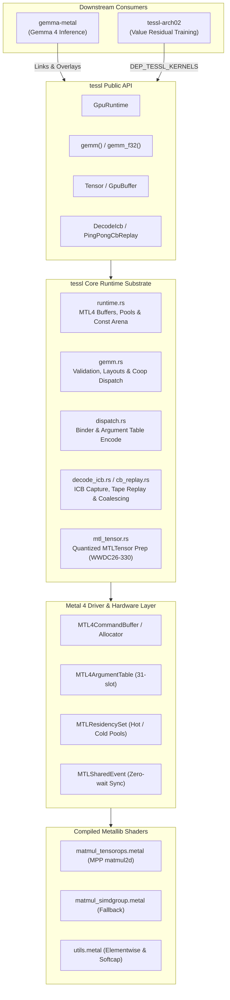
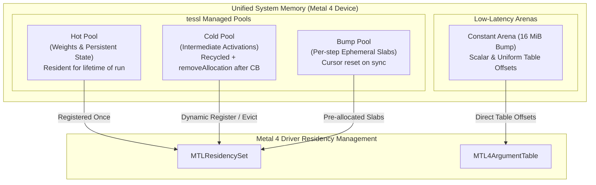
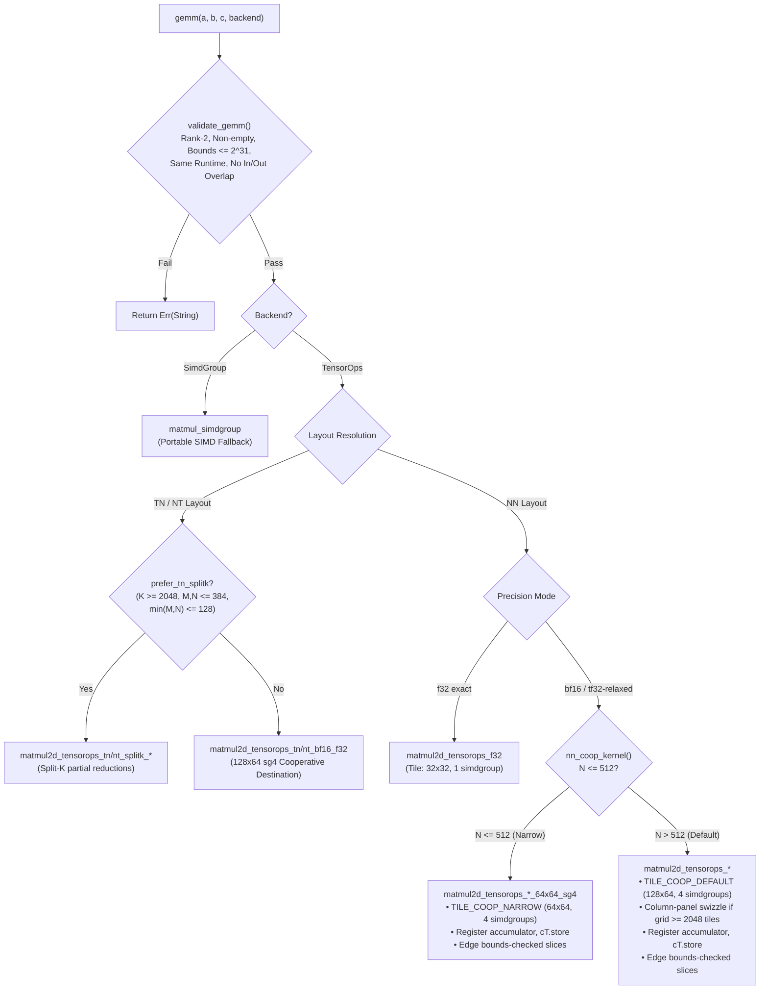

# tessl

**Low-overhead, zero-host-wait Metal 4 encode and GEMM runtime for Apple Silicon**, built on Metal Performance Primitives (MPP) TensorOps `matmul2d`.

`tessl` serves as the high-performance GPU substrate for neural network inference and training on Apple Silicon (e.g., [`gemma-metal`](../../gemma-metal/) and [`tessl-arch02`](../../arch_02_value_resid/metal-native/)).

---

## Key Highlights

- **Pure Metal 4 Architecture:** Built strictly for Metal 4 (`MTL4CommandBuffer`, `MTL4ComputeCommandEncoder`, `MTL4ArgumentTable`, `MTLResidencySet`). Legacy `MTLCommandQueue` and classic command buffer paths are deliberately absent.
- **Hardware-Accelerated GEMM:** Native integration with MPP TensorOps `matmul2d` across NN, TN, and NT layouts in `f32`, `bf16` (with `f32` accumulate), and `tf32-relaxed` precision modes.
- **Cooperative Register Accumulators:** High-throughput cooperative destination kernels (`get_destination_cooperative_tensor`) holding `f32` accumulators in GPU registers across the entire $K$-reduction, eliminating device memory round-trips for NN, TN, NT, and accumulating paths.
- **In-Kernel Grid Swizzling & Bounds Checking:** Column-panel tile swizzling for large grids ($\ge 2048$ tiles) bounding operand rereads, combined with origin-shifted slice bounds checking for ragged edges.
- **Zero-Wait Execution Pipeline:** Packed command encoding with bump-allocated constant arenas (16 MiB) and `MTLSharedEvent` synchronization—host threads never block mid-step.
- **Neural-Network Kernel Library:** 44 model-agnostic kernels — RMSNorm, gated MLP activations, flash attention (sliding-window $h{=}128/256$, global $h{=}512$), fused RMSNorm+QKV+RoPE, MLX-format Q4 GEMV/GEMM, Q8 GEMV, KV-cache stores, embedding lookup, and softcap/argmax sampling. These were promoted out of `gemma-metal`, where they were reachable only as raw strings through an overlay metallib.
- **Decode ICB Capture & Replay:** Low-latency Indirect Command Buffer (ICB) capture and ping-pong replay with freeze-binds and range-batching for decode-shaped inference workloads.

> [!IMPORTANT]
> **Platform Requirements:**
> - **OS:** macOS 26+
> - **Toolchain:** Xcode 26 with the Metal Toolchain component (`xcodebuild -downloadComponent MetalToolchain`).
> - **Hardware:** Apple Silicon GPU with Neural Accelerators (Apple M-series) for the MPP TensorOps path. A portable `simdgroup_matrix` fallback is available for A/B testing, but is 2–3× slower.

---

## System Architecture



---

## Module Overview

| Module | Purpose & Implementation Details |
|---|---|
| [`gemm`](src/gemm.rs) | TensorOps `matmul2d` GEMM — NN, TN, and NT layouts; plain and accumulating; `f32`, `tf32-relaxed`, and `bf16→f32`; split-$K$; register-resident cooperative accumulators (`TILE_COOP_DEFAULT`, `TILE_COOP_NARROW`, `TILE_COOP_TN_NT`, `TILE_COOP_ACCUM`); column-panel grid swizzle; Morton 1D threadgroup dispatch walk. |
| [`runtime`](src/runtime.rs) | Device initialization, Metal 4 command buffer and compute command encoder orchestration, residency sets, `Hot` / `Cold` / `Bump` buffer pools, packed binder scoping, 16 MiB bump constant arena, and `MTLSharedEvent` synchronization. |
| [`dispatch`](src/dispatch.rs) | Metal 4 argument-table binding (`MTL4ArgumentTable`), constant staging cursor tracking, and 1D / 2D / 3D dispatch helpers. |
| [`tensor`](src/tensor.rs) | Bounds-checked `GpuBuffer` / `Tensor` representations, multi-dimensional shape views, stride handling, and data types (`F32`, `Bf16`). |
| [`ops`](src/ops.rs) | Elementwise utility launches (e.g., `softcap_f32`, activation scaling). |
| [`nn`](src/nn.rs) | Neural-network kernels promoted out of `gemma-metal`: RMSNorm (`f32`, `bf16`, fused residual-add with layer scale), gated MLP activations (SiLU, `gelu_pytorch_tanh`), Q8 GEMV, KV-cache timestep stores and ring densify. Every entry point validates operand extents on the host before encoding. |
| [`npy`](src/npy.rs) | NumPy `.npy` binary serialization for validating GPU buffer outputs directly against host CPU references. |
| [`decode_icb`](src/decode_icb.rs) | Indirect Command Buffer (ICB) capture, command stream tracing, freeze-bind argument management, and execution batching. |
| [`cb_replay`](src/cb_replay.rs) | Ping-pong command buffer replay harness for decode-heavy token generation loops. |
| [`infer_trace`](src/infer_trace.rs) | Execution tracing, timing hooks, and kernel profiling probes. |
| [`mtl_tensor`](src/mtl_tensor.rs) | Quantized `MTLTensor` preparation (`Int8`, `Int4`, `Fp8E8M0`) for WWDC26-330 — gated behind the `quant-prep` feature. |

---

## Metal 4 Memory & Residency Hierarchy

`tessl` manages GPU memory allocations explicitly to eliminate mid-command buffer host stalls and memory thrashing.



### Memory Allocation Policies

- **`BufferKind::Hot`**: Persistent allocations (model weights, optimizer state, KV cache banks). Added to the `MTLResidencySet` once at initialization and retained across steps.
- **`BufferKind::Cold`**: Intermediate activations. Managed via an active freelist pool with a default 2 GiB cap (`DEFAULT_POOL_CACHE_BYTES`). Unused slabs are evicted via `removeAllocation` upon command buffer completion.
- **`BufferKind::Bump`**: Ephemeral scratch memory allocated linearly from pre-committed slabs. Bump cursors are reset at synchronization points without individual buffer deallocations.
- **Constant Arena (16 MiB)**: Eliminates per-dispatch host allocation overhead for scalars and small metadata buffers by writing directly into a shared staging buffer at 16-byte aligned offsets.

> [!NOTE]
> Steady-state execution never synchronizes with the host CPU during forward or backward passes. Synchronization occurs strictly at log, loss, or evaluation boundaries via [`GpuRuntime::synchronize`](src/runtime.rs).

---

## GEMM Pipeline & Kernel Selection

The core GEMM engine in `tessl` dynamically selects the most optimal kernel based on layout, precision, and matrix geometry.



### Cooperative Destination Tile Execution

All production `bf16` and `tf32-relaxed` kernels utilize cooperative destination tensors:
1. **Register Accumulation:** `op.template get_destination_cooperative_tensor<...>()` maintains the full `f32` accumulator in hardware SIMDgroup registers across the entire $K$-reduction loop.
2. **Zero Pre-Zero Overhead:** Register accumulators are initialized via `.set(i, 0.0f)` in shader code. The host-side `zero_f32(C)` pre-pass is completely eliminated.
3. **Single Store to Memory:** Device memory $C$ is written **exactly once** (`cT.store(tC)`) at threadgroup termination.
4. **Ragged Edge Handling:** Boundary tiles use origin-shifted full-extent tensor slices (`mA.slice(...)`, `mB.slice(...)`, `mC.slice(...)`), executing the same cooperative register accumulation without dropping tail elements.
5. **Column-Panel Grid Swizzling:** For large dispatch grids ($\text{tiles}_n \times \text{tiles}_m \ge 2048$), threadgroups are swizzled into 8-tile-row bands to bound operand $B$ cache rereads, delivering $+11\%$ throughput at $4096^3$.

---

## Indirect Command Buffer (ICB) Decode Pipeline

For auto-regressive generation where kernel execution times approach dispatch overheads, `tessl` provides Indirect Command Buffer (ICB) capture and tape replay.


### ICB Optimizations

- **Freeze-Binds (`TESSL_ICB_FREEZE_BINDS=1`):** Inlines buffer bindings and threadgroup memory directly into the ICB commands, reducing host `setArgumentTable` invocations to zero at replay time.
- **Range-Batching (`TESSL_ICB_RANGE_BATCH=1`):** Coalesces contiguous command spans between execution barriers into unified `executeCommandsInBuffer:withRange:` calls.
- **Coarse Barriers (`TESSL_COARSE_BARRIERS=1`):** Elides redundant inter-command barriers when memory access footprints across successive passes are demonstrably disjoint.

---

## Performance vs. PyTorch MPS

Measurements taken on Apple M5 Pro utilizing `bench/paired_cross_runtime.py`. The benchmark harness interleaves `tessl` and PyTorch MPS iterations round-by-round to cancel GPU thermal throttling and frequency scaling drift.

*Geomean of per-shape medians over 5 rounds across an 8-shape ladder:*

| Precision Mode | vs. PyTorch MPS | Worst Shape | Best Shape | Peak Throughput (M5 Pro) |
|---|---|---|---|---|
| **bf16 → f32 accumulate** | **1.11×** *(Outperforms MPS)* | 1.01× | 1.22× | **29,022 GFLOP/s** (`square_4096`) |
| **f32 exact** | **1.07×** | 0.92× | 1.47× | **10,897 GFLOP/s** (`square_2048`) |
| **tf32-relaxed vs. PyTorch f32** | **2.01×** | 1.49× | 2.90× | **18,040 GFLOP/s** (`square_4096`) |

> [!WARNING]
> **Benchmarking Rigor:**
> - **Clock Drift:** Single-run cross-runtime benchmarks can fluctuate by 15–20% on identical workloads due to Apple Silicon dynamic power governor adjustments. Always use paired, interleaved sweeps (`bench_gemm_tnnt_tune` or `paired_cross_runtime.py`).
> - **Dispatch Floor:** Below ~2 GFLOP of total work, both runtimes hit a ~0.25 ms host submit-and-wait floor, measuring host driver dispatch latency rather than raw shader throughput.

---

## Quickstart Guide

Both snippets below are compiled and run as examples, so they cannot drift from
the API:

```bash
cargo run --release --example gemm      # the GEMM quickstart
cargo run --release --example nn_layer  # RMSNorm -> gate/up -> GELU -> residual
```

### Basic GEMM Usage

```rust
use tessl::{gemm, GemmBackend, GpuRuntime, PrecisionMode};

fn main() -> Result<(), Box<dyn std::error::Error>> {
    // 1. Initialize Metal 4 GPU runtime
    let rt = GpuRuntime::new()?;

    // 2. Allocate tensors on the GPU
    let a = rt.alloc_tensor_f32(&[4096, 2304])?;
    let b = rt.alloc_tensor_f32(&[2304, 768])?;
    let c = rt.alloc_tensor_f32(&[4096, 768])?;

    // 3. Dispatch GEMM: C = A @ B via MPP TensorOps
    gemm(&a, &b, &c, GemmBackend::TensorOps)?;

    // 4. Synchronize GPU work to host
    rt.synchronize()?;
    
    Ok(())
}
```

### Consuming Kernels from Downstream Crates

Downstream crates building their own `default.metallib` can directly compile `tessl` shaders without copying source files. `tessl` exports `DEP_TESSL_KERNELS` via `links = "tessl"`.

In downstream `build.rs`:
```rust
let tessl_kernels = std::path::PathBuf::from(std::env::var("DEP_TESSL_KERNELS").unwrap());
let matmul_shader = tessl_kernels.join("matmul_tensorops.metal");
// Compile matmul_shader into your custom metallib...
```

To overlay custom metallibs onto `tessl` at runtime:
```rust
use std::path::Path;

// Initialize from a standalone metallib:
let rt = GpuRuntime::from_metallib_path(Path::new("/path/to/custom.metallib"))?;

// Or overlay onto tessl's default library. Pipeline names must be unique
// across the primary library and every overlay: `pipeline()` resolves the
// primary first, so a duplicate name in an overlay is silently unreachable.
let rt = GpuRuntime::new()?;
rt.add_metallib(Path::new("/path/to/custom_overlay.metallib"))?;
```

---

## Verification & Hardening Suite

```bash
# Run unit and integration tests (single-threaded for GPU context safety)
cargo test --release --lib -- --test-threads=1

# Validate static TileGeom definitions against compiled Metal kernel constants
python3 scripts/audit_gemm_tiles.py

# Run randomized adversarial shape fuzzing (with self-asserting kernel coverage)
# Quick fuzz (160 cases) runs as part of the ordinary suite:
cargo test --release --lib -- --test-threads=1 --nocapture gemm_fuzz_quick

# Deep soak (2500 cases), #[ignore]d so it stays out of the default run:
cargo test --release --lib -- --ignored --test-threads=1 --nocapture gemm_fuzz_deep

# Replay a specific failing seed:
STRESS_SEED=0xdeadbeef cargo test --release --lib -- --test-threads=1 gemm_fuzz_quick
```

### Static Tile Audit (`scripts/audit_gemm_tiles.py`)
Cross-references every Rust `TileGeom` struct against the `constexpr int SM/SN` parameters compiled into `matmul_tensorops.metal`, including macro-instantiated kernels (`NN_COOP_KERNEL`, `TN_NT_COOP_KERNEL`). A mismatch would cause the host to dispatch incorrect threadgroup grids, silently leaving output tiles unwritten.

### Self-Asserting Shape Fuzzer
`gemm_fuzz_quick` / `gemm_fuzz_deep` validate numerical correctness across non-standard matrix dimensions, reporting the failing seed so it can be replayed via `STRESS_SEED`.

> [!NOTE]
> An earlier version of this section claimed the fuzzer "asserts its own coverage — the test panics if any selectable NN kernel is exercised in fewer than 1% of fuzz iterations". No such assertion is implemented. It named a test (`gemm_randomized_shape_fuzz`) and environment variables (`GEMM_FUZZ_SEED`, `GEMM_FUZZ_CASES`) that do not exist either, so the documented command ran zero tests and reported success. Per-kernel coverage accounting would be worth adding; until it is, the fuzzer checks correctness on the shapes it happens to draw and nothing more.

> [!CAUTION]
> GPU tests are not thread-safe across concurrent OS threads sharing default command encoders. Always specify `--test-threads=1` when running `cargo test`.

---

## Benchmarking & Tuning Binaries

Tuning and A/B verification kernels (92 measurement variants) are excluded from the default metallib to keep release binaries lightweight (0.20 MB vs. 1.07 MB).

To build with tuning kernels enabled:
```bash
TESSL_GEMM_TUNE=1 cargo build --release --bins
```

| Binary | Description & Usage |
|---|---|
| `bench_gemm_tnnt_tune` | TN/NT tile sweep; the paired, round-interleaved A/B comparison lane. |
| `bench_gemm_tile_tune` | Exhaustive tile geometry ($SM \times SN$) and $BK$ ladder benchmark. |
| `bench_gemm_tnnt_tune` | Paired A/B tuning evaluation for TN/NT descriptor and accumulate kernels. |
| `bench_gemm_sweep` | Automated cross-runtime sweep (`f32`, `tf32`, `bf16`) with JSON telemetry output. |
| `probe_gemm_parity` | Bit-exact verification probe comparing TensorOps against reference SIMD implementations. |
| `bench/paired_cross_runtime.py` | Python harness driving paired `tessl` vs. PyTorch MPS / MLX evaluation. |

---

## Environment Variables Reference

All runtime configuration parameters use the canonical `TESSL_*` prefix. Legacy `METAL_RUNTIME_*` and `METAL_NATIVE_*` variants are supported for backwards compatibility.

| Environment Variable | Default | Description |
|---|---|---|
| `TESSL_GEMM_TUNE` | `0` | Compiles extended 92-kernel A/B tuning suite into metallib (build-time). |
| `TESSL_GEMM_ACCUM` | `0` | Enables native TensorOps `multiply_accumulate` for TN/NT accumulate paths. |
| `TESSL_GEMM_ACCUM_DX` | `0` | Enables hardware accumulate path specifically for $dX$ NT GEMM. |
| `TESSL_GEMM_INTERIOR` | `0` | Enables interior-offset tile optimizations for `f32` GEMM. |
| `TESSL_HAZARD_BARRIERS` | `0` (barriers on) | **Unsafe, do not enable.** `1` *removes* the always-on Dispatch→Dispatch device barrier. The sense is the opposite of what this row said until 2026-08-31, and following the old wording to "enforce barriers" removed them. Enabling it requires the caller to place an explicit `Binder::barrier` at every RAW edge, and tessl's own ops do not: measured on an M5 Pro, `gemm_tn_accum_train` 64×64×128 under async encode produced wrong results in **300 of 300** repetitions with this set, and `stress_mapping_reentry_and_queued_copies` fails 3/3. |
| `TESSL_COARSE_BARRIERS` | inherits `TESSL_HAZARD_BARRIERS` | Replaces per-RAW barriers with coarse phase-level synchronization. |
| `TESSL_MID_COMMIT=N` | `0` | Overlaps host command encoding with GPU execution every $N$ dispatches. |
| `TESSL_DECODE_ICB` | `0` | Enables Indirect Command Buffer capture and execution path. |
| `TESSL_ICB_FREEZE_BINDS` | `0` | Freezes argument table buffer bindings directly into ICB commands. |
| `TESSL_ICB_RANGE_BATCH` | `0` | Coalesces contiguous ICB command ranges into single execution dispatches. |
| `TESSL_SKIP_AOT` | `0` | Bypasses `build.rs` AOT shader compilation and reuses existing `default.metallib`. |

---

## Feature Flags

| Feature | Default | Description |
|---|---|---|
| `quant-prep` | **Disabled** | Compiles `mtl_tensor` for native quantized `MTLTensor` bindings (WWDC26-330). Kept off by default until Apple NAX hardware dequantization APIs stabilize in public SDKs. |

---

## Reference Documentation

- [`../../docs/gemm_architecture.md`](../../docs/gemm_architecture.md): Deep-dive into cooperative accumulator gates, $K$-reduction bandwidth analysis, and arithmetic proofs.
- [`../../docs/metal4_mpp.md`](../../docs/metal4_mpp.md): Low-level Metal 4 and Metal Performance Primitives integration guidelines.
- [`bench/results/bf16_tile_tune_FINDINGS.md`](bench/results/bf16_tile_tune_FINDINGS.md): Empirical tuning log documenting $BK$ ladder benchmarks, root causes, and landed M5 Pro speedups.

---

## 🔗 Fused GEMM epilogue

`gemm_epilogue` computes `C = activation(alpha * A@B + beta * C_prev + bias)` in one dispatch.

Every term there is otherwise a separate kernel that reads all of `C` and writes all of `C`. A bias plus an activation costs two extra full round-trips through device memory — on a bandwidth-bound machine, most of what the GEMM saved. Applied inside the cooperative-destination kernel the accumulator is still in registers, so `C` is written exactly once and read at most once, only when `beta != 0`.

```rust
use tessl::{gemm_epilogue, Activation, Epilogue, GemmBackend};

gemm_epilogue(&a, &b, &c, GemmBackend::TensorOps, Epilogue {
    alpha: 1.0,
    beta: 0.0,                 // skips reading C entirely
    bias: Some(&bias),         // per-column, length N
    activation: Activation::GeluTanh,
})?;
```

Bias is per-column and broadcasts across rows through a **row-stride-0 tensor view**, so the same cooperative `load` that fetches `C_prev` fetches the bias with no separate indexing.

| shape | `gemm` | fused | `gemm` + one pass over C | epilogue cost | vs one pass |
|---|---:|---:|---:|---:|---:|
| 512³ | 0.377 ms | 0.558 ms | 0.661 ms | 0.181 ms | **1.57× cheaper** |
| 1024³ | 0.471 ms | 0.584 ms | 0.746 ms | 0.113 ms | **2.43× cheaper** |
| 2048×2048×512 | 0.916 ms | 1.139 ms | 1.297 ms | 0.223 ms | **1.71× cheaper** |

`cargo run --release --example epilogue_cost`. The comparison arm is `gemm` plus a *single* `add_inplace_f32` sweep — strictly less work than a real bias broadcast, and half the work of bias plus a separate activation. Fusing beats even that lower bound at every shape. All three arms are GPU-side in one interleaved run, so the machine's load average of 52 during measurement affects them alike.

`Activation::GeluTanh` is the same clamped `precise::tanh` formulation as `nn::mlp_gelu_tanh`, deliberately copied rather than re-derived: at `-O2` MSL lowers plain `tanh` to `air.fast_tanh`, which returns NaN past roughly |10|, and a crate with two different GELUs would be a worse defect than a slow one.

It requires the cooperative-destination path — bf16 operands, or f32 with relaxed precision. The exact-f32 and simdgroup kernels write `C` straight from the matmul with no register accumulator, so there is nothing to fuse into; those are refused rather than silently falling back to separate dispatches, which would make the call quietly slower than the unfused code it replaced.

---

## 🧭 Known gaps

Recorded rather than implied. All kernels are wired to a typed Rust API, the suite is warning-free, and there are no stubs; these are capabilities the crate does not have. **The fused epilogue shipped** — see [Fused GEMM epilogue](#-fused-gemm-epilogue).

| Gap | Why it matters | Why not yet |
|---|---|---|
| **No batched / strided GEMM** | Attention *is* batched matmul. `gemm(a, b, c, backend)` has no batch dimension. | Needs a strided-descriptor pass over the TensorOps entry points, not a wrapper. |
| **No f16** | Only f32 and bf16, so every PyTorch MPS interop boundary pays a cast. | Mechanical, but it doubles the tile-tuning matrix that `bench_gemm_tile_tune` already covers slowly. |
| **Quantized TensorOps GEMM** | The `quant-prep` module allocates real `MTLTensor`s but there is no quantized matmul. | `MTLTensorDataType::Int4` is unbound in objc2-metal 0.3, so the dtype cannot be named. `QUANT_PREFILL_GEMM_WIRED` reports this. |
| **No CPU fallback** | No Metal 4 device means nothing runs. | Deliberate: the crate is an Apple-silicon runtime, and a silent CPU path would make "GPU" benchmarks meaningless. |

The typed `nn` API covers 11 kernels in depth (RMSNorm, MLP gating, Q8 GEMV, KV stores) and the remaining promoted ones through shape-checked entry points; the MLX Q4 family is reached via `Q4MlxBank` rather than 15 separate signatures.

---

## License

Licensed under either of:

- Apache License, Version 2.0 ([`LICENSE-APACHE`](LICENSE-APACHE))
- MIT License ([`LICENSE-MIT`](LICENSE-MIT))

at your option.
