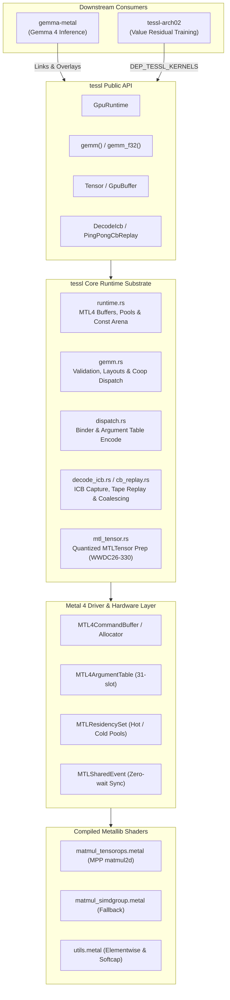
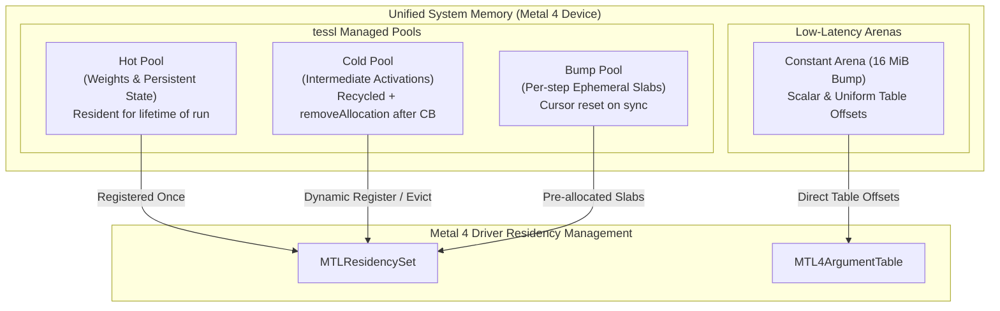
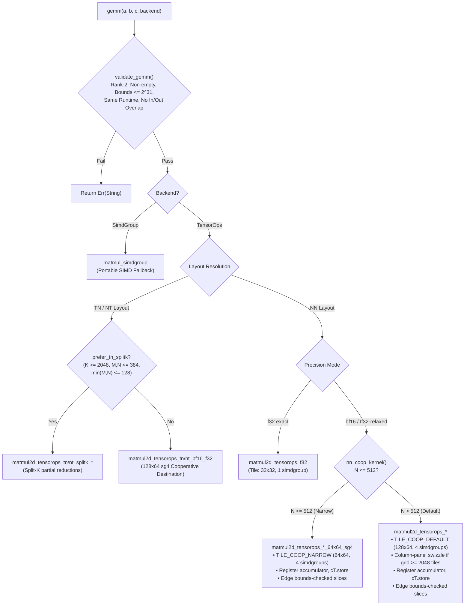

# tessl

**Low-overhead, zero-host-wait Metal 4 encode and GEMM runtime for Apple Silicon**, built on Metal Performance Primitives (MPP) TensorOps `matmul2d`.

`tessl` serves as the high-performance GPU substrate for neural network inference and training on Apple Silicon (e.g., [`gemma-metal`](../../gemma-metal/) and [`tessl-arch02`](../../arch_02_value_resid/metal-native/)).

---

## Key Highlights

- **Pure Metal 4 Architecture:** Built strictly for Metal 4 (`MTL4CommandBuffer`, `MTL4ComputeCommandEncoder`, `MTL4ArgumentTable`, `MTLResidencySet`). Legacy `MTLCommandQueue` and classic command buffer paths are deliberately absent.
- **Hardware-Accelerated GEMM:** Native integration with MPP TensorOps `matmul2d` across NN, TN, and NT layouts in `f32`, `bf16` (with `f32` accumulate), and `tf32-relaxed` precision modes.
- **Cooperative Register Accumulators:** High-throughput cooperative destination kernels (`get_destination_cooperative_tensor`) holding `f32` accumulators in GPU registers across the entire $K$-reduction, eliminating device memory round-trips for NN, TN, NT, and accumulating paths.
- **In-Kernel Grid Swizzling & Bounds Checking:** Column-panel tile swizzling for large grids ($\ge 2048$ tiles) bounding operand rereads, combined with origin-shifted slice bounds checking for ragged edges.
- **Zero-Wait Execution Pipeline:** Packed command encoding with bump-allocated constant arenas (16 MiB) and `MTLSharedEvent` synchronization—host threads never block mid-step.
- **Neural-Network Kernel Library:** 44 model-agnostic kernels — RMSNorm, gated MLP activations, flash attention (sliding-window $h{=}128/256$, global $h{=}512$), fused RMSNorm+QKV+RoPE, MLX-format Q4 GEMV/GEMM, Q8 GEMV, KV-cache stores, embedding lookup, and softcap/argmax sampling. These were promoted out of `gemma-metal`, where they were reachable only as raw strings through an overlay metallib.
- **Decode ICB Capture & Replay:** Low-latency Indirect Command Buffer (ICB) capture and ping-pong replay with freeze-binds and range-batching for decode-shaped inference workloads.

> [!IMPORTANT]
> **Platform Requirements:**
> - **OS:** macOS 26+
> - **Toolchain:** Xcode 26 with the Metal Toolchain component (`xcodebuild -downloadComponent MetalToolchain`).
> - **Hardware:** Apple Silicon GPU with Neural Accelerators (Apple M-series) for the MPP TensorOps path. A portable `simdgroup_matrix` fallback is available for A/B testing, but is 2–3× slower.

---

## System Architecture



---

## Module Overview

| Module | Purpose & Implementation Details |
|---|---|
| [`gemm`](src/gemm.rs) | TensorOps `matmul2d` GEMM — NN, TN, and NT layouts; plain and accumulating; `f32`, `tf32-relaxed`, and `bf16→f32`; split-$K$; register-resident cooperative accumulators (`TILE_COOP_DEFAULT`, `TILE_COOP_NARROW`, `TILE_COOP_TN_NT`, `TILE_COOP_ACCUM`); column-panel grid swizzle; Morton 1D threadgroup dispatch walk. |
| [`runtime`](src/runtime.rs) | Device initialization, Metal 4 command buffer and compute command encoder orchestration, residency sets, `Hot` / `Cold` / `Bump` buffer pools, packed binder scoping, 16 MiB bump constant arena, and `MTLSharedEvent` synchronization. |
| [`dispatch`](src/dispatch.rs) | Metal 4 argument-table binding (`MTL4ArgumentTable`), constant staging cursor tracking, and 1D / 2D / 3D dispatch helpers. |
| [`tensor`](src/tensor.rs) | Bounds-checked `GpuBuffer` / `Tensor` representations, multi-dimensional shape views, stride handling, and data types (`F32`, `Bf16`). |
| [`ops`](src/ops.rs) | Elementwise utility launches (e.g., `softcap_f32`, activation scaling). |
| [`nn`](src/nn.rs) | Neural-network kernels promoted out of `gemma-metal`: RMSNorm (`f32`, `bf16`, fused residual-add with layer scale), gated MLP activations (SiLU, `gelu_pytorch_tanh`), Q8 GEMV, KV-cache timestep stores and ring densify. Every entry point validates operand extents on the host before encoding. |
| [`npy`](src/npy.rs) | NumPy `.npy` binary serialization for validating GPU buffer outputs directly against host CPU references. |
| [`decode_icb`](src/decode_icb.rs) | Indirect Command Buffer (ICB) capture, command stream tracing, freeze-bind argument management, and execution batching. |
| [`cb_replay`](src/cb_replay.rs) | Ping-pong command buffer replay harness for decode-heavy token generation loops. |
| [`infer_trace`](src/infer_trace.rs) | Execution tracing, timing hooks, and kernel profiling probes. |
| [`mtl_tensor`](src/mtl_tensor.rs) | Quantized `MTLTensor` preparation (`Int8`, `Int4`, `Fp8E8M0`) for WWDC26-330 — gated behind the `quant-prep` feature. |

---

## Metal 4 Memory & Residency Hierarchy

`tessl` manages GPU memory allocations explicitly to eliminate mid-command buffer host stalls and memory thrashing.



### Memory Allocation Policies

- **`BufferKind::Hot`**: Persistent allocations (model weights, optimizer state, KV cache banks). Added to the `MTLResidencySet` once at initialization and retained across steps.
- **`BufferKind::Cold`**: Intermediate activations. Managed via an active freelist pool with a default 2 GiB cap (`DEFAULT_POOL_CACHE_BYTES`). Unused slabs are evicted via `removeAllocation` upon command buffer completion.
- **`BufferKind::Bump`**: Ephemeral scratch memory allocated linearly from pre-committed slabs. Bump cursors are reset at synchronization points without individual buffer deallocations.
- **Constant Arena (16 MiB)**: Eliminates per-dispatch host allocation overhead for scalars and small metadata buffers by writing directly into a shared staging buffer at 16-byte aligned offsets.

> [!NOTE]
> Steady-state execution never synchronizes with the host CPU during forward or backward passes. Synchronization occurs strictly at log, loss, or evaluation boundaries via [`GpuRuntime::synchronize`](src/runtime.rs).

---

## GEMM Pipeline & Kernel Selection

The core GEMM engine in `tessl` dynamically selects the most optimal kernel based on layout, precision, and matrix geometry.



### Cooperative Destination Tile Execution

All production `bf16` and `tf32-relaxed` kernels utilize cooperative destination tensors:
1. **Register Accumulation:** `op.template get_destination_cooperative_tensor<...>()` maintains the full `f32` accumulator in hardware SIMDgroup registers across the entire $K$-reduction loop.
2. **Zero Pre-Zero Overhead:** Register accumulators are initialized via `.set(i, 0.0f)` in shader code. The host-side `zero_f32(C)` pre-pass is completely eliminated.
3. **Single Store to Memory:** Device memory $C$ is written **exactly once** (`cT.store(tC)`) at threadgroup termination.
4. **Ragged Edge Handling:** Boundary tiles use origin-shifted full-extent tensor slices (`mA.slice(...)`, `mB.slice(...)`, `mC.slice(...)`), executing the same cooperative register accumulation without dropping tail elements.
5. **Column-Panel Grid Swizzling:** For large dispatch grids ($\text{tiles}_n \times \text{tiles}_m \ge 2048$), threadgroups are swizzled into 8-tile-row bands to bound operand $B$ cache rereads, delivering $+11\%$ throughput at $4096^3$.

---

## Indirect Command Buffer (ICB) Decode Pipeline

For auto-regressive generation where kernel execution times approach dispatch overheads, `tessl` provides Indirect Command Buffer (ICB) capture and tape replay.


### ICB Optimizations

- **Freeze-Binds (`TESSL_ICB_FREEZE_BINDS=1`):** Inlines buffer bindings and threadgroup memory directly into the ICB commands, reducing host `setArgumentTable` invocations to zero at replay time.
- **Range-Batching (`TESSL_ICB_RANGE_BATCH=1`):** Coalesces contiguous command spans between execution barriers into unified `executeCommandsInBuffer:withRange:` calls.
- **Coarse Barriers (`TESSL_COARSE_BARRIERS=1`):** Elides redundant inter-command barriers when memory access footprints across successive passes are demonstrably disjoint.

---

## Performance vs. PyTorch MPS and MLX

Apple M5 Pro, via [`bench/paired_cross_runtime.py`](bench/paired_cross_runtime.py).
The harness interleaves the tessl and comparison lanes **round by round** rather
than running each sweep once, because two single sweeps of the identical
benchmark disagreed by 16–21% on the torch lane alone — more than most of the
differences being reported. Every geomean below covers the **whole 8-shape
ladder**; the run aborts rather than averaging over the shapes that happened to
report. Artifact: [`bench/results/gemm_speed_ladder_m5pro.json`](bench/results/gemm_speed_ladder_m5pro.json).

*Geomean of per-shape medians, 5 alternating rounds × 30 iterations, 8 shapes:*

| Precision Mode | vs. torch MPS | worst shape | best shape | vs. MLX |
|---|---|---|---|---|
| **bf16 → f32 accumulate** | **1.00×** | 0.91× | 1.06× | 2.67× |
| **f32 exact** | **1.07×** | 0.90× | 1.62× | 0.98× |
| **tf32-relaxed** vs. their **f32** | **2.10×** | 1.61× | 2.31× | 1.94× |

| Lane | Peak GFLOP/s | at |
|---|---|---|
| `tensorops-bf16` | **26,702** | `square_4096` |
| `mps-bf16` | 26,104 | `mlp_up` |
| `tensorops-tf32` | **15,872** | `tall_k1024` |
| `mlx-bf16` | 6,850 | `tall_k1024` |
| `mlx-f32` | 6,665 | `mlp_up` |
| `mps-f32` | 6,524 | `mlp_up` |
| `tensorops-f32` | **6,492** | `mlp_down` |
| `simdgroup-f32` | 2,710 | `tall_k1024` |

> [!WARNING]
> **The bf16 row is a correction.** This table previously claimed **1.11×
> "(Outperforms MPS)"** for bf16. Re-measured over the full ladder it is
> **1.00×** (5 rounds), and **1.03×** on an independent 9-round × 40-iteration
> confirmation. tessl bf16 is at *parity* with torch MPS bf16, not ahead of it.
>
> The structure matters more than the geomean. Per shape, tessl bf16 wins only
> on the two smallest squares — 1.26× at 512³ and 1.34× at 1024³, both with
> per-round spreads reaching 2.15× and 3.38× — and sits at **0.86×–0.95× on
> `mlp_up`, `square_4096`, `qkv_proj` and `tall_k1024`**. The small squares are
> the dispatch-floor regime this file's own note warns about, so the geomean was
> being carried by exactly the shapes that measure host submit latency rather
> than shader throughput. On the shapes that determine training throughput,
> torch MPS bf16 is marginally ahead.

Reading the rest:

- **tf32-relaxed's 2.10×** is the one large, robust win, and it reproduces the
  previously recorded 2.01× within round-to-round noise. It is *not* a
  like-for-like comparison — see the accuracy section directly below.
- **f32 exact at 1.07×** also reproduces its prior figure, but the spread is
  wide (0.90×–1.62×) and the win is concentrated at 512³; from 2048³ up it is
  0.92×–1.06×, i.e. parity.
- **The 2.67× over MLX bf16 says more about MLX than about tessl.** MLX's bf16
  matmul peaks at 6,850 GFLOP/s here against torch MPS's 26,104 — roughly 4×
  slower — so it is the weak baseline of the two. torch MPS is the one worth
  measuring against, and there the honest answer is parity.
- **Absolute GFLOP/s did not reproduce** the previously recorded peaks (29,022
  bf16 / 10,897 f32 / 18,040 tf32). That is the quantity the paired design
  explicitly says not to compare across runs — thermal state and background load
  move it — which is why the ratios above are the durable claim and these peaks
  are reported only as same-run context.

> [!NOTE]
> **Benchmarking rigor.**
> - **Dispatch floor.** Below ~2 GFLOP of total work, both runtimes hit a
>   ~0.25 ms host submit-and-wait floor, measuring driver dispatch latency rather
>   than shader throughput. `square_512` is near that floor and its ratios should
>   not be read as kernel performance — see the bf16 correction above for what
>   happens when they are.
> - **Clock drift.** Single-run cross-runtime benchmarks fluctuate 15–20% on
>   identical workloads under the Apple Silicon power governor. Always use a
>   paired, interleaved sweep — `paired_cross_runtime.py` for cross-runtime, or
>   `bench_gemm_coop_ab` / `bench_gemm_tnnt_tune` for kernel-vs-kernel A/B.

## Flash attention

The three attention kernels had thorough correctness coverage and **no timing
lane at all**. [`bench_flash_attn`](src/bin/bench_flash_attn.rs) and
[`bench/attn_paired.py`](bench/attn_paired.py) closed that over 10 prefill and
decode configurations at 4:1 GQA — and the measurement found the kernels were
**11× slower than torch-MPS and 20.5× slower than MLX**, geomean, with a worst
case of 271×. Both causes are now fixed.

**Shipping path vs. the baselines, 5 alternating rounds × 20 iterations.
>1 means tessl is slower.**

| Config | torch before | torch after | MLX before | MLX after |
|---|---|---|---|---|
| `swa128_prefill_512` | 7.1× | **0.78×** | 9.4× | 1.21× |
| `swa128_prefill_2048` | 7.7× | **1.67×** | 8.1× | 1.67× |
| `swa128_prefill_4096` | 4.4× | **0.89×** | 4.8× | 0.94× |
| `swa256_prefill_2048` | 4.6× | **0.88×** | 8.6× | 1.66× |
| `global512_prefill_1024` | 35.1× | **1.59×** | 54.8× | 2.54× |
| `swa128_decode_1k` | 23.7× | **1.44×** | 27.0× | 2.40× |
| `swa128_decode_4k` | 14.6× | **0.89×** | 22.8× | 1.94× |
| `swa128_decode_b8_4k` | 2.7× | **0.30×** | 9.9× | 1.06× |
| `swa256_decode_4k` | 24.7× | **0.83×** | 47.3× | 1.95× |
| `global512_decode_4k` | 29.1× | **0.17×** | 271.1× | 1.69× |
| **GEOMEAN** | **11.0×** | **0.79×** | **20.5×** | **1.63×** |

Against torch-MPS the shipping path is now **faster than the baseline** on 8 of
10 configs; against MLX it is 1.63× slower, down from 20.5×. Artifacts:
[before](bench/results/attn_speed_m5pro.json),
[after](bench/results/attn_speed_routed_m5pro.json).

### What was wrong, and what replaced it

Both causes were visible at the dispatch in [`nn.rs`](src/nn.rs): a grid of
`ceil(Tq/BR) × B·H` threadgroups of **32 threads**, with the inner loops guarded
by `row_valid = lid < BR`.

**1. Decode was starved of parallelism.** No split over the KV axis, so
single-sequence decode launched `B·H` threadgroups — **8** for
`global512_decode_4k` — each walking a 4,096-key history serially, and at
`Tq = 1` only **one lane in 32** was row-valid. The slowdown tracked threadgroup
count almost monotonically: 8 → 271×, 16 → 47×, 32 → 27×, 256 → 10×.

→ [`flash_attn_decode.metal`](kernels/flash_attn_decode.metal), FlashDecoding:
one simdgroup per KV chunk, so the grid is `n_chunks × B·H`. Each chunk emits
`(m, l, acc[D])` and a second pass combines them with the exact rescale.

**2. Prefill had grid but not throughput.** `swa128_prefill_4096` launched
16,384 threadgroups and was still 4.8× slower than MLX, so occupancy was not the
binding constraint there — **8 of 32 lanes doing scalar FMAs** was. It ran at
**241 GFLOP/s, 3.7% of this machine's own f32 GEMM peak**, against MLX at 998.

→ [`flash_attn_rows.metal`](kernels/flash_attn_rows.metal): one simdgroup per
query *row*, lane `L` owning head dims `L, L+32, L+64, …`. Prefill went to
**984–1343 GFLOP/s**, 4.5–21× faster than the tiled kernel:

| Config | tiled | row-parallel | speedup | GFLOP/s |
|---|---|---|---|---|
| `swa128_prefill_512` | 10.6 ms | 1.65 ms | 6.4× | 203 → 1306 |
| `swa128_prefill_2048` | 123.5 ms | 23.3 ms | 5.3× | 209 → 1109 |
| `swa128_prefill_4096` | 293.5 ms | 61.1 ms | 4.8× | 205 → 984 |
| `swa256_prefill_2048` | 135.3 ms | 24.8 ms | 5.5× | 191 → 1039 |
| `global512_prefill_1024` | 177.7 ms | 8.3 ms | **21.4×** | 48 → 1036 |

Both new kernels share one design, and three properties do the work:

- **every lane is live**, and the K/V reads are one coalesced 128-byte line per
  simdgroup step;
- **the P@V accumulate needs no cross-lane communication** — each lane owns its
  own slice of the output row in registers, so there is no `Oacc` threadgroup
  array and no barrier around it;
- a score is one `simd_sum`, which every lane then holds, so the online-softmax
  state is uniform and the kernels are divergence free.

The row-parallel kernel gains a fourth: because a simdgroup owns *one* row
rather than a BR tile, it walks that row's exact key range. The tiled kernel had
to take the union window over its rows and mask inside it, so it iterated key
blocks that were fully masked for most of the tile. Here masked keys are never
visited.

### Routing

`flash_attn_swa` and `flash_attn_global_h512` now pick the kernel:

```rust
if tq == 1 && B*H < ATTN_SPLIT_KV_BELOW_TG { decode } else { rows }
```

The threshold is 128 threadgroups, measured rather than guessed: at `B·H = 8`
the KV split wins 0.59 ms against 2.29, at 16 it wins 0.61 against 0.68, at 32
the two are within noise, and at 256 the split *loses* 0.96 against 0.65 because
the grid is already full and its second pass is pure overhead.

The tiled kernels remain as [`flash_attn_swa_tiled`](src/nn.rs) /
`flash_attn_global_h512_tiled` — they are the A/B baseline the benchmark
measures against and the second opinion the tests score against, not dead code.
`TESSL_ATTN_TILED=1` forces them.

### Correctness

Both new paths are scored against the same f64 reference as everything else, and
match the kernel they replace to the digit (5.117e-07 vs 5.117e-07 at
`swa128_decode_4k`). [`tests/attention.rs`](tests/attention.rs) grew from 6 tests
to 12: seventeen shape/window/GQA cases across the two paths, `Tq` values that
straddle the rows-per-threadgroup boundary, windows narrower than one chunk,
cross-attention shapes where `Tq != Tkv`, fully-masked queries that must yield
zeros rather than `exp(-inf - -inf)` NaN, and two shader-constant cross-checks
(`KV_CHUNK`, `SG_PER_TG`) where a drift between the host's copy and the
shader's would silently drop rows or read partials at the wrong stride.

> [!NOTE]
> The existing `global_h512_is_causal_and_ignores_the_window` test caught a real
> regression during this work. The tiled h512 kernel has no `window` parameter,
> so that entry point's contract is to ignore one; the routed kernels take a
> `window` and treat 0 as global. Passing `dims` through unchanged would have
> given callers sliding-window attention from the global entry point. The global
> path now zeroes the window before routing.

---

### What each speed ratio costs in accuracy

A speed ratio is only a claim if the lane producing it is as correct as the lane
it is measured against, so the two are reported together.

[`bench/parity_ladder.py`](bench/parity_ladder.py) sweeps a grid of **8 shapes ×
5 operand distributions × 4 seeds = 320 scored cells per lane**, scoring each
against a float64 reference computed per cell, alongside MLX and torch on those
same operands. Artifact:
[`bench/results/gemm_parity_grid_m5pro.json`](bench/results/gemm_parity_grid_m5pro.json).

Three numbers are reported per lane, because they answer different questions and
disagree by orders of magnitude:

| Lane | Out | normwise | worst element | budget used |
|---|---|---|---|---|
| `tensorops-f32` | f32 | 5.109e-06 | 1.04e+02 | **0.079×** |
| `simdgroup-f32` / `mlx-f32` / `torch-mps-f32` | f32 | 5.109e-06 | 1.04e+02 | 0.079× |
| `tensorops-tf32` | f32 | 1.517e-03 | 2.94e+04 | **0.238×** |
| `tensorops-bf16` | f32 | 5.469e-03 | 3.08e+05 | **0.936×** |
| `mlx-bf16` / `torch-mps-bf16` | bf16 | 7.145e-03 | 3.08e+05 | 0.921× |

- **normwise** = max\|err\| / max\|ref\|. This is the only number this harness
  used to report, and the only one the table above used to carry.
- **worst element** = max per-element relative error. Where cancellation makes an
  output near zero, a bf16 result can be wrong by **3.08e+05 relative** while the
  normwise figure reads 5.5e-03. Both are correct; they describe different
  things, and quoting only the first invites the reader to conclude individual
  outputs are good to ~0.5%. They are not.
- **budget used** = the fraction of the per-element bound
  `(γ_{K+8} + 2·u_in)·Σ\|a·b\| + u_out·\|ref\|` that the lane consumes — the same
  bound [`tests/common/mod.rs`](tests/common/mod.rs) asserts against. **This is
  the number that decides pass or fail**, and exceeding 1.0 aborts the run.

#### The operand distribution is a benchmark input, and it dominates

The grid sweeps `uniform`, `normal`, `log_uniform`, `near_cancel` and
`heavy_tail`. Uniform operands — all this harness used to run — are the *easiest*
case: magnitudes sit within one order of each other, so every partial sum stays
well scaled. Budget consumed, worst cell per distribution:

| Lane | uniform | normal | log_uniform | near_cancel | heavy_tail | spread |
|---|---|---|---|---|---|---|
| `tensorops-f32` | 0.009× | 0.011× | 0.035× | 0.050× | 0.079× | **9.0×** |
| `tensorops-tf32` | 0.026× | 0.032× | 0.114× | 0.096× | 0.238× | **9.2×** |
| `tensorops-bf16` | 0.076× | 0.103× | 0.413× | 0.063× | **0.936×** | **14.9×** |

**bf16 runs at 93.6% of its error budget under heavy-tailed operands, and at
7.6% under uniform.** Reporting only the uniform figure understated budget
consumption by ~15× and left the impression of 92% headroom where the true worst
case has 6%. MLX and torch bf16 land at 0.921× on the same cell, so this is bf16
arithmetic reaching its theoretical bound rather than a tessl defect — but it is
a property of the format that a single-distribution benchmark could not see.

Note the two axes move in *opposite* directions: for f32, larger shapes consume
*less* budget (0.009× at 512³ down to 0.002× at 4096³, because the γ_K bound
grows faster than the realised error), while heavier-tailed operands consume
~9× more. Sweeping one axis alone is misleading in either direction.

Reading the three speed rows against these:

- **f32 exact — 1.07× is like-for-like.** `tensorops-f32` is **bit-identical** to
  torch-MPS and to the simdgroup fallback at every shape measured, and to MLX at
  1024/2048/4096 (MLX diverges only at `square_512`, where it is slightly *more*
  accurate — a different kernel path at small sizes). All four consume the same
  0.079× of budget.
- **bf16 → f32 accumulate — the accuracy edge over MLX/torch is real but small.**
  tessl is closer to the reference at every cell (normwise 5.47e-03 vs 7.15e-03),
  partly because it returns f32 where they return bf16, which is why the scorer
  records `out_dtype` per lane. On budget consumed the three are within 2%.
- **tf32-relaxed — 2.10× costs 0.238× of budget** against f32's 0.079×, i.e.
  ~3× the headroom consumed, and up to 2.94e+04 worst-element relative error.
  Sound for a tolerance-bearing workload, not a drop-in f32 result — which is
  why the mode is opt-in (`set_relaxed_precision`) rather than default.

> [!NOTE]
> Bit-inequality with another runtime is **not** an error signal here and is not
> scored. Reduced-precision lanes can never match f32 bit-for-bit by
> construction, and even two f32 lanes differ constantly from summation order
> alone: at M=N=256, K=1024, `probe_gemm_parity` reports 57,091 of 65,536
> elements differing between the TensorOps and CPU f32 lanes while both sit at
> max error 6.335e-5 against the f64 reference.

> [!IMPORTANT]
> **The parity path is fail-closed at every step.** `bench_gemm_sweep` pre-zeroes
> C so a lane that writes nothing scores as out-of-tolerance rather than
> inheriting the previous lane's result, refuses to dump a non-finite result or
> non-finite operands, and writes its `parity_manifest.json` *last and only on
> success*. The scorer exits non-zero on a missing lane, seed or grid cell, a
> shape mismatch, a non-finite value, a degenerate reference, a lane with no
> declared unit roundoff, or **any lane exceeding its per-element budget** — and
> when a budget is breached it names whether tessl alone, the comparison runtime
> alone, or every runtime exceeded it, because those call for opposite responses.
>
> [`bench/test_parity_harness.py`](bench/test_parity_harness.py) holds **56
> assertions** against that whole class — adversarial dumps, grid-merge cases,
> budget verdicts and CLI/env contracts. Only the CLI section needs a GPU:
>
> ```bash
> python3 bench/test_parity_harness.py
> ```

---

## Quickstart Guide

Both snippets below are compiled and run as examples, so they cannot drift from
the API:

```bash
cargo run --release --example gemm      # the GEMM quickstart
cargo run --release --example nn_layer  # RMSNorm -> gate/up -> GELU -> residual
```

### Basic GEMM Usage

```rust
use tessl::{gemm, GemmBackend, GpuRuntime, PrecisionMode};

fn main() -> Result<(), Box<dyn std::error::Error>> {
    // 1. Initialize Metal 4 GPU runtime
    let rt = GpuRuntime::new()?;

    // 2. Allocate tensors on the GPU
    let a = rt.alloc_tensor_f32(&[4096, 2304])?;
    let b = rt.alloc_tensor_f32(&[2304, 768])?;
    let c = rt.alloc_tensor_f32(&[4096, 768])?;

    // 3. Dispatch GEMM: C = A @ B via MPP TensorOps
    gemm(&a, &b, &c, GemmBackend::TensorOps)?;

    // 4. Synchronize GPU work to host
    rt.synchronize()?;
    
    Ok(())
}
```

### Consuming Kernels from Downstream Crates

Downstream crates building their own `default.metallib` can directly compile `tessl` shaders without copying source files. `tessl` exports `DEP_TESSL_KERNELS` via `links = "tessl"`.

In downstream `build.rs`:
```rust
let tessl_kernels = std::path::PathBuf::from(std::env::var("DEP_TESSL_KERNELS").unwrap());
let matmul_shader = tessl_kernels.join("matmul_tensorops.metal");
// Compile matmul_shader into your custom metallib...
```

To overlay custom metallibs onto `tessl` at runtime:
```rust
use std::path::Path;

// Initialize from a standalone metallib:
let rt = GpuRuntime::from_metallib_path(Path::new("/path/to/custom.metallib"))?;

// Or overlay onto tessl's default library. Pipeline names must be unique
// across the primary library and every overlay: `pipeline()` resolves the
// primary first, so a duplicate name in an overlay is silently unreachable.
let rt = GpuRuntime::new()?;
rt.add_metallib(Path::new("/path/to/custom_overlay.metallib"))?;
```

---

## Verification & Hardening Suite

```bash
# Run unit and integration tests (single-threaded for GPU context safety)
cargo test --release --lib -- --test-threads=1

# Validate static TileGeom definitions against compiled Metal kernel constants
python3 scripts/audit_gemm_tiles.py

# Run randomized adversarial shape fuzzing (with self-asserting kernel coverage)
# Quick fuzz (160 cases) runs as part of the ordinary suite:
cargo test --release --lib -- --test-threads=1 --nocapture gemm_fuzz_quick

# Deep soak (2500 cases), #[ignore]d so it stays out of the default run:
cargo test --release --lib -- --ignored --test-threads=1 --nocapture gemm_fuzz_deep

# Replay a specific failing seed:
STRESS_SEED=0xdeadbeef cargo test --release --lib -- --test-threads=1 gemm_fuzz_quick
```

### Static Tile Audit (`scripts/audit_gemm_tiles.py`)
Cross-references every Rust `TileGeom` struct against the `constexpr int SM/SN` parameters compiled into `matmul_tensorops.metal`, including macro-instantiated kernels (`NN_COOP_KERNEL`, `TN_NT_COOP_KERNEL`). A mismatch would cause the host to dispatch incorrect threadgroup grids, silently leaving output tiles unwritten.

### Self-Asserting Shape Fuzzer
`gemm_fuzz_quick` / `gemm_fuzz_deep` validate numerical correctness across non-standard matrix dimensions, reporting the failing seed so it can be replayed via `STRESS_SEED`.

> [!NOTE]
> An earlier version of this section claimed the fuzzer "asserts its own coverage — the test panics if any selectable NN kernel is exercised in fewer than 1% of fuzz iterations". No such assertion is implemented. It named a test (`gemm_randomized_shape_fuzz`) and environment variables (`GEMM_FUZZ_SEED`, `GEMM_FUZZ_CASES`) that do not exist either, so the documented command ran zero tests and reported success. Per-kernel coverage accounting would be worth adding; until it is, the fuzzer checks correctness on the shapes it happens to draw and nothing more.

> [!CAUTION]
> GPU tests are not thread-safe across concurrent OS threads sharing default command encoders. Always specify `--test-threads=1` when running `cargo test`.

---

## Benchmarking & Tuning Binaries

Tuning and A/B verification kernels (92 measurement variants) are excluded from the default metallib to keep release binaries lightweight (0.20 MB vs. 1.07 MB).

To build with tuning kernels enabled:
```bash
TESSL_GEMM_TUNE=1 cargo build --release --bins
```

| Binary | Description & Usage |
|---|---|
| `bench_gemm_tnnt_tune` | TN/NT tile sweep; the paired, round-interleaved A/B comparison lane. |
| `bench_gemm_tile_tune` | Exhaustive tile geometry ($SM \times SN$) and $BK$ ladder benchmark. |
| `bench_gemm_tnnt_tune` | Paired A/B tuning evaluation for TN/NT descriptor and accumulate kernels. |
| `bench_gemm_sweep` | Cross-runtime GEMM timing (`f32`, `tf32`, `bf16`), JSON out. `--dump-parity DIR` writes operands and every lane's result for the numeric scorer. |
| `bench_flash_attn` | The attention kernels over 10 prefill/decode configs, timing the tiled baseline, the shipping routed path, and each fast kernel in one run. `--dump-parity DIR` writes Q/K/V/O for the f64 scorer. |
| `probe_gemm_parity` | Bit-exact verification probe comparing TensorOps against reference SIMD implementations. |
| `bench_nn_kernels` | RMSNorm, MLP gating, Q4/Q8 GEMV, reductions. |
| `bench/paired_cross_runtime.py` | Paired, round-interleaved `tessl` vs. PyTorch MPS / MLX GEMM evaluation. |
| `bench/parity_ladder.py` | Drives the GEMM numeric check across the shape × distribution grid. |
| `bench/flash_attn_torch_mlx.py` | torch-MPS and MLX SDPA lanes plus the f64 attention reference. |
| `bench/attn_paired.py` | Paired, round-interleaved attention evaluation. |
| `bench_gemm_variants` | TN / NT / accumulate / split-K / batched / epilogue / f16 GEMM lanes. |
| `bench/kernel_coverage.py` | Measures which kernels the suite actually dispatches, via `TESSL_KERNEL_TRACE`. `--check` gates on 100%. |
| `bench/test_parity_harness.py` | Adversarial tests for every harness. Only the CLI sections need a GPU. |

---

## Environment Variables Reference

All runtime configuration parameters use the canonical `TESSL_*` prefix. Legacy `METAL_RUNTIME_*` and `METAL_NATIVE_*` variants are supported for backwards compatibility.

| Environment Variable | Default | Description |
|---|---|---|
| `TESSL_GEMM_TUNE` | `0` | Compiles extended 92-kernel A/B tuning suite into metallib (build-time). |
| `TESSL_GEMM_ACCUM` | `0` | Enables native TensorOps `multiply_accumulate` for TN/NT accumulate paths. |
| `TESSL_GEMM_ACCUM_DX` | `0` | Enables hardware accumulate path specifically for $dX$ NT GEMM. |
| `TESSL_GEMM_INTERIOR` | `0` | Enables interior-offset tile optimizations for `f32` GEMM. |
| `TESSL_HAZARD_BARRIERS` | `0` (barriers on) | **Unsafe, do not enable.** `1` *removes* the always-on Dispatch→Dispatch device barrier. The sense is the opposite of what this row said until 2026-08-31, and following the old wording to "enforce barriers" removed them. Enabling it requires the caller to place an explicit `Binder::barrier` at every RAW edge, and tessl's own ops do not: measured on an M5 Pro, `gemm_tn_accum_train` 64×64×128 under async encode produced wrong results in **300 of 300** repetitions with this set, and `stress_mapping_reentry_and_queued_copies` fails 3/3. |
| `TESSL_COARSE_BARRIERS` | inherits `TESSL_HAZARD_BARRIERS` | Replaces per-RAW barriers with coarse phase-level synchronization. |
| `TESSL_MID_COMMIT=N` | `0` | Overlaps host command encoding with GPU execution every $N$ dispatches. |
| `TESSL_DECODE_ICB` | `0` | Enables Indirect Command Buffer capture and execution path. |
| `TESSL_ICB_FREEZE_BINDS` | `0` | Freezes argument table buffer bindings directly into ICB commands. |
| `TESSL_ICB_RANGE_BATCH` | `0` | Coalesces contiguous ICB command ranges into single execution dispatches. |
| `TESSL_SKIP_AOT` | `0` | Bypasses `build.rs` AOT shader compilation and reuses existing `default.metallib`. |

Benchmark-only variables, read by the sweep binaries rather than the runtime.
All of them **fail loud** on a malformed or unknown value rather than falling
back to the default silently.

| Environment Variable | Default | Description |
|---|---|---|
| `BENCH_ITERS` / `BENCH_WARMUP` | `50` / `10` | Timed iterations and warmup per lane. `BENCH_ITERS` must be ≥ 1. |
| `BENCH_SHAPES` | built-in ladder | `MxNxK,…` override for the GEMM timing sweep. Rejected alongside `--dump-parity`, which selects its shape by label. |
| `BENCH_PARITY_SHAPE` | `square_1024` | Ladder label the GEMM parity dump scores. |
| `BENCH_PARITY_DIST` | `uniform` | Operand distribution: `uniform`, `normal`, `log_uniform`, `near_cancel`, `heavy_tail`. |
| `BENCH_PARITY_SEEDS` | `8` | Operand draws per parity dump. Must be ≥ 1. |
| `BENCH_ATTN_CFGS` | all | Comma-separated attention config labels. |
| `BENCH_ATTN_DIST` | `uniform` | Operand distribution for the attention sweep. |
| `TESSL_KERNEL_TRACE` | unset | Records every kernel a run dispatches, for `bench/kernel_coverage.py`. One relaxed load on the dispatch path when unset. |
| `TESSL_ATTN_TILED` | unset | Forces the original BR-tiled attention kernels instead of the row-parallel / KV-split ones. A/B only; the tiled path is 4.8–21× slower. |

---

## Feature Flags

| Feature | Default | Description |
|---|---|---|
| `quant-prep` | **Disabled** | Compiles `mtl_tensor` for native quantized `MTLTensor` bindings (WWDC26-330). Kept off by default until Apple NAX hardware dequantization APIs stabilize in public SDKs. |

---

## Reference Documentation

- [`../../docs/gemm_architecture.md`](../../docs/gemm_architecture.md): Deep-dive into cooperative accumulator gates, $K$-reduction bandwidth analysis, and arithmetic proofs.
- [`../../docs/metal4_mpp.md`](../../docs/metal4_mpp.md): Low-level Metal 4 and Metal Performance Primitives integration guidelines.
- [`bench/results/bf16_tile_tune_FINDINGS.md`](bench/results/bf16_tile_tune_FINDINGS.md): Empirical tuning log documenting $BK$ ladder benchmarks, root causes, and landed M5 Pro speedups.

---

## 🔗 Fused GEMM epilogue

`gemm_epilogue` computes `C = activation(alpha * A@B + beta * C_prev + bias)` in one dispatch.

Every term there is otherwise a separate kernel that reads all of `C` and writes all of `C`. A bias plus an activation costs two extra full round-trips through device memory — on a bandwidth-bound machine, most of what the GEMM saved. Applied inside the cooperative-destination kernel the accumulator is still in registers, so `C` is written exactly once and read at most once, only when `beta != 0`.

```rust
use tessl::{gemm_epilogue, Activation, Epilogue, GemmBackend};

gemm_epilogue(&a, &b, &c, GemmBackend::TensorOps, Epilogue {
    alpha: 1.0,
    beta: 0.0,                 // skips reading C entirely
    bias: Some(&bias),         // per-column, length N
    activation: Activation::GeluTanh,
})?;
```

Bias is per-column and broadcasts across rows through a **row-stride-0 tensor view**, so the same cooperative `load` that fetches `C_prev` fetches the bias with no separate indexing.

| shape | `gemm` | fused | `gemm` + one pass over C | epilogue cost | vs one pass |
|---|---:|---:|---:|---:|---:|
| 512³ | 0.377 ms | 0.558 ms | 0.661 ms | 0.181 ms | **1.57× cheaper** |
| 1024³ | 0.471 ms | 0.584 ms | 0.746 ms | 0.113 ms | **2.43× cheaper** |
| 2048×2048×512 | 0.916 ms | 1.139 ms | 1.297 ms | 0.223 ms | **1.71× cheaper** |

`cargo run --release --example epilogue_cost`. The comparison arm is `gemm` plus a *single* `add_inplace_f32` sweep — strictly less work than a real bias broadcast, and half the work of bias plus a separate activation. Fusing beats even that lower bound at every shape. All three arms are GPU-side in one interleaved run, so the machine's load average of 52 during measurement affects them alike.

`Activation::GeluTanh` is the same clamped `precise::tanh` formulation as `nn::mlp_gelu_tanh`, deliberately copied rather than re-derived: at `-O2` MSL lowers plain `tanh` to `air.fast_tanh`, which returns NaN past roughly |10|, and a crate with two different GELUs would be a worse defect than a slow one.

It requires the cooperative-destination path — bf16 operands, or f32 with relaxed precision. The exact-f32 and simdgroup kernels write `C` straight from the matmul with no register accumulator, so there is nothing to fuse into; those are refused rather than silently falling back to separate dispatches, which would make the call quietly slower than the unfused code it replaced.

---

## 🧭 Known gaps

Recorded rather than implied. All kernels are wired to a typed Rust API, the suite is warning-free, and there are no stubs; these are capabilities the crate does not have.

Four of the six entries here have since shipped: the [fused epilogue](#-fused-gemm-epilogue), row-wise reductions (`nn::softmax_rows_f32`, `row_sum_f32`, `row_max_f32`), IEEE binary16 (`DType::F16` with casts and GEMM), and strided batched GEMM (`gemm_batched`). What remains is one upstream block and one deliberate choice.

| Gap | Why it matters | Why not yet |
|---|---|---|
| **Int4 TensorOps GEMM** | Half the weight bandwidth of int8. | TensorOps accepts `int4b_format` — the gap is the shader-side tensor constructor for a sub-byte element type, not the objc2 binding this table used to blame. `nn::gemm_i8_dequant` ships the int8 case. |
| **No CPU fallback** | No Metal 4 device means nothing runs. | Deliberate: the crate is an Apple-silicon runtime, and a silent CPU path would make "GPU" benchmarks meaningless. |

The typed `nn` API covers 11 kernels in depth (RMSNorm, MLP gating, Q8 GEMV, KV stores) and the remaining promoted ones through shape-checked entry points; the MLX Q4 family is reached via `Q4MlxBank` rather than 15 separate signatures.

### Benchmark coverage: 84/84, measured

Every kernel entry point in the shipped metallib is dispatched by a benchmark.
That is measured rather than claimed: `TESSL_KERNEL_TRACE=1` makes the runtime
record every name passed to `GpuRuntime::pipeline` — the single site where a
kernel is selected — and each bench binary prints its trace on exit, on every
exit path including early returns and errors.

```bash
python3 bench/kernel_coverage.py --check   # non-zero if any kernel is unmeasured
```

| Suite | Kernels dispatched |
|---|---|
| `bench_nn_kernels` | 44 |
| `bench_gemm_variants` (+`TESSL_GEMM_ACCUM`) | 23 |
| `bench_gemm_sweep` (timing + `--dump-parity`) | 12 |
| `bench_flash_attn` | 3 |
| **union** | **84 / 84** |

> [!WARNING]
> **This section previously published wrong numbers** — "67 kernel entry
> points", "28 of 67 untimed", later "25 of 67". All three were wrong in both
> directions, and the tooling that produced them was the reason:
>
> - **The census was wrong.** A scan for `^kernel void` misses every kernel
>   declared through the `NN_COOP_KERNEL` / `TN_NT_COOP_KERNEL` macro families —
>   16 entry points, including every `_64x64_sg4` cooperative variant. The true
>   count is **84**, confirmed against `xcrun metal-nm default.metallib`.
> - **Coverage was inferred, not measured.** Grepping a kernel's name out of the
>   bench sources reported `matmul2d_tensorops_*` as untimed (it is reached
>   through a dispatcher) and a name in a comment as timed.
>
> Measured from a clean start, the real figure was **22 of 84 (26%)**. The
> inventory is now cross-checked against the compiled metallib and **fails**
> rather than undercounting if the two disagree, or if a kernel-declaring macro
> appears that the scan cannot parse.

What closing the gap took, and what it found:

- **`bench_gemm_variants`** (new) — TN, NT, their accumulating and split-K
  forms, strided-batched, the fused epilogue and the f16 operand path: 18
  kernels including both layouts the backward pass runs on. No cross-runtime
  lane here on purpose — `a.T @ b` in torch or MLX may materialise the
  transpose rather than fuse it, so a ratio would compare tessl's fused kernel
  against transpose-plus-GEMM and read as a kernel result.
- **`bench_nn_kernels`** (extended) — the 19-kernel MLX-format Q4 family, the
  fused RMSNorm+QKV+RoPE variants, KV-cache stores, the sampling tail,
  embedding lookup, typed copies and reverse casts.
- Two selectors had to be enumerated rather than sampled: `Q4MlxRowVariant`,
  `Q4MlxLayout` and `QkvRopeVariant` each *select a kernel* rather than hint at
  one, so a lane that fixes them measures one entry point and silently leaves
  its siblings unmeasured. That is precisely how they came to be uncovered.
- `matmul2d_tensorops_*_64x64_sg4` needs `N <= 512`, and the bf16 TN/NT
  entry points need `PrecisionMode::Bf16` — a lane calling `gemm_tn_train`
  under `F32` silently measures the f32 kernel and reports it under a bf16
  name.

---

## License

Licensed under either of:

- Apache License, Version 2.0 ([`LICENSE-APACHE`](LICENSE-APACHE))
- MIT License ([`LICENSE-MIT`](LICENSE-MIT))

at your option.
