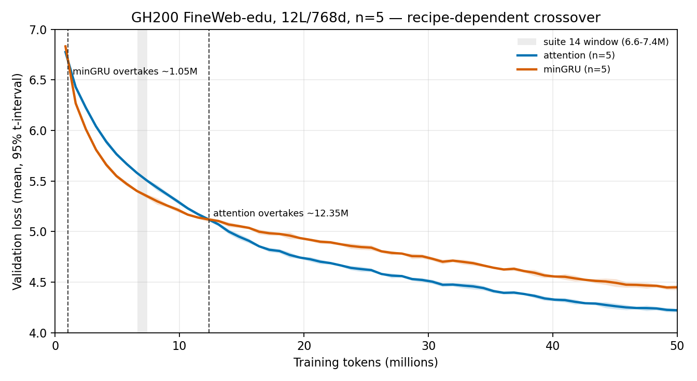

# 22: GH200 50M mixer grid — short rankings lie

## Executive summary

- **Question:** Does the suite-14 6.6–7.4M attention-over-minGRU crossover replicate at 50M tokens, n=5, on a GH200?
- **Result:** It does not. On the matched attention vs minGRU pair (bs32, `eval_iters=20`, n=5) the mean curves flip twice: minGRU overtakes at **1.05M** tokens; attention overtakes for good at **12.4M**. At suite 14’s 6.6–8.2M window minGRU still leads by **0.13–0.18**. At 50M attention wins the mean, **4.222** [4.204, 4.240] vs minGRU **4.449** [4.423, 4.475].
- **Implication:** Do not ship “7M crossover, replicated.” Ship: **short rankings lie, and the token of the flip is recipe-dependent.**
- **Status:** `done`; evidence confidence **High** for the matched pair, **Medium** for the ten-arm 50M ranking (mixed batch / `eval_iters` / a mid-grid GDN kernel fix).

## Meta

| Field | Value |
|-------|-------|
| Suite id | `22-gh200-crossover-50m` |
| Dates | 2026-08-20 – 2026-08-21 |
| Hardware | Lambda ParameterGolf GH200, 97871 MiB HBM, aarch64, PyTorch 2.7.0 + CUDA 12.8 |
| Status | `done` |

## Hypothesis

If suite 14’s 6.6–7.4M overtake is an architecture fact rather than a 3070 / bs8 / one-seed snapshot, the same 12L/768d FineWeb-edu pair on a GH200 at n=5 should flip in that window and stay flipped through 50M.

## Setup

- Trainer / preset: `nanolab` — `crossover50m` via `python -m nanolab.crossover_replicate`
- Architecture: 12L / 768d, ctx 512, Muon lr 6e-4, FineWeb-edu, `mixer_chunk=32`, `compile=False`, GPU-resident data, `eval_train=False`
- Seeds: `1337, 42, 100, 2026, 777`
- Token budget: 50M (3051 steps at bs32; 1017 steps at bs96). Eval cadence aimed at suite 14’s 0.8192M-token grid.
- **Not mixed with suite 14:** this note never puts GH200 bs32 numbers in the same table as 3070 bs8 cells.

## Variants

| Variant | Mixer layout | Recipe actually run |
|---------|--------------|---------------------|
| `attention` | 12× attention | bs32, `eval_iters=20` |
| `mingru` | 12× minGRU | bs32, `eval_iters=20` |
| `mamba2` | 12× Mamba-2 | **mixed:** s1337/s42 bs32 `eval_iters=20`; s100/s2026/s777 bs96 `eval_iters=4` |
| `gdn` | 12× GDN | bs32, `eval_iters=4`, after the WY-kernel NaN fix |
| `mla` | 12× MLA | bs96, `eval_iters=4` |
| `hybrid_gdn10_attn2` | 10 GDN + last-2 attention | bs32, `eval_iters=4`, post-fix |
| `hybrid_gdn_periodic` | GDN×3, attn, repeating | bs32, `eval_iters=4`, post-fix |
| `hybrid_gdn_bookend` | attn, 10 GDN, attn | bs32, `eval_iters=4`, post-fix |
| `hybrid_mingru10_attn2` | 10 minGRU + last-2 attention | bs96, `eval_iters=4` |
| `hybrid_mamba10_attn2` | 10 Mamba-2 + last-2 attention | bs96, `eval_iters=4` |

## Results

### Matched pair (the claim)

Attention vs minGRU share one recipe from step 0: **bs32, `eval_iters=20`, n=5**. Means are nearest-eval to the named token; 95% intervals are Student-t on five seeds (`t_4 = 2.776`). Gap is attention − minGRU; negative means attention is better. Sign is the same on every seed except at the 12.3M tie.

| Actual tokens | Attention mean [95%] | minGRU mean [95%] | gap A−G [95%] |
|---------------|----------------------|-------------------|---------------|
| 0.836M | 6.775 [6.755, 6.794] | 6.831 [6.819, 6.844] | **−0.056** [−0.065, −0.048] |
| 4.112M | 5.888 [5.863, 5.914] | 5.661 [5.637, 5.684] | **+0.228** [+0.216, +0.239] |
| 6.570M | 5.581 [5.573, 5.589] | 5.402 [5.390, 5.414] | **+0.179** [+0.169, +0.189] |
| 7.389M | 5.504 [5.489, 5.519] | 5.350 [5.330, 5.370] | **+0.154** [+0.145, +0.162] |
| 8.208M | 5.434 [5.405, 5.462] | 5.299 [5.267, 5.332] | **+0.134** [+0.126, +0.143] |
| 12.304M | 5.122 [5.104, 5.141] | 5.120 [5.097, 5.144] | +0.002 [−0.009, +0.013] (tie) |
| 19.677M | 4.743 [4.733, 4.754] | 4.936 [4.924, 4.947] | **−0.193** [−0.201, −0.185] |
| 49.988M | **4.222** [4.204, 4.240] | 4.449 [4.423, 4.475] | **−0.227** [−0.244, −0.211] |

Linear interpolation of the two mean curves on attention’s eval grid (at-or-after alignment):

1. **1.05M** — minGRU overtakes attention.
2. **12.35M** — attention overtakes minGRU and stays ahead through 50M.

Suite 14’s 6.6–7.4M window sits inside the minGRU-lead region on this recipe. Absolute losses are also ~0.3 worse at ~8.2M than the 3070 bs8 one-seed numbers (attention 5.136 there vs 5.434 here). That is another recipe/hardware gap, not a rounding error.



### 50M last-eval ranking (n=5, mixed recipes)

Last eval at ~50M, mean and 95% t-interval. This ranks what finished, not a locked bakeoff. Do not read it as “hybrids lose to attention at matched batch.” The matched-batch board is [26-matched32-hybrids](26-matched32-hybrids.md).

| Rank | Arm | Mean val [95%] | Seed range |
|------|-----|----------------|------------|
| 1 | attention | **4.222** [4.204, 4.240] | 4.204–4.237 |
| 2 | hybrid_mingru10_attn2 | 4.275 [4.245, 4.305] | 4.241–4.302 |
| 3 | hybrid_gdn_periodic | 4.280 [4.247, 4.313] | 4.254–4.321 |
| 4 | hybrid_gdn_bookend | 4.293 [4.258, 4.328] | 4.262–4.335 |
| 5 | hybrid_gdn10_attn2 | 4.309 [4.274, 4.344] | 4.278–4.351 |
| 6 | gdn | 4.429 [4.402, 4.456] | 4.404–4.456 |
| 7 | mingru | 4.449 [4.423, 4.475] | 4.430–4.473 |
| 8 | hybrid_mamba10_attn2 | 4.604 [4.517, 4.692] | 4.534–4.719 |
| 9 | mla | 4.606 [4.579, 4.634] | 4.577–4.627 |
| 10 | mamba2 | 4.657 [4.586, 4.727] | 4.578–4.716 |

Best single seed on the board is `hybrid_gdn_periodic` s777 at 4.182 (attention’s best seed is 4.189). Attention still wins the **mean**.

**Interpretation boundary.** Two sign flips on a matched pair are measured. “Bias early, capacity late” remains an explanation, not a theorem, and the **token** of each flip moved when batch, hardware, and eval recipe moved. No throughput claim follows.

## Failures

- GDN NaN’d at bs96 step 39 and again at bs32 step 55 (finite loss, NaN grad norm). Cause: `gdn_chunked` exponentiated the full C×C log-ratio grid; `j>t` overflowed; `.tril()` hid it in the forward. Fix: tril before exp, clamp log-ratios `max=0`, clamp alpha. GDN rows above are post-fix only.
- `torch.compile` on GH200 aarch64 stalled attention in Inductor. All jobs ran `compile=False`.
- Batch and `eval_iters` drifted mid-grid (bs32/`20` → drain-repack to bs96/`4` for non-GDN remaining arms) to burn the 50M budget. That drift is why the ten-arm ranking is Medium and why Mamba-2 is not a five-seed matched curve.
- Auto-generated `table` intersection over mixed token grids is not a source of truth; this note uses per-seed nearest / at-or-after evals.

## Lesson

**Short rankings lie, and the token of the flip is recipe-dependent.** Suite 14 remains a valid 3070 / bs8 / one-seed observation. It is not a universal 7M crossover.

## Reproduction

```bash
# 50M grid (already finished on ParameterGolf)
PYTHONPATH=/home/ubuntu python3 -m nanolab.crossover_replicate status \
  --out nanolab/out/crossover50m

# Locked follow-up: attention vs minGRU only, one batch, ~20M, eval_iters=20
PYTHONPATH=/home/ubuntu python3 -m nanolab.crossover_replicate locked20 --workers 2
```

Required artifacts: `nanolab/out/crossover50m/cx50_<arm>_s<seed>/{metrics.jsonl,config.json}` and `queue.json`. Figure source: `experiment-notes/nanolab/figures/22-attn-mingru-crossover.{png,svg,pdf}`. Locked numbers: `experiment-notes/nanolab/artifacts/22-suite22_lock.json`.

## Evidence quality

**Confidence: High** for attention vs minGRU at 50M (five seeds, same batch from step 0, same `eval_iters`, same kernel, every seed agrees on sign except at the 12.3M tie). **Medium** for the ten-arm ranking and for any comparison to suite 14’s absolute losses (different GPU, batch, eval noise, and a GDN kernel change after start).

## Artifacts

- `nanolab/out/crossover50m/` — 50 jobs, `metrics.jsonl` + `config.json` per run, `queue.json`
- `experiment-notes/nanolab/figures/22-attn-mingru-crossover.png`
- `experiment-notes/nanolab/artifacts/22-suite22_lock.json`
- Archived incomplete bs8 wave: `nanolab/out/crossover50m/wave0_bs8/` (not used here)

## Why this experiment happened

Suite 14 ([14-scale-crossover-8M](14-scale-crossover-8M.md)) reported attention overtaking minGRU between 6.6M and 7.4M on a 3070 Ti, one seed, bs8. Suite 15 preserved the *shape* at two other scales. This suite asked whether the **location** survives a different GPU, n=5, and a 50M horizon. The preceding notebook context is reconstructed from that sequence plus the GH200 grid logs; it is not a quoted contemporaneous rationale.

## Experiment story

**Baseline.** Suite 14’s 8.2M board is a one-seed, bs8, 3070 result: minGRU led from the first eval and attention crossed between 6.6M and 7.4M. The GH200 grid was sized to replicate that pair at n=5 through 50M and, opportunistically, to rank GDN / Mamba-2 / MLA / hybrids on the same box.

**Hypothesis.** If the 7M overtake is architecture, the GH200 mean curves should flip in the same window.

**Test contract.** Same 124M shape and FineWeb-edu. Token cadence borrowed from suite 14 (warmup / eval / ckpt in tokens, not steps) so a wider microbatch still lands evals near the old markers. Seeds locked. `compile=False` after Inductor stalled.

**Variant sequence.** Ten arms × five seeds = 50 jobs. Attention and minGRU ran first at bs32 / `eval_iters=20` and finished on that recipe. Remaining arms were repacked: GDN-containing jobs capped at bs32 after NaNs at bs96; other leftover jobs went to bs96 / `eval_iters=4`. That is recipe drift, recorded above, not a hidden footnote.

**Measured turn.** On the matched pair the first eval (0.836M) has attention slightly ahead on every seed. By 1.655M minGRU leads, and the interpolated mean-curve crossing is **1.05M**. Through 4.1–8.2M the minGRU lead is 0.13–0.23, including the entire suite-14 window. Mean curves meet at 12.30M (gap CI includes zero; seeds split) and attention is ahead for good by 19.7M (gap −0.193, same sign on all five seeds) and at 50M (gap −0.227).

**Turning point and readout.** The 7M crossover did not replicate. Two flips did. The 50M mean ranking still puts attention first; GDN hybrids beat pure minGRU on this mixed-recipe board, and Mamba-2 / MLA sit last. Those extra arms answer “what finished at 50M,” not “what would win at matched bs32 / `eval_iters=20`.”

**Failures and surprises.** GDN’s backward NaN at finite loss was a kernel bug, not a mixer-quality result. Mixing bs32 and bs96 on Mamba-2 made an exact-token-grid intersection table lie (flat early markers). Guest-agent GPU% on the Lambda console is not compute; local power / MFU / tok/s remain the run truth.

## Decision and aftermath

**Kept:** Suite 14 as a 3070 / bs8 / one-seed observation. Suite 22 as the n=5 GH200 measurement that **short rankings lie and the flip token is recipe-dependent.**

**Rejected:** Shipping “7M crossover, replicated.” Putting suite-14 bs8 cells in the same table as these bs32 cells.

**Carried forward:** [23](23-locked20-attn-mingru.md) (short cosine), [24](24-matched20-prefix.md) (recovered 12.34M), [25](25-gh200-bs8.md) (no bs8 flip by 7.38M), [26](26-matched32-hybrids.md) (matched 50M zoo). Per-seed late flips **on this 50M cosine** are 12.03–12.58M.

## Detailed observations

- First eval is not “minGRU from the start.” Attention leads at 0.836M on all five seeds; suite 14’s first point was already a minGRU lead.
- 7.4M and 8.2M are distinct nearest evals here (7.389M and 8.208M). An at-or-after rule collapses 8.2M onto 8.208M as well; this note uses nearest-eval for the table and interpolation for the two crossing times.
- Absolute 8.2M attention loss 5.434 vs suite 14’s 5.136 is a ~0.3 gap. Do not treat the curves as vertically interchangeable.
- Attention’s 50M last-eval range is 4.204–4.237. minGRU’s is 4.430–4.473. The intervals do not overlap.
- `hybrid_gdn_periodic` s777 beat every attention seed on last/best val and still lost the mean. One lucky seed is not a ranking.
- Per-seed interpolated late flips on this 50M cosine: 12.031, 12.216, 12.453, 12.474, 12.579M. The 12.4M mean is not a single lucky seed.

## What this does not prove

It does not prove a universal crossover token, a 3070-vs-GH200 quality ranking, or that hybrids are worse than attention at matched batch. Suite 26 is the matched-batch ranking. Suite 23 shows 12.4M is the late-flip location **under this 50M cosine**, not under a truncated 20M cosine; suite 24 recovered 12.34M with the long cosine.

## See also

- [learning-notes/08-experiments-and-results.md](../../learning-notes/08-experiments-and-results.md) — §8.3 (suite 14 numbers; do not overwrite with this grid)
- Related suites: [`14-scale-crossover-8M`](14-scale-crossover-8M.md), [`15-crossover-followups`](15-crossover-followups.md), [`13-mixer-bakeoff-2M`](13-mixer-bakeoff-2M.md), [`23-locked20-attn-mingru`](23-locked20-attn-mingru.md)

---

[Previous](21-diffusion-lm.md) · [Index](../00-INDEX.md) · [Next](23-locked20-attn-mingru.md)
