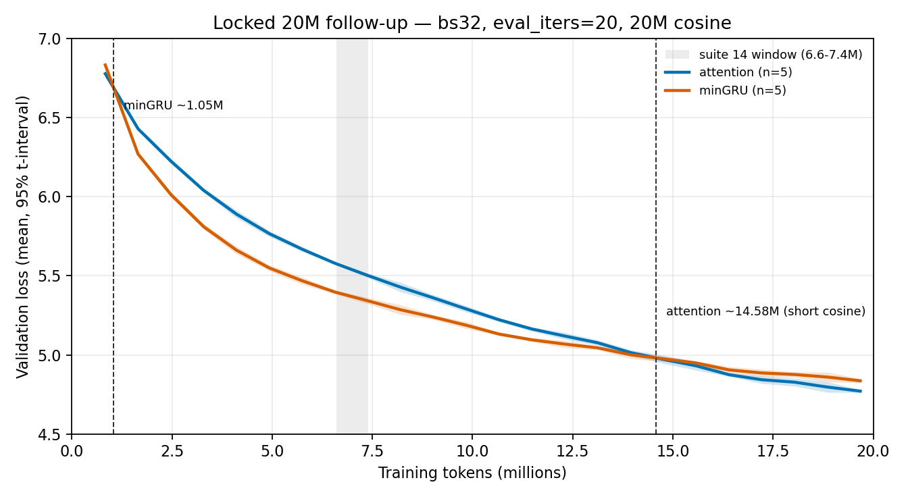

# 23: Locked 20M attention vs minGRU

## Executive summary

- **Question:** On one batch from step 0, n=5, ~20M tokens, `eval_iters=20`, no kernel edits — where is the attention/minGRU flip, and does suite 22’s 12.4M late overtake hold?
- **Result:** The **early** flip replicates: minGRU overtakes at **1.05M** (per-seed 1.03–1.09M). The **late** flip does **not** stay at 12.4M. Under this run’s 20M cosine it is **14.6M** (per-seed 13.7–15.2M). At 12.3M minGRU still leads by **+0.051** on every seed. At 19.68M attention leads **−0.065** [−0.081, −0.050]. Cause: cosine length followed `max_steps` (1220), not the 50M horizon (3051). At 12.3M the 20M-horizon LR is ~47% of the 50M-horizon LR.
- **Implication:** 1.05M is locked for this box/batch/eval. 12.4M is locked only under the **50M cosine**. Shortening the schedule moved the late flip — more evidence that the token of the flip is recipe-dependent, not a failed architecture replicate.
- **Status:** `done`; evidence confidence **High**.

## Meta

| Field | Value |
|-------|-------|
| Suite id | `23-locked20-attn-mingru` |
| Dates | 2026-08-21 – 2026-08-21 |
| Hardware | Lambda ParameterGolf GH200, 97871 MiB HBM, aarch64, PyTorch 2.7.0 + CUDA 12.8 |
| Status | `done` |

## Hypothesis

If suite 22’s two flips are architecture facts at bs32 / `eval_iters=20`, an independent n=5 pair stopped at 20M should recover ~1.05M and ~12.4M.

## Setup

- Trainer: `python -m nanolab.crossover_replicate locked20`
- Fixed knobs: 12L/768d, ctx 512, **bs32 from step 0**, Muon lr 6e-4, FineWeb-edu, `eval_iters=20`, `compile=False`, `eval_train=False`, GPU-resident data, 1220 steps ≈ 20M tokens
- Seeds: `1337, 42, 100, 2026, 777`
- **Not mixed with suite 14:** no bs8 cells in any table here.
- Cosine: this finished run used `lr_max_steps = max_steps = 1220` (short horizon). The runner now sets `CROSSOVER_LR_HORIZON=50e6` so a future launch keeps the 50M cosine. These artifacts were not regenerated.

## Variants

| Variant | Change |
|---------|--------|
| `attention` | 12× attention |
| `mingru` | 12× minGRU |

## Results

Recipe lock (all 10 jobs): `batch_size=32`, `eval_iters=20`, `max_steps=1220`, `compile=False`, 24 evals, last eval **19.677M**.

| Actual tokens | Attention mean [95%] | minGRU mean [95%] | gap A−G [95%] |
|---------------|----------------------|-------------------|---------------|
| 0.836M | 6.776 [6.755, 6.797] | 6.831 [6.819, 6.843] | **−0.055** [−0.065, −0.046] |
| 4.112M | 5.888 [5.862, 5.914] | 5.661 [5.636, 5.686] | **+0.228** [+0.215, +0.240] |
| 6.570M | 5.578 [5.568, 5.588] | 5.397 [5.384, 5.410] | **+0.182** [+0.171, +0.193] |
| 7.389M | 5.501 [5.488, 5.514] | 5.341 [5.322, 5.360] | **+0.160** [+0.152, +0.168] |
| 8.208M | 5.427 [5.407, 5.447] | 5.285 [5.258, 5.312] | **+0.143** [+0.135, +0.151] |
| 12.304M | 5.119 [5.104, 5.134] | 5.068 [5.050, 5.086] | **+0.051** [+0.043, +0.059] |
| 19.677M | **4.771** [4.762, 4.780] | 4.836 [4.823, 4.850] | **−0.065** [−0.081, −0.050] |

Mean-curve flips: **1.047M**, **14.582M**. Per-seed late flips: 13.709, 14.490, 14.929, 15.058, 15.193.

Suite 22 (50M cosine, same seeds/batch/eval) late flips were 12.031–12.579M. Early flips on both suites sit in 1.03–1.09M.



**Interpretation boundary.** The early flip is a matched-recipe replicate. The late-flip shift is a **schedule** result, not a seed-noise result. Absolute 20M losses also differ from suite 22’s 19.7M prefix (attention 4.771 vs 4.743; minGRU 4.836 vs 4.936) for the same reason.

## Failures

- The follow-up was specified as “locate the flip without confounding.” Stopping at 20M without `lr_max_steps=3051` retuned cosine. That is a design miss, now wired in `crossover_replicate.locked20` via `CROSSOVER_LR_HORIZON`. These 10 jobs were not rerun.

## Lesson

**1.05M is stable on this GH200 recipe. The late overtake is not a single token: 12.4M under a 50M cosine, 14.6M under a 20M cosine.**

## Reproduction

```bash
PYTHONPATH=/home/ubuntu python3 -m nanolab.crossover_replicate status \
  --out nanolab/out/crossover20m_locked
```

The finished artifacts are the short-cosine run. A schedule-matched prefix would set `CROSSOVER_LR_HORIZON=50000000` and a **new** `--out` (do not overwrite this folder).

## Evidence quality

**Confidence: High.** Ten jobs, one batch from step 0, `eval_iters=20`, five seeds, every seed agrees on sign at every marker except none at 12.3M (all still minGRU-led). The cosine confound is measured (LR ratio ~0.47 at 12.3M), not inferred from a missing log.

## Artifacts

- `nanolab/out/crossover20m_locked/cx20_{attention,mingru}_s{seed}/{metrics.jsonl,config.json}`
- `experiment-notes/nanolab/figures/23-locked20-crossover.png`

## Why this experiment happened

Suite 22 ([22-gh200-crossover-50m](22-gh200-crossover-50m.md)) asked for one locked pair covering the ~12M flip, not another ten-arm zoo. This is that pair.

## Experiment story

**Baseline.** Suite 22’s matched pair (bs32, `eval_iters=20`, 50M cosine) flipped at 1.05M and 12.35M, with per-seed late flips in a 0.55M band.

**Hypothesis.** An independent 20M stop on the same batch and eval recipe should recover both locations.

**Test contract.** Two arms, five seeds, ~20M tokens, no GDN, no batch mix, no kernel change.

**Measured turn.** Early evals overlay suite 22. The 6.6–8.2M window is still minGRU-led. At 12.3M this run is **not** tied: minGRU leads +0.051 on all five seeds. Attention only takes the mean after ~14.6M, and the 20M gap is −0.065 rather than suite 22’s −0.193.

**Turning point.** Cosine `total` was 1220 steps instead of 3051. That is a different recipe. The runner now keeps the long horizon when the token budget is truncated.

## Decision and aftermath

**Kept:** 1.05M early flip as GH200 / bs32 / `eval_iters=20` fact. Suite 22’s 12.4M as the late flip **under the 50M cosine**. The claim “short rankings lie, and the token of the flip is recipe-dependent.”

**Rejected:** Treating this 20M board as a prefix replicate of suite 22. Shipping “12.4M crossover, replicated” from this run. Mixing these cells with suite 14’s bs8 table.

**Not launched:** a third 10-job grid with matched `lr_max_steps`. Suite 22 already has n=5 on the long cosine through 20M and 50M; the remaining experiment is an independent prefix copy, not a hole in the shipped claim.

## Detailed observations

- Attention leads at the first eval on every seed in both suite 22 and this run.
- Suite 14’s window is minGRU-led here by 0.14–0.18, matching suite 22’s 0.13–0.18.
- Best-val vs last-eval: queue `best_val` at 19.68M is the last eval on this short run (no later recovery).

## What this does not prove

It does not prove 14.6M would appear on a 50M cosine, or that 12.4M would fail an independent long-cosine replicate. It does not isolate GH200 vs 3070 or bs32 vs bs8. Those remain named opportunities, not unfinished jobs in this suite.

## See also

- Related suites: [`22-gh200-crossover-50m`](22-gh200-crossover-50m.md), [`14-scale-crossover-8M`](14-scale-crossover-8M.md)

---

[Previous](22-gh200-crossover-50m.md) · [Index](../00-INDEX.md) · [Next](24-matched20-prefix.md)
