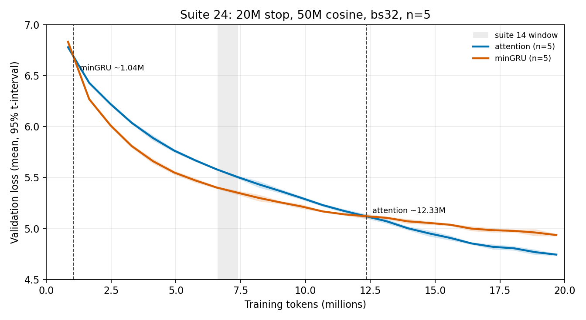

# 24: Schedule-matched 20M prefix

## Executive summary

- **Question:** If the 20M stop keeps the **50M cosine** (`lr_max_steps` = 3051 at bs32), does an independent n=5 pair recover suite 22’s 1.05M and 12.4M flips?
- **Result:** Yes. Mean-curve flips **1.04M** and **12.34M**. Per-seed late flips 11.93–12.58M. At 19.68M the gap is **−0.192** [−0.199, −0.185], matching suite 22’s −0.193. Suite 23’s 14.6M late flip was the short cosine, not seed noise.
- **Implication:** 12.4M is locked for GH200 / bs32 / `eval_iters=20` / **50M cosine**. Do not mix with suite 23’s short-cosine table or suite 14’s bs8 table.
- **Status:** `done`; evidence confidence **High**.

## Meta

| Field | Value |
|-------|-------|
| Suite id | `24-matched20-prefix` |
| Dates | 2026-08-21 – 2026-08-21 |
| Hardware | Lambda ParameterGolf GH200, 97871 MiB HBM, aarch64, PyTorch 2.7.0 + CUDA 12.8 |
| Status | `done` |

## Hypothesis

Suite 23 moved the late flip because cosine followed `max_steps=1220`. Holding cosine at the 50M horizon and stopping at 20M should recover suite 22’s late flip (~12.4M) if that location is schedule-stable.

## Setup

- `python -m nanolab.crossover_replicate matched20` (isolates stage 1)
- 12L/768d, ctx 512, **bs32 from step 0**, `eval_iters=20`, `compile=False`, FineWeb-edu, Muon
- Token budget 20M (1220 steps); **`lr_max_steps` = 3051** (50M horizon)
- Seeds: 1337, 42, 100, 2026, 777
- Out: `nanolab/out/crossover20m_matched_lr/` prefix `cx20h_`
- Verified on every job: `batch_size=32`, `eval_iters=20`, `max_steps=1220`, `lr_max_steps=3051`

## Variants

| Variant | Change |
|---------|--------|
| attention | 12× attention |
| mingru | 12× minGRU |

## Results

Nearest-eval means, 95% t-interval, n=5. Gap = attention − minGRU.

| Actual tokens | Attention mean [95%] | minGRU mean [95%] | gap A−G [95%] |
|---------------|----------------------|-------------------|---------------|
| 0.836M | 6.778 [6.765, 6.791] | 6.831 [6.819, 6.844] | **−0.053** [−0.055, −0.051] |
| 4.112M | 5.888 [5.863, 5.914] | 5.661 [5.637, 5.684] | **+0.227** [+0.214, +0.241] |
| 6.570M | 5.580 [5.572, 5.589] | 5.402 [5.390, 5.414] | **+0.178** [+0.168, +0.189] |
| 7.389M | 5.504 [5.489, 5.518] | 5.350 [5.330, 5.370] | **+0.153** [+0.141, +0.166] |
| 8.208M | 5.432 [5.401, 5.464] | 5.299 [5.267, 5.332] | **+0.133** [+0.125, +0.141] |
| 12.304M | 5.122 [5.099, 5.144] | 5.120 [5.097, 5.144] | +0.001 [−0.010, +0.013] (tie) |
| 19.677M | **4.744** [4.734, 4.754] | 4.936 [4.924, 4.947] | **−0.192** [−0.199, −0.185] |

Mean-curve flips: **1.038M**, **12.335M**. Per-seed late flips: 11.930, 12.287, 12.365, 12.564, 12.579.

Suite 22 (same recipe, 50M run prefix): 1.049M and 12.353M; 19.677M gap −0.193. Overlay, not a new location.



**Interpretation boundary.** This is an independent draw of the suite-22 recipe truncated at 20M. It does not change the 50M ranking.

## Failures

- None. 10/10 done, 0 failed.

## Lesson

**The late flip is 12.4M when cosine is the 50M horizon, and 14.6M when cosine is the 20M horizon.** Suite 23 measured the schedule; this suite recovered the original location.

## Reproduction

```bash
PYTHONPATH=/home/ubuntu python3 -m nanolab.crossover_replicate status \
  --out nanolab/out/crossover20m_matched_lr
```

Artifacts: `nanolab/out/crossover20m_matched_lr/cx20h_{attention,mingru}_s{seed}/{metrics.jsonl,config.json}` and `recipe.json`.

## Evidence quality

**Confidence: High.** Five seeds, recipe fingerprint matches every config, late-flip band 11.9–12.6M, 19.7M gap agrees with suite 22 to 0.001.

## Artifacts

- `nanolab/out/crossover20m_matched_lr/`
- `experiment-notes/nanolab/figures/24-matched20-crossover.png`
- `experiment-notes/nanolab/artifacts/24-matched20_lock.json`

## Why this experiment happened

Suite 23 ([23-locked20-attn-mingru](23-locked20-attn-mingru.md)) stopped at 20M with a 1220-step cosine and moved the late flip. This is the prefix copy with `lr_max_steps=3051`.

## Experiment story

**Baseline.** Suite 22 n=5 on a 50M cosine flipped at 1.05M and 12.35M. Suite 23, same batch and eval, short cosine, flipped at 1.05M and 14.6M.

**Test contract.** Independent 10 jobs, 20M stop, long cosine, no kernel edits.

**Measured turn.** Curves overlay suite 22 through 20M. The 6.6–8.2M window is still minGRU-led. Mean curves meet at 12.30M and attention leads by 0.19 at 19.68M.

## Decision and aftermath

**Kept:** 12.4M as the GH200 / bs32 / 50M-cosine late flip. **Rejected:** treating suite 23 as a failed replicate of 12.4M. Next: [25-gh200-bs8](25-gh200-bs8.md).

## Detailed observations

- First eval: attention ahead on all five seeds, as in suite 22, unlike suite 14.
- Seed 42’s late flip at 11.93M is the left edge; still inside the 12.0–12.6M suite-22 band.

## What this does not prove

It does not speak to bs8 or to hybrid ranking. It is not a 50M independent replicate of attention/minGRU (those remain suite 22).

## See also

- [`22-gh200-crossover-50m`](22-gh200-crossover-50m.md), [`23-locked20-attn-mingru`](23-locked20-attn-mingru.md)

---

[Previous](23-locked20-attn-mingru.md) · [Index](../00-INDEX.md) · [Next](25-gh200-bs8.md)
