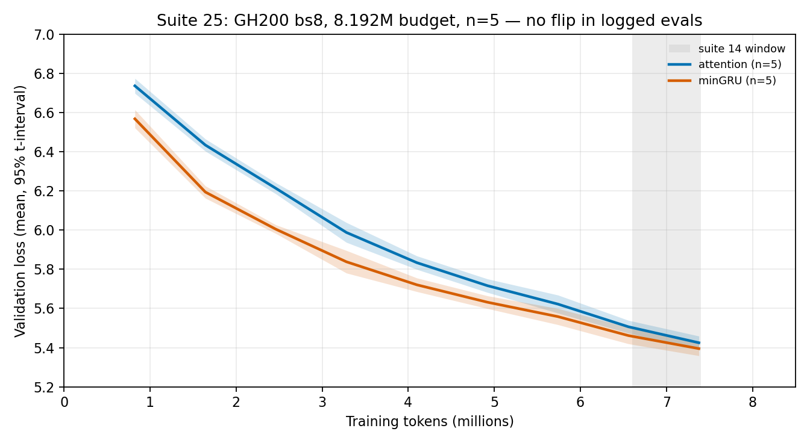

# 25: GH200 bs8 n=5 vs suite 14 length

## Executive summary

- **Question:** On GH200 at **bs8**, n=5, 8.192M tokens (suite 14’s budget), where is the attention/minGRU flip?
- **Result:** There is **no sign flip** in the nine logged evals through **7.38M**. minGRU leads from the first eval on every seed. The gap shrinks from **+0.168** at 0.82M to **+0.030** [+0.017, +0.043] at 7.38M. Suite 14’s one-seed overtake between 6.6M and 7.4M does **not** appear at n=5 on this box.
- **Implication:** Isolates hardware vs batch. GH200 bs8 looks like suite 14’s *early* shape (minGRU from eval 1, gap closing) and unlike suite 22’s bs32 first-eval attention lead. It does **not** replicate the 7.4M overtake. **Never** put these cells in a bs32 table.
- **Status:** `done`; evidence confidence **High** for “no flip by 7.38M,” **Medium** at 8.2M because the final evaluate() was not logged as `event=eval`.

## Meta

| Field | Value |
|-------|-------|
| Suite id | `25-gh200-bs8` |
| Dates | 2026-08-21 – 2026-08-21 |
| Hardware | Lambda ParameterGolf GH200, 97871 MiB HBM, aarch64, PyTorch 2.7.0 + CUDA 12.8 |
| Status | `done` |

## Hypothesis

If the 6.6–7.4M overtake is a batch/GPU effect, GH200 bs8 should move toward suite 22’s 1.05M/12.4M pattern (or fail to finish 12M inside 8.2M). If it recovers 6.6–7.4M, the 3070 result was recipe-local to bs8 more than to the laptop GPU.

## Setup

- `python -m nanolab.crossover_replicate bs8` (isolates stage 2)
- 12L/768d, ctx 512, **bs8 from step 0**, `eval_iters=20`, `compile=False`
- 2000 steps = **8.192M tokens**; cosine horizon = 2000 (not truncated)
- Seeds: 1337, 42, 100, 2026, 777
- Out: `nanolab/out/crossover8m_bs8/` prefix `cx8_`
- Eval every 200 steps / 0.8192M tokens (suite 14 cadence)
- Verified: `batch_size=8`, `eval_iters=20`, `max_steps=2000`, `lr_max_steps=2000`

## Variants

| Variant | Change |
|---------|--------|
| attention | 12× attention |
| mingru | 12× minGRU |

## Results

Last **logged** eval is step 1800 / **7.377M**, not 8.192M. The train loop’s final `evaluate()` at 8.192M writes `done.best_val` only. Gap = attention − minGRU; positive means minGRU is better. Sign is the same on every seed at every logged marker.

| Actual tokens | Attention mean [95%] | minGRU mean [95%] | gap A−G [95%] |
|---------------|----------------------|-------------------|---------------|
| 0.823M | 6.736 [6.698, 6.774] | 6.567 [6.521, 6.614] | **+0.168** [+0.160, +0.177] |
| 4.100M | 5.834 [5.799, 5.868] | 5.721 [5.686, 5.755] | **+0.113** [+0.102, +0.124] |
| 6.558M | 5.507 [5.474, 5.539] | 5.462 [5.420, 5.504] | **+0.045** [+0.028, +0.062] |
| 7.377M | 5.425 [5.391, 5.459] | 5.395 [5.359, 5.431] | **+0.030** [+0.017, +0.043] |

Mean-curve flips in logged evals: **none**. Per-seed flips: **none**.

`done.best_val` (min over all evals including the unlogged final): attention 5.371 [5.330, 5.412], minGRU 5.353 [5.319, 5.387]. That is not a paired 8.2M snapshot and is **not** a ranking.

Suite 14 (3070, bs8, **one seed**): minGRU 6.334 vs attention 6.516 at 0.8M; overtake between 6.6M and 7.4M; attention 5.136 at 8.2M. Those cells stay in suite 14. Absolute GH200 losses at ~7.4M are ~0.18 worse than that one 3070 seed; do not stack the tables.



**Interpretation boundary.** Batch, not just GPU, changes the early ranking: bs32 on this box starts with attention ahead; bs8 starts with minGRU ahead. The 7.4M overtake is still not a GH200 n=5 fact.

## Failures

- 10/10 done, 0 failed.
- Final 8.192M val is missing from `metrics.jsonl` as an eval row. That is a logger gap, not a crash.

## Lesson

**GH200 bs8 n=5 does not replicate suite 14’s 7.4M overtake in logged evals. It does replicate suite 14’s early minGRU lead, which suite 22’s bs32 runs do not.**

## Reproduction

```bash
PYTHONPATH=/home/ubuntu python3 -m nanolab.crossover_replicate status \
  --out nanolab/out/crossover8m_bs8
```

## Evidence quality

**Confidence: High** that minGRU leads through 7.38M on all five seeds. **Medium** for anything about 8.2M. `eval_iters=20` may differ from suite 14’s unevaluated eval count (eval noise).

## Artifacts

- `nanolab/out/crossover8m_bs8/`
- `experiment-notes/nanolab/figures/25-bs8-crossover.png`
- `experiment-notes/nanolab/artifacts/25-bs8_lock.json`

## Why this experiment happened

Suite 22 changed GPU and batch together. This holds batch at suite 14’s bs8 on the GH200.

## Experiment story

**Baseline.** Suite 14: 3070, bs8, seed 1337, flip 6.6–7.4M. Suite 22: GH200, bs32, n=5, flips 1.05M and 12.4M.

**Measured turn.** First GH200 bs8 eval is a minGRU lead of 0.17 on every seed. The 6.6M marker is still minGRU by 0.045. The 7.4M marker (logged 7.38M) is still minGRU by 0.030. No seed has flipped.

## Decision and aftermath

**Kept:** suite 14 as a 3070 / one-seed observation; suite 22 as the bs32 GH200 observation. **Rejected:** “7M crossover on GH200 at bs8.” Downstream: [26-matched32-hybrids](26-matched32-hybrids.md).

## Detailed observations

- Gap monotonic shrink: 0.168 → 0.113 → 0.045 → 0.030. A later flip is possible; this horizon does not show it.
- Archived `wave0_bs8` from the 50M campaign was incomplete and is unused.

## What this does not prove

It cannot locate a 12.4M flip. It does not prove the 3070 number was wrong. It does not rank hybrids.

## See also

- [`14-scale-crossover-8M`](14-scale-crossover-8M.md), [`22-gh200-crossover-50m`](22-gh200-crossover-50m.md)

---

[Previous](24-matched20-prefix.md) · [Index](../00-INDEX.md) · [Next](26-matched32-hybrids.md)
