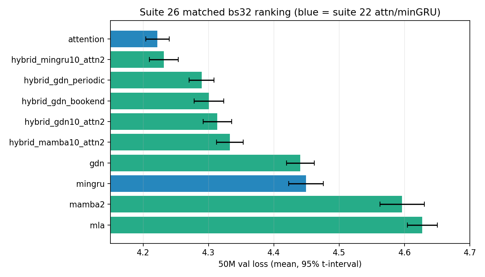

# 26: Matched-batch 50M hybrid ranking

## Executive summary

- **Question:** At **one** batch (bs32) and `eval_iters=20` from step 0, n=5, 50M tokens, how do the eight drifted suite-22 arms rank against the already-matched attention/minGRU pair?
- **Result:** Attention (suite 22) **4.222** [4.204, 4.240] and `hybrid_mingru10_attn2` **4.232** [4.210, 4.254] **tie** (CIs overlap). GDN hybrids sit 4.29–4.31. `hybrid_mamba10_attn2` is **4.333**, not the 4.60 it was on bs96. Pure minGRU 4.449; Mamba-2 4.596; MLA last at 4.627.
- **Implication:** Suite 22’s mixed-batch zoo underrated the minGRU and Mamba hybrids. The matched board still does not dethrone attention on the mean, and it does not produce a unique winner versus last-2-attention minGRU. Do not mix with suite 14 bs8.
- **Status:** `done`; evidence confidence **High** for these eight reruns, **Medium-High** for the combined ranking (attention/minGRU are the prior matched sample, not a new 50M draw).

## Meta

| Field | Value |
|-------|-------|
| Suite id | `26-matched32-hybrids` |
| Dates | 2026-08-21 – 2026-08-22 |
| Hardware | Lambda ParameterGolf GH200, 97871 MiB HBM, aarch64, PyTorch 2.7.0 + CUDA 12.8 |
| Status | `done` |

## Hypothesis

If batch/`eval_iters` drift was why GDN hybrids sat near attention and Mamba hybrids sat last, a matched bs32 / `eval_iters=20` 50M rerun will reorder the board.

## Setup

- `python -m nanolab.crossover_replicate matched32` (isolates stage 3)
- 12L/768d, ctx 512, **bs32 from step 0**, `eval_iters=20`, 3051 steps, cosine = 3051
- Seeds: 1337, 42, 100, 2026, 777
- Out: `nanolab/out/crossover50m_matched32/` prefix `cx32_`
- 8 arms × 5 seeds = 40 jobs, 40/40 done, 0 failed
- Verified on every job: `batch_size=32`, `eval_iters=20`, `max_steps=3051`, `lr_max_steps=3051`
- Attention / minGRU cells are from [22](22-gh200-crossover-50m.md) (same recipe), labeled `s22`

## Variants

| Variant | Change |
|---------|--------|
| mamba2 | 12× Mamba-2 |
| gdn | 12× GDN (post-fix kernel; no further kernel edits) |
| mla | 12× MLA |
| hybrid_gdn10_attn2 | 10 GDN + last-2 attention |
| hybrid_gdn_periodic | GDN×3, attn, repeating |
| hybrid_gdn_bookend | attn, 10 GDN, attn |
| hybrid_mingru10_attn2 | 10 minGRU + last-2 attention |
| hybrid_mamba10_attn2 | 10 Mamba-2 + last-2 attention |

## Results

Last eval at 49.99M, mean and 95% t-interval, n=5.

| Rank | Arm | Source | Mean val [95%] | Seed range |
|------|-----|--------|----------------|------------|
| 1 | attention | s22 | **4.222** [4.204, 4.240] | 4.204–4.237 |
| 2 | hybrid_mingru10_attn2 | s26 | **4.232** [4.210, 4.254] | 4.210–4.249 |
| 3 | hybrid_gdn_periodic | s26 | 4.290 [4.271, 4.309] | 4.271–4.308 |
| 4 | hybrid_gdn_bookend | s26 | 4.301 [4.278, 4.324] | 4.277–4.319 |
| 5 | hybrid_gdn10_attn2 | s26 | 4.314 [4.292, 4.336] | 4.290–4.331 |
| 6 | hybrid_mamba10_attn2 | s26 | 4.333 [4.312, 4.353] | 4.313–4.353 |
| 7 | gdn | s26 | 4.441 [4.419, 4.462] | 4.422–4.461 |
| 8 | mingru | s22 | 4.449 [4.423, 4.475] | 4.430–4.473 |
| 9 | mamba2 | s26 | 4.596 [4.562, 4.630] | 4.572–4.633 |
| 10 | mla | s26 | 4.627 [4.604, 4.650] | 4.609–4.647 |

Vs the mixed-recipe suite 22 board: `hybrid_mamba10_attn2` moved from 4.604 to 4.333; `hybrid_mingru10_attn2` from 4.275 to 4.232. Those two trained at bs96 in suite 22. GDN-family arms were already bs32 and barely moved.



**Interpretation boundary.** Attention still has the best mean. It is not separable from last-2-attention minGRU at n=5. Throughput is not a ranking.

## Failures

- None. 40/40 done, 0 failed. GDN kernel unchanged after suite 22.

## Lesson

**The 50M zoo was Medium because batch drifted. At matched bs32, last-2 attention on minGRU ties pure attention, and the Mamba hybrid is a mid-board model, not a loser.**

## Reproduction

```bash
PYTHONPATH=/home/ubuntu python3 -m nanolab.crossover_replicate status \
  --out nanolab/out/crossover50m_matched32
```

## Evidence quality

**Confidence: High** for the eight new arms (one recipe, n=5, finite last evals). Combined ranking is **Medium-High** because attention/minGRU are suite 22’s sample.

## Artifacts

- `nanolab/out/crossover50m_matched32/`
- `experiment-notes/nanolab/figures/26-matched32-ranking.png`
- `experiment-notes/nanolab/artifacts/26-matched32_lock.json`

## Why this experiment happened

Suite 22’s ten-arm 50M ranking mixed bs32/bs96 and `eval_iters` 20/4.

## Experiment story

**Baseline.** Suite 22 ranked attention 4.222, then hybrids, with Mamba/MLA last — but four arms had trained at bs96.

**Measured turn.** Rerunning those eight at bs32 / `eval_iters=20` / 50M pulled `hybrid_mingru10_attn2` onto attention’s interval and lifted `hybrid_mamba10_attn2` by ~0.27. Pure Mamba-2 and MLA stayed last.

## Decision and aftermath

**Kept:** attention as the 50M mean leader; the claim that short rankings lie. **Rejected:** the suite 22 zoo order as a matched bakeoff. No further isolate is required for this ranking.

## Detailed observations

- `hybrid_mingru10_attn2` s777 last-eval 4.210 is inside attention’s seed range.
- GDN periodic 4.290 vs suite 22’s 4.280: same training batch, new eval_iters=20 sample; movement is seed-scale.

## What this does not prove

It does not rerun attention/minGRU. It does not restore bs96 as a fair arm. It does not say hybrids win at 2M or 8M.

## See also

- [`22-gh200-crossover-50m`](22-gh200-crossover-50m.md)

---

[Previous](25-gh200-bs8.md) · [Index](../00-INDEX.md) · Next
