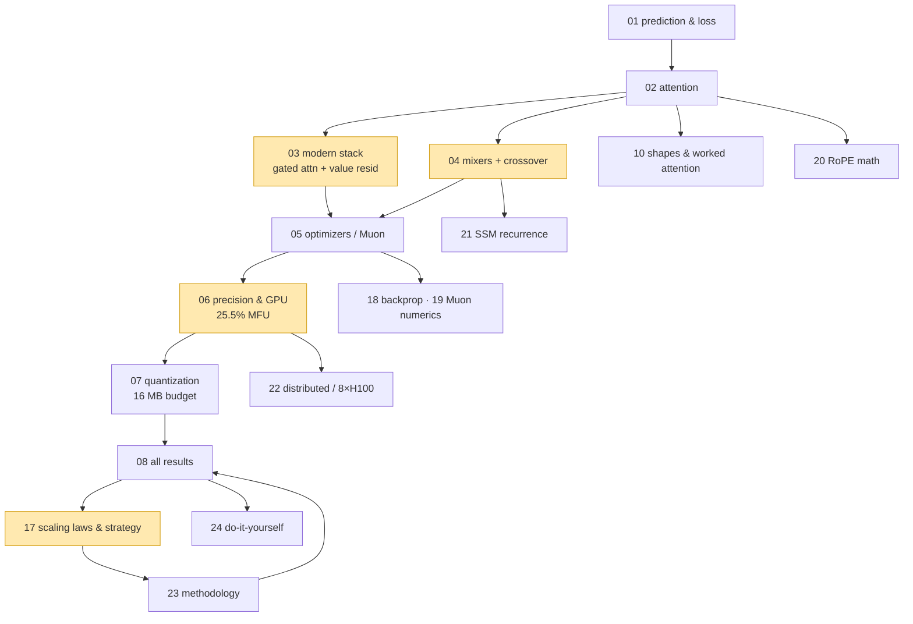

# ML From Scratch — Learning Notes (grounded in *Parameter Golf*)

These notes teach modern language-model training **from first principles**, but every
concept is tied back to an experiment **you actually ran** in this workspace
(`parameter_golf/`). Nothing here is abstract hand-waving — when a note says "recurrent
mixers win at low token budgets," there is a number from `nanolab/out/` next to it.

Author of the experiments: **Bharath Vaddaram**. Hardware: a single **RTX 3070 Ti Laptop
(8 GB, Ampere)** plus the competition's notional **8×H100** target.

> **Lab notebook:** [`experiment-notes/00-INDEX.md`](../experiment-notes/00-INDEX.md) has
> suite-level methods, failures, replay guidance, High/Medium/Low evidence grades, and a
> source-grounded narrative/decision-history layer. Each suite now records why it happened,
> the chronological experiment story, the decision carried forward, detailed observations,
> and what the evidence does not prove. Chapter 08 remains the consolidated scoreboard.

> **Read it as one rendered page.** Run `python3 build_html.py` to stitch all 26 notes into a
> single `ml-notes.html` with:
> - a **full-text search box** (press `/` to focus) that highlights every match, shows an `n / N`
>   counter, and steps through hits with `Enter` / `Shift+Enter` / arrows (`Esc` clears);
> - a sidebar TOC with **scroll-spy** highlighting and clickable `¶` heading anchors;
> - styled tables, ASCII charts in monospace, and the 9 Mermaid diagrams rendered as real flowcharts.
>
> The `vendor/` folder holds local copies of marked.js + mermaid.js, so the build **inlines them
> for a fully offline, self-contained file** (delete `vendor/` to fall back to CDN). Open it
> directly or serve it (`python -m http.server`); press `Ctrl/Cmd+P` to save as PDF (a print
> stylesheet hides the sidebar and paginates per note).

---

## How to read this (suggested order)

| # | File | What you learn | Your experiments it uses |
|---|------|----------------|--------------------------|
| 1 | [`01-ml-from-scratch.md`](01-ml-from-scratch.md) | What a language model *is*: tokens, the loss, gradients, the training loop, BPB | the whole `nanolab` loop, BPB scoring |
| 2 | [`02-transformer-and-attention.md`](02-transformer-and-attention.md) | Attention from zero — Q/K/V, softmax, multi-head, causal mask, **sliding window**, GQA/MLA, RoPE | champion = gated attention; MLA in the mixer bake-off |
| 3 | [`03-modern-architecture-stack.md`](03-modern-architecture-stack.md) | GPT-2 → 2026 stack: RMSNorm, QK-norm, SwiGLU, **value residual**, **gated attention**, zero-init, U-Net skips. **With diagrams.** | the SOTA architecture ladder (champion BPB 1.985) |
| 4 | [`04-sequence-mixers.md`](04-sequence-mixers.md) | Attention vs Mamba-2 vs Gated DeltaNet vs minGRU — the math, and **chunk-parallel kernels** | the mixer bake-off + the **token-budget crossover** |
| 5 | [`05-optimizers-and-schedules.md`](05-optimizers-and-schedules.md) | SGD → Adam → **Muon** (Newton–Schulz), LR schedules, warmup, clipping | champion optimizer settings; the GPU optimizer sweep |
| 6 | [`06-precision-and-gpu.md`](06-precision-and-gpu.md) | **FP32/FP16/BF16/FP8/FP4**, MFU, FlashAttention, fused kernels, the sysmem-thrash trap | your 14% → 25.5% MFU GPU-maximization run |
| 7 | [`07-quantization-and-compression.md`](07-quantization-and-compression.md) | QAT, int8/int6, GPTQ, the 16 MB artifact budget | the sprint trainer + champion 1.34 MB artifact |
| 8 | [`08-experiments-and-results.md`](08-experiments-and-results.md) | **Every result table in one place**, with the lesson each one teaches | all of the above, consolidated |
| 9 | [`09-glossary.md`](09-glossary.md) | Fast lookup for every term, including the minute ones | — |

### Part II — deeper passes (worked examples, mechanics, strategy)

| # | File | What you learn | Your experiments it uses |
|---|------|----------------|--------------------------|
| 10 | [`10-math-foundations-and-shapes.md`](10-math-foundations-and-shapes.md) | Tensor shapes `[B,T,C]`, dot products, **attention hand-computed with numbers**, param counting | the real `phase1` config (d=768, GQA), fused-CE logits |
| 11 | [`11-tokenization-deep-dive.md`](11-tokenization-deep-dive.md) | How BPE/SentencePiece build a vocab, byte-level, **why vocab 50304**, loss→BPB conversion | the 1024-vocab champion lever, `prep_fineweb` |
| 12 | [`12-generation-and-sampling.md`](12-generation-and-sampling.md) | Greedy/temperature/top-k/top-p, the **KV cache**, sampling vs BPB | `sample.py` (T=0.8, top_k=50), GQA cache motivation |
| 13 | [`13-regularization-init-and-stability.md`](13-regularization-init-and-stability.md) | Weight init, **zero-init**, weight decay vs dropout, label smoothing, **μP** | the champion's stability stack, μP scale-up |
| 14 | [`14-moe-and-adaptive-compute.md`](14-moe-and-adaptive-compute.md) | **MoE** + Switch load-balancing, adaptive computation, APRDH's compute controller | nanolab MoE (OOM at bs16), APRDH |
| 15 | [`15-diffusion-language-models.md`](15-diffusion-language-models.md) | Dropping autoregression: masked diffusion, bidirectional attention, parallel decoding | your DiffuGPT run (ppl 19.5→8.2) + the loss-collapse bug |
| 16 | [`16-debugging-and-failure-modes.md`](16-debugging-and-failure-modes.md) | **Field guide**: every bug, the logged signal that caught it, the fix | all your real failures, consolidated |
| 17 | [`17-scaling-laws-and-competition-strategy.md`](17-scaling-laws-and-competition-strategy.md) | Chinchilla, L(N), the 16 MB budget as allocation, local-vs-H100 | the crossover as a scaling law, the 1.34 MB headroom |

### Part III — worked math, systems depth, and doing it yourself

| # | File | What you learn | Your experiments it uses |
|---|------|----------------|--------------------------|
| 18 | [`18-backprop-by-hand.md`](18-backprop-by-hand.md) | Backprop **fully worked** on a tiny net with numbers; chain rule, the retained graph, why grad-norm=0 means a bug | custom-autograd kernels, the grad-norm signal |
| 19 | [`19-muon-newton-schulz-numerics.md`](19-muon-newton-schulz-numerics.md) | The **exact Newton–Schulz iteration** (coeffs 3.4445/−4.7750/2.0315), SVD intuition, batched Muon | your `optim.py`, the 496→109 ms batched-Muon win |
| 20 | [`20-rope-positional-math.md`](20-rope-positional-math.md) | RoPE **worked with numbers** — rotation → relative position, multi-frequency, why only q/k | your `build_rope_cache`/`apply_rope` |
| 21 | [`21-ssm-recurrence-worked.md`](21-ssm-recurrence-worked.md) | minGRU/Mamba-2/GDN recurrences **stepped by hand**, the chunk-parallel derivation, why fp32 | the verified kernels, the 9.7× SSD speedup |
| 22 | [`22-distributed-and-scaling-systems.md`](22-distributed-and-scaling-systems.md) | Gradient accumulation, data/tensor/pipeline/expert parallelism, all-reduce, why 8×H100 is a different world | your grad_accum, the local-vs-H100 gap |
| 23 | [`23-evaluation-methodology.md`](23-evaluation-methodology.md) | How to measure: held-out eval, seeds, the staged ladder, calibration, the traps that make a number lie | your `evaluate()`, the seed-1337+42 ladder |
| 24 | [`24-build-it-yourself-exercises.md`](24-build-it-yourself-exercises.md) | **Hands-on exercises** (A–E tracks + a 1-week path) using real nanolab/verify commands | every headline result, reproducible |
| 25 | [`25-reading-list-and-connections.md`](25-reading-list-and-connections.md) | Annotated primary sources per concept + the dependency map of the whole field | ties all 25 files together |

---

## The one-paragraph summary of everything you found

> At a **small token budget**, the model's *inductive bias* dominates: recurrent / state-space
> mixers (minGRU, Gated DeltaNet, Mamba-2) **beat attention** because they assume sequentiality
> for free. As you pour in more tokens, attention's greater *capacity* catches up and overtakes —
> you measured the crossover at **~7M tokens**, precisely. On the architecture side, the cheap
> 2026 tricks (**gated attention + value residual**) reliably beat plain attention (BPB
> 1.985 vs 2.089). On the systems side, the bottleneck on an 8 GB laptop is **memory**, not
> math: fused cross-entropy + gradient checkpointing + the right batch took you from a
> thrashing 14% GPU utilization to a healthy **25.5% MFU**. None of this is visible without
> **logging from step one** — that's the meta-lesson.

---

## How the concepts depend on each other (the course as a graph)



The four highlighted nodes are where your *measured results* live; everything else is the
machinery that makes those results understandable and trustworthy.

---

## A quick visual of the headline result (real data, file 04/08)

```
minGRU leads early ───────────────► attention overtakes at ~7M tokens
 gap (attn − minGRU):  +0.182  +0.075  +0.005 | −0.010  −0.019
                        0.8M    4.1M    6.6M  ⤫  7.4M    8.2M
                        └─── bias wins ───┘ crossover └ capacity wins ┘
```

---

## The map of the workspace (where each result lives)

```
parameter_golf/
├── modern-small-lm-training-guide.md   # the theory these notes expand on
├── nanolab/                            # clean teaching trainer (1 lever = 1 flag)
│   └── out/
│       ├── bakeoff_<mixer>/            # mixer bake-off @ 2M tokens
│       ├── scale_<mixer>/              # token-budget crossover @ 8.2M tokens
│       ├── gpu_max/ gpu_baseline/      # GPU-maximization runs
│       └── gpu_sweep_{mixer,opt,ffn}.json
└── parameter-golf/
    └── logs/                           # the SOTA architecture ablation ladder
        └── ...champion.json            # gated attention + value residual, BPB 1.985
```

Start with [`01-ml-from-scratch.md`](01-ml-from-scratch.md).
