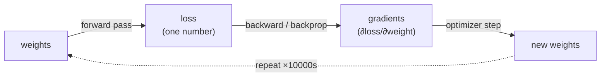

# 01 — ML From Scratch: What a Language Model Actually Is

Goal of this file: by the end you can explain, with no hand-waving, what your `nanolab`
trainer is doing on every single step, and why the loss number means something.

---

## 1.1 A language model is a next-token probability machine

Strip away all the jargon. A language model does exactly one thing:

> Given a sequence of tokens so far, output a **probability distribution over the next token**.

That's it. Everything else — attention, Mamba, Muon, FP8 — is engineering to make that one
prediction better or cheaper.

```
input tokens:   "The cat sat on the"
                          │
                          ▼
                ┌───────────────────┐
                │  language model   │   ← billions of multiply-adds
                └───────────────────┘
                          │
                          ▼
output:  P(next = "mat")  = 0.31
         P(next = "floor")= 0.12
         P(next = "roof") = 0.05
         ... (one probability for every token in the vocabulary)
```

The model is **autoregressive**: to generate text it predicts one token, appends it to the
input, and predicts again. "AR" in these notes = this left-to-right loop. (The diffusion
experiment in `nanolab/diffusion.py` breaks this assumption — see file 08.)

---

## 1.2 Tokens: text → integers

Neural nets eat numbers, not characters. A **tokenizer** chops text into chunks ("tokens")
and maps each to an integer id.

- **Character-level** (`text8`/`enwik8` in nanolab): one token per character. Tiny vocab
  (~27–256), but long sequences and the model has to learn spelling.
- **BPE / SentencePiece** (the real choice): "Byte-Pair Encoding" greedily merges frequent
  character pairs into subword tokens. GPT-2 uses **50,257** tokens. Your Parameter Golf
  champion uses a slim **1,024-token SentencePiece** vocab.

### Why vocab size is a real lever (and a Parameter Golf knob)

The input embedding table and output "head" both have shape `[vocab_size × d_model]`.
With `d_model = 512`:

- vocab 50,257 → embedding params ≈ 25.7M **per table**
- vocab 1,024 → embedding params ≈ 0.5M per table

Under a **16 MB compressed budget**, a 50k vocab would eat the entire budget on embeddings.
That's why the competition champion shrank the vocab to 1,024. Trade-off: a smaller vocab
means more tokens per sentence (each token carries less), so the model needs more sequence
length to see the same text. **Tying** the input and output embedding (`tie_embeddings: true`)
shares one table for both, halving that cost again.

---

## 1.3 The loss: cross-entropy, and why it's "surprise"

The model outputs probabilities. We need a single number saying "how wrong was it?" That's
**cross-entropy loss**:

```
loss = -log( P_model(correct_next_token) )
```

- If the model gave the true next token probability **1.0**, loss = `-log(1) = 0`. Perfect.
- If it gave it **0.5**, loss = `-log(0.5) = 0.69`.
- If it gave it nearly **0**, loss → ∞. Catastrophic surprise.

Cross-entropy is literally the *average number of nats (or bits) of surprise* per token. A
model with loss 5.1 is, on average, this surprised at each token. Lower = the model's
predictions match reality better.

> **Reading your numbers:** in the mixer bake-off the models ended at val loss ~5.8–6.2.
> That sounds terrible (random over 1024 tokens would be `ln(1024)=6.93`), and it is —
> those models saw only 2M tokens and produce "English-ish babble." The *number* isn't the
> point; the **ranking between mixers** is. See file 04.

### Perplexity and bits-per-byte (BPB)

- **Perplexity** = `exp(loss)`. "On average the model is as confused as if choosing
  uniformly among `perplexity` tokens." Loss 2.0 → perplexity 7.4.
- **Bits-per-byte (BPB)** = the loss converted to **bits per *byte* of original text**,
  independent of which tokenizer you used:
  `BPB = loss_in_nats / ln(2) × (tokens / bytes)`.
  This is how **Parameter Golf is scored** — it's tokenizer-agnostic, so a model with a
  clever 1024-vocab tokenizer can't cheat the metric. Your champion scored **BPB 1.985**.

BPB is also exactly a **compression ratio**: a model that predicts text at 1.985 bits/byte
could (with arithmetic coding) compress that text to 1.985/8 ≈ 25% of its size. *A language
model is a compressor.* This is the deep idea behind the whole competition.

---

## 1.4 How the model learns: gradients and backprop

The model has millions of **weights** (the numbers in its matrices). Learning = nudging every
weight a tiny bit in the direction that reduces the loss.

1. **Forward pass:** run the input through the model, get the loss. (One number.)
2. **Backward pass (backprop):** compute the **gradient** — the partial derivative of the
   loss with respect to *every weight*. The gradient of a weight answers: "if I increase this
   weight slightly, does the loss go up or down, and how fast?" Backprop is just the chain
   rule applied automatically (`loss.backward()` in PyTorch).
3. **Optimizer step:** move each weight a small step *against* its gradient (downhill).
   `new_weight = old_weight − learning_rate × gradient` (this is plain SGD; Adam/Muon are
   smarter versions — see file 05).

```
  weights ──forward──▶ loss ──backward──▶ gradients ──optimizer──▶ new weights ──▶ (repeat)
     ▲                                                                  │
     └──────────────────────────────────────────────────────────────────┘
```



That loop, run tens of thousands of times, *is* training. Everything in `nanolab/train.py`
is bookkeeping around it.

---

## 1.5 The training loop, annotated (your actual loop)

This is the loop from the guide §4.1, which `nanolab/train.py` implements:

```python
for step in range(max_steps):
    for micro in range(grad_accum_steps):          # (A) gradient accumulation
        x, y = next(loader)                        #     x = tokens, y = same shifted by 1
        with torch.autocast("cuda", dtype=torch.bfloat16):   # (B) mixed precision (file 06)
            logits = model(x)                      #     forward pass
            loss = cross_entropy(logits, y) / grad_accum_steps
        loss.backward()                            #     accumulate gradients
    grad_norm = clip_grad_norm_(model.parameters(), 1.0)     # (C) gradient clipping
    lr = schedule(step)                            # (D) LR schedule (file 05)
    for g in optimizer.param_groups: g["lr"] = lr
    optimizer.step()                               #     apply the update
    optimizer.zero_grad(set_to_none=True)          #     reset for next step
    log(step, loss, lr, grad_norm, tok_s, mfu)     # (E) LOG EVERYTHING (file 06/08)
```

The five labelled pieces, each a real lever:

- **(A) Gradient accumulation** — process several small "micro-batches" and sum their
  gradients before stepping, to *simulate* a big batch that wouldn't fit in 8 GB VRAM.
  Effective batch = `micro_batch × grad_accum_steps`.
- **(B) Mixed precision** — do the math in 16-bit to go ~2× faster (file 06).
- **(C) Gradient clipping** — if the total gradient is huge (a bad batch), scale it down so
  one step can't blow up training. Your champion clipped at ~**0.3**.
- **(D) LR schedule** — the learning rate isn't constant; it warms up then decays (file 05).
- **(E) Logging** — loss, val loss, LR, **grad-norm**, **tok/s**, **MFU**. This is not
  optional decoration; it's how you *see* what's happening. Half your findings (the sysmem
  thrash, the diffusion loss-collapse bug) were caught **because a logged number looked wrong**.

---

## 1.6 Train vs validation: the only rule you cannot break

- **Training set** — text the model learns from.
- **Validation set** — held-out text the model **never trains on**, used to measure real
  generalization. `best_val` in your `metrics.jsonl` files is this number.

If validation data leaks into training, your loss looks great and means nothing — the model
memorized the test. In Parameter Golf this is *the* disqualifier. nanolab's `data.py` keeps a
strict split; `get_dataset` even checks for pre-tokenized `.bin` files before importing the
data stack to avoid accidental contamination.

The gap between train and val loss tells you about **overfitting**: small gap = healthy;
val rising while train falls = the model is memorizing.

---

## 1.7 Parameters, FLOPs, and "scale"

- **Parameters (N)** — the count of learnable weights. Your models: ~124–128M (nanolab GPU
  runs) or the tiny competition-scale 512-dim / 11-layer model (~a few M after the slim vocab).
- **Tokens (D)** — how much text the model trains on. The bake-off used 2M, the scaling run
  8.2M, real pretraining uses billions.
- **Compute (FLOPs)** — roughly `6 × N × D` for a transformer. This is the currency you
  spend; the whole competition is "lowest loss for fixed N under a size budget."

The famous result (Chinchilla scaling laws) is that for a fixed compute budget there's an
optimal N-vs-D balance. Parameter Golf fixes the *artifact size* instead and asks for the best
loss — a variant of the same L(N) optimization.

**Next:** [`02-transformer-and-attention.md`](02-transformer-and-attention.md) — how the model
in the middle of the box actually mixes tokens together.
