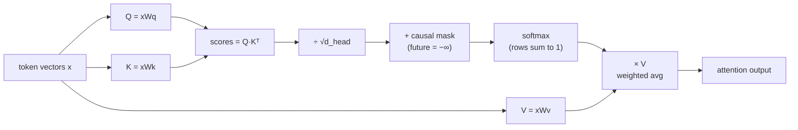

# 02 — The Transformer and Attention, From Zero

This is the heart of it. By the end you'll understand attention well enough to know *why*
"gated attention + value residual" was your champion, *why* sliding window exists, and *what*
GQA/MLA actually save.

---

## 2.1 The problem attention solves

A sentence's meaning depends on **relationships between words**. In "the animal didn't cross
the street because **it** was too tired," what does "it" refer to? To resolve "it," the model
must *look back* at "animal" — and weight that word heavily while mostly ignoring "street."

**Attention is a learned, content-based lookup**: for each token, it decides *which other
tokens to pull information from, and how much*. It is the mechanism that lets the model mix
information across positions.

---

## 2.2 Query, Key, Value — the core trick

For every token, the model computes three vectors by multiplying its embedding by three
learned weight matrices `W_Q, W_K, W_V`:

- **Query (Q)** — "what am I looking for?"
- **Key (K)** — "what do I offer / advertise?"
- **Value (V)** — "what information do I actually hand over if you attend to me?"

Think of a dictionary lookup, but *soft*. Your query is compared against every key; the better
the match, the more of that token's value you receive.

### The mechanism, step by step

For a sequence of T tokens, each with a d-dimensional Q, K, V:

```
1. Scores:   S = Q · Kᵀ                 # [T×T]  every token's query vs every key
2. Scale:    S = S / √d_head            # keeps numbers from exploding (the √d in the paper)
3. Mask:     S[i,j] = -∞ for j > i      # causal: a token can't see the future
4. Softmax:  A = softmax(S, axis=-1)    # [T×T]  each row sums to 1 → attention weights
5. Mix:      out = A · V                # weighted average of value vectors
```

Written as the famous one-liner:

```
Attention(Q,K,V) = softmax( Q·Kᵀ / √d_head + mask ) · V
```

The dataflow, as a diagram:



ASCII picture of the T×T attention matrix for "The cat sat" (causal — lower triangle only):

```
            attends to →
            The   cat   sat
   The   [ 1.0    -     -  ]    "The" can only see itself
   cat   [ 0.4   0.6    -  ]    "cat" splits attention over The, cat
   sat   [ 0.2   0.5   0.3 ]    "sat" pulls mostly from "cat"
            ▲ each row sums to 1 (softmax)
```

### Softmax — what it does and why

`softmax(x)_i = exp(x_i) / Σ exp(x_j)`. It turns arbitrary real "scores" into a probability
distribution (positive, sums to 1). It's *sharp*: a slightly higher score gets exponentially
more weight, so attention can focus almost entirely on one token when it's confident — but it's
also why attention logits can blow up, which is what **QK-norm** (file 03) fixes.

### Why √d_head?

Dot products of d-dimensional vectors grow with d. Without dividing by `√d_head`, the scores
get large, softmax saturates (one value ≈1, rest ≈0), gradients vanish, learning stalls. The
scale keeps scores in a sane range. (This is one of those "minute things" you asked about — it
looks arbitrary but it's load-bearing.)

---

## 2.3 Multi-head attention (MHA)

One attention operation can only learn one kind of relationship. **Multi-head** runs several
attentions in parallel ("heads"), each with its own small `W_Q,W_K,W_V`, then concatenates the
results. One head might track syntax, another coreference, another local n-grams.

```
d_model = 512, n_heads = 8  →  head_dim = 64
   x ──┬─▶ head 1 (Q1,K1,V1) ─┐
       ├─▶ head 2 (Q2,K2,V2) ─┤
       │        ...            ├─▶ concat ─▶ W_O ─▶ out
       └─▶ head 8 (Q8,K8,V8) ─┘
```

Your champion config: **8 heads, head_dim 64, d_model 512**. The output projection `W_O` mixes
the heads back together.

---

## 2.4 Causal masking: why the model can't cheat

During training we show the model a whole sentence at once (for speed), but each position must
only predict its *next* token using tokens **at or before** it — otherwise it would just read
the answer. The **causal mask** sets all "future" attention scores to `−∞` before softmax (step
3 above), so they get weight 0. This is what makes the model **autoregressive**. Diffusion
models (file 08) *remove* this mask and attend bidirectionally.

---

## 2.5 The cost problem: attention is quadratic

The score matrix S is **T×T**. Double the sequence length → 4× the compute and memory. This
**O(T²)** cost is attention's Achilles heel and the reason for almost every variant below:

- **FlashAttention** (file 06) — same math, but never materializes the full T×T matrix in slow
  memory. A *systems* fix, not a math change.
- **Sliding window** (next) — make attention *local* so cost is O(T·window).
- **Linear-recurrent mixers** (file 04 — Mamba, GDN, minGRU) — replace attention entirely with
  an O(T) recurrence.

---

## 2.6 Sliding-Window Attention (SWA) — local attention

Instead of letting each token attend to **all** previous tokens, restrict it to the last **W**
tokens (a fixed "window"). Cost drops from O(T²) to **O(T·W)** — linear in sequence length.

```
Full causal attention (W = ∞):        Sliding window (W = 3):
   t0 t1 t2 t3 t4 t5                       t0 t1 t2 t3 t4 t5
t0 ■                                    t0 ■
t1 ■  ■                                 t1 ■  ■
t2 ■  ■  ■                              t2 ■  ■  ■
t3 ■  ■  ■  ■                           t3    ■  ■  ■      ← t3 can't see t0 anymore
t4 ■  ■  ■  ■  ■                        t4       ■  ■  ■
t5 ■  ■  ■  ■  ■  ■                     t5          ■  ■  ■
   (cost ∝ T²)                            (cost ∝ T·W, the band)
```

**"But then it forgets long-range info?"** No — and this is the elegant part. Just like the
**receptive field in a CNN**, information propagates *across layers*. A token at layer 1 sees W
back; at layer 2 it sees a token that itself saw W back, so its effective reach is 2W; after L
layers the receptive field is **L × W** tokens. Mistral 7B uses window 4096 × 32 layers →
effective context **131,072 tokens**, while every layer only does cheap local work.

```
layer 1:  t5 ──sees──▶ t3,t4,t5            (reach = W)
layer 2:  t5 ──sees──▶ t3 ──which saw──▶ t1,t2,t3   (reach = 2W)
   ...
layer L:  effective reach = L × W   ← long-range emerges from stacking, like CNN receptive fields
```

In your sprint trainer (`train_gpt_sprint_native.py`) sliding-window attention is used at
**evaluation** time as one of the efficiency/quality levers, alongside test-time training. The
takeaway: *locality + depth* recovers most of global attention's power at a fraction of the cost.

Sources for SWA: [Sliding Window Attention in Mistral (Medium)](https://medium.com/@ramponnana.2011/sliding-window-attention-in-mistral-with-receptive-field-in-cnns-bdc5f8d5d055),
[Abhik Sarkar — Sliding Window Attention](https://www.abhik.ai/concepts/attention/sliding-window-attention),
[EmergentMind — SWA topic](https://www.emergentmind.com/topics/sliding-window-attention-swa).

---

## 2.7 Shrinking the KV cache: MHA → GQA → MQA → MLA

When the model *generates* text one token at a time, it caches the K and V vectors of all past
tokens so it doesn't recompute them — the **KV cache**. For long contexts this cache becomes the
memory bottleneck. Three variants attack it:

```
MHA (Multi-Head):     8 query heads, 8 K heads, 8 V heads     ← biggest cache, best quality
GQA (Grouped-Query):  8 query heads share 4 KV heads          ← your champion: 8 Q / 4 KV
MQA (Multi-Query):    8 query heads share 1 KV head           ← smallest cache, some quality loss
MLA (Multi-head Latent): compress KV into a small latent, decompress on use  ← DeepSeek
```

- **GQA** — query heads are grouped; each group shares one K/V head. Your champion uses **8
  query / 4 KV heads** (`kv1` variants in the logs explored even fewer). Halves the KV cache for
  near-zero quality cost. This is the standard 2026 default.
- **MQA** — extreme GQA, all queries share one KV head. Cheapest, slight quality hit.
- **MLA (Multi-head Latent Attention, DeepSeek)** — projects K and V down to a small shared
  *latent* vector and reconstructs them on the fly. Smallest cache + good quality, more complex.
  You implemented MLA as a mixer option; in the **2M-token bake-off it came last** (val 6.156)
  — MLA's low-rank KV is a *memory/inference* win, not a small-data quality win. Right tool,
  wrong metric for that test.

> **Crucial caveat from the guide (§2.4):** GQA/MLA exist to shrink the *growing KV cache during
> left-to-right decoding*. A **diffusion** model attends bidirectionally with no growing cache,
> so the motivation weakens — re-evaluate, don't blindly copy. This is exactly why the diffusion
> experiment didn't just reuse the AR attention variants.

---

## 2.8 RoPE — telling the model *where* each token is

Attention as described is **permutation-blind**: shuffle the tokens and the Q·Kᵀ scores are the
same. We must inject position. GPT-2 added a learned "position embedding" vector per slot.
Modern models use **RoPE (Rotary Position Embedding)**:

- It **rotates** each token's Q and K vectors by an angle proportional to its position.
- When you then take Q·Kᵀ, the result depends only on the **relative** offset (i − j) between
  the two tokens — exactly what you want ("3 tokens back" should mean the same thing everywhere).
- It generalizes to longer sequences than seen in training far better than learned positions
  (and YaRN can extend it further).

RoPE is "strictly better, cheap" (guide §2.1) and is on in every nanolab run. **QK-norm**
(file 03) is applied right before RoPE/attention to keep the logits stable.

---

## 2.9 The two attention upgrades that won your ablation

These are small, cheap modifications to vanilla attention that your SOTA ladder found reliably
helpful — they're covered in depth (with diagrams) in file 03, but in attention terms:

- **Gated attention** — multiply the attention output by a learned, input-dependent **gate**
  (a sigmoid in [0,1]) before adding it back to the residual stream. Lets the model *dynamically
  decide how much attention to trust* for this token. Cheap, and it was part of your champion.
- **Value residual** — let deep layers re-mix in the **value vectors from an early layer**, so
  information that attention would otherwise overwrite survives to the top of the network.
  On its own it scored BPB 1.987; **combined with gating → 1.985, the champion.** Gated attention
  *alone* (without value residual) was much worse at 2.089 — the two compose.

**Next:** [`03-modern-architecture-stack.md`](03-modern-architecture-stack.md) — the full block
diagram, GPT-2 vs modern, where every one of these pieces sits.
