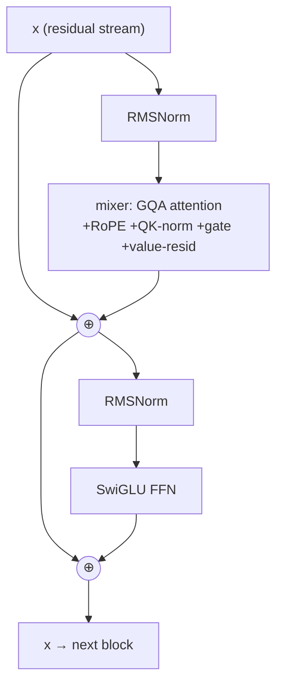

# 03 — The Modern Architecture Stack (with diagrams)

This file draws the **block diagrams** you asked for: GPT-2 (2019) vs the 2026 stack your
champion uses, and explains every component change and *why it helps*. Each change is one
nanolab flag — "one lever per run."

---

## 3.1 The big picture: a transformer is a stack of identical blocks

```
                    tokens (ids)
                         │
                 ┌───────▼────────┐
                 │  Embedding     │   id → vector  [vocab × d_model]
                 │  (+ position)  │
                 └───────┬────────┘
                         │
            ┌────────────▼────────────┐
            │   Transformer block 1   │ ─┐
            ├─────────────────────────┤  │
            │   Transformer block 2   │  │  repeat L times
            ├─────────────────────────┤  │  (your champion: L = 11)
            │          ...            │  │
            ├─────────────────────────┤  │
            │   Transformer block L   │ ─┘
            └────────────┬────────────┘
                         │
                 ┌───────▼────────┐
                 │  Final norm    │
                 │  + LM head     │   vector → logits  [d_model × vocab]
                 └───────┬────────┘
                         │
                  next-token logits
```

Each **block** has two sub-layers: a **token mixer** (attention or an SSM — file 04) and a
**feed-forward network (FFN/MLP)**. The mixer moves information *between positions*; the FFN
processes each position *independently* (it's where most "knowledge" is stored).

One modern block, as a diagram (note the two residual `⊕` adds and pre-norm placement):



---

## 3.2 GPT-2 block vs Modern block — side by side

```
   GPT-2 (2019)                          MODERN 2026 (your champion)
   ─────────────                         ───────────────────────────
        x                                       x ───────────────┐ (residual)
        │                                       │                │
   ┌────▼─────┐  LayerNorm                 ┌────▼─────┐  RMSNorm  │   (pre-norm)
   │  LN      │                            │  RMSNorm │           │
   └────┬─────┘                            └────┬─────┘           │
        │                                       │                 │
   ┌────▼─────┐  Multi-Head Attn          ┌────▼─────────────┐    │
   │  MHA     │  (learned abs. pos)       │ GQA Attention    │    │
   │          │                           │  + RoPE          │    │
   │          │                           │  + QK-norm       │    │
   │          │                           │  + gating ⊗      │    │  ← gated attention
   │          │                           │  + value-residual│    │  ← value residual
   └────┬─────┘                            └────┬─────────────┘    │
        │ + (residual)                          │ ⊕───────────────┘
        ▼                                        ▼
   ┌────▼─────┐  LayerNorm                ┌────▼─────┐  RMSNorm
   │  LN      │                           │  RMSNorm │
   └────┬─────┘                           └────┬─────┘
        │                                      │
   ┌────▼─────┐  MLP (GELU)               ┌────▼─────┐  SwiGLU FFN
   │ Linear   │  h = GELU(x W1) W2        │ SwiGLU   │  down(SiLU(xWg) ⊙ xWu)
   └────┬─────┘                           └────┬─────┘
        │ + (residual)                         │ ⊕ (residual)
        ▼                                       ▼
       out                                     out
                                          (zero-init output projections;
                                           U-Net skips across the whole stack)
```

The skeleton is the same — **residual connections** + **normalize → mix → add**. The 2026
version swaps in a series of cheap, individually-tested upgrades. Here's each one.

---

## 3.3 Residual connections (the thing that makes deep nets trainable)

Every sub-layer computes `x = x + sublayer(norm(x))`, not `x = sublayer(x)`. The `x +` is the
**residual / skip connection**. Without it, gradients vanish through dozens of layers and deep
nets won't train. The running `x` is called the **residual stream** — think of it as a shared
bus that every layer reads from and writes to. *Value residual* (below) and *U-Net skips* are
extra wires onto this bus.

---

## 3.4 Pre-norm vs post-norm

- **GPT-2 (post-norm):** normalize *after* the sublayer + residual. Less stable deep.
- **Modern (pre-norm):** normalize *before* the sublayer (`x + sublayer(norm(x))`). The
  residual stream stays "clean" and un-normalized, which makes very deep stacks trainable.
  Every nanolab model is pre-norm.

---

## 3.5 RMSNorm vs LayerNorm

Normalization keeps activations at a stable scale so training doesn't diverge.

- **LayerNorm (GPT-2):** subtract the mean, divide by std, then scale+shift. Two stats.
- **RMSNorm (modern):** just divide by the root-mean-square — `x / sqrt(mean(x²) + ε) × g`.
  **No mean subtraction, no bias.** Cheaper, and in pre-norm it's just as stable. Standard now.

```
LayerNorm:  (x − mean) / std · γ + β       ← 2 stats, 2 learned params
RMSNorm:     x / rms(x)      · g           ← 1 stat,  1 learned param   (faster, fewer params)
```

---

## 3.6 QK-Norm — the stabilizer

Apply RMSNorm to the **queries and keys** right before computing attention scores. Recall from
file 02 that Q·Kᵀ can blow up and saturate softmax. QK-norm bounds the magnitude of Q and K, so
the logits can't explode, and training stays stable even at higher learning rates. It's now
standard (OLMo 2, Qwen3). In your findings, QK-norm + zero-init are on by default. Some ablation
variants (`_ln` suffix in the logs) toggle exactly this kind of normalization placement.

---

## 3.7 SwiGLU FFN vs GELU MLP

The FFN is where each token gets "thought about." GPT-2 used a 2-layer MLP with GELU. Modern
models use **SwiGLU**, a *gated* FFN:

```
GPT-2 MLP:    h = GELU(x · W1) · W2                          # one path
SwiGLU:       h = ( SiLU(x · W_gate) ⊙ (x · W_up) ) · W_down  # two paths, element-wise gated (⊙)
```

The extra "gate" path lets the network multiplicatively suppress or amplify each hidden unit per
token — more expressive per parameter. Because it adds a third matrix, you shrink the hidden
width to ~⅔ to keep the param count matched. In the GPU FFN sweep, **SwiGLU was both the quality
choice and fast** (10.3K tok/s, ahead of GELU 9.8K and ReLU² 9.2K). (modded-nanoGPT uses **ReLU²**
— `relu(x)²` — a cheaper gateless alternative that the speedrun favors.)

---

## 3.8 The two champion-makers: gated attention and value residual

These are the upgrades your **SOTA architecture ladder** found, in `parameter-golf/logs/`.

### Gated attention

After attention produces its output, pass the input through a small learned gate (a sigmoid)
and **multiply**:

```
attn_out = Attention(x)
gate     = sigmoid(x · W_gate)        # in [0,1], per channel, input-dependent
x        = x + gate ⊙ attn_out        # the model decides how much attention to admit
```

It's a learned volume knob on attention, per token per channel. Nearly free, and consistently
helpful — but note: **gating *alone* (without value residual) scored BPB 2.089**, worse than
plain value-residual (1.987). The pieces interact.

### Value residual

Normally each attention layer computes fresh V vectors and the early-layer values are lost as
the residual stream gets overwritten. **Value residual** wires the **value vectors from an early
layer** forward into deeper layers (a learned mix), so foundational information survives to the
top:

```
   layer 1 ──V₁──┐
                 ├──(learned mix λ)──▶ V used by layer k   (deep layer re-reads early values)
   layer k ──Vₖ──┘
```

This is a modded-nanoGPT speedrun trick. On its own: **BPB 1.987**.

### The combination = champion

| Variant (long stage, 3000 steps, 2 seeds) | Calibrated BPB |
|---|---|
| gated attention **only** | 2.089 |
| value residual only | 1.987 |
| **gated attention + value residual** | **1.985 ← champion** |

Lesson: **stack cheap, individually-validated tricks**, but *always re-test the combination* —
gating was harmful alone yet helped on top of value residual.

---

## 3.9 Zero-init projections and U-Net skips

- **Zero-init output projections** — initialize the *last* matrix of each sub-layer (the `W_O`
  of attention and `W_down` of the FFN) to **zero**. At step 0 every block is an identity
  function, so the network starts as a clean residual pass-through and *gradually* learns to add
  each layer's contribution. A cheap, powerful stabilizer; on by default in your runs.
- **U-Net skips** — borrowed from image U-Nets: connect early layers directly to late layers
  (layer 1 → layer L, 2 → L−1, …) with learned weights, giving the network shortcut highways for
  low-level information. Used in the sprint trainer and hypercascade stacks.

---

## 3.10 Auxiliary heads (the small extra params that paid off)

Your ablations found small **auxiliary embedding heads** helped:

- **Bigram hash embeddings** (`BIGRAM_DIM=48`) — a tiny lookup keyed by *token pairs*, injecting
  cheap local n-gram statistics straight into the residual stream. Best result at this width.
- **Value embeddings** (`VE_DIM=24`) — extra learned vectors added to the value path.
- **XSA** (cross/extra self-attention on the **last 4 layers**) — turning it **off cost +0.020
  BPB**, so it stayed on.

Combined, the aux heads reached **BPB 2.066** in their sub-ablation. These are exactly the kind
of "extra few % of params spent where they pay" moves the competition rewards.

> **What *didn't* work:** recursive weight-sharing (`recur_2x3` — reuse one block's weights
> several times to fake depth cheaply) **hurt quality badly: BPB 2.851.** Sharing weights saves
> parameters but the layers can't specialize. A clean negative result worth remembering.

---

## 3.11 Your champion config, in full

```
architecture:  gated attention + value residual   (+ QK-norm, RoPE, RMSNorm, SwiGLU, zero-init)
layers:        11
d_model:       512
heads:         8 query / 4 KV   (GQA)
vocab:         1024  (SentencePiece, tied embeddings)
seq_len:       256  (local proxy)
aux heads:     bigram_dim 48, ve_dim 24, XSA on last-4 layers
result:        calibrated BPB 1.985, ~1.34 MB artifact
```

**Next:** [`04-sequence-mixers.md`](04-sequence-mixers.md) — what if you replace attention
*entirely*? Mamba-2, Gated DeltaNet, minGRU, and the crossover you measured.
