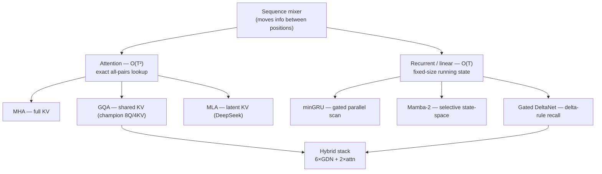

# 04 — Sequence Mixers: Attention vs SSMs vs Linear RNNs

Attention is *one* way to mix information across positions. This file covers the alternatives
you implemented from scratch — **Mamba-2, Gated DeltaNet, minGRU** — the math behind them, the
**chunk-parallel kernels** that made them trainable on your laptop, and the headline result:
**the token-budget crossover you measured precisely.**

---

## 4.1 The fundamental trade-off: O(T²) vs O(T)

```
                  Attention                    Recurrent / SSM mixer
                  ─────────                    ─────────────────────
  How it mixes    every token looks at         each token updates a fixed-size
                  every other token            "state" it carries forward
  Cost in T       O(T²)  (quadratic)           O(T)   (linear)
  Memory at gen   grows with sequence (cache)  constant (just the state)
  Inductive bias  none — must learn order      sequentiality baked in
  Strength        recall, exact lookups        cheap long context, fast inference
```

The key intuition: attention is a **lookup over the whole past** (powerful, expensive). A
recurrent mixer is a **running summary** — it compresses the past into a fixed-size state vector
and updates it token by token (cheap, but lossy). The interesting question — which you *answered
empirically* — is when each wins.

The family tree of token mixers (all swap into the same residual stream — one nanolab flag):



---

## 4.2 minGRU — the minimal parallel RNN

The simplest baseline. A classic RNN updates a hidden state `h_t = f(h_{t-1}, x_t)`, but the
dependence of `f` on `h_{t-1}` forces sequential computation (slow). **minGRU** strips the GRU
down until the recurrence becomes a **linear scan** that can be computed in parallel:

```
classic GRU:  h_t = (1−z_t) ⊙ h_{t-1} + z_t ⊙ h̃_t     where z_t, h̃_t depend on h_{t-1}  (sequential!)
minGRU:       h_t = (1−z_t) ⊙ h_{t-1} + z_t ⊙ h̃_t     where z_t, h̃_t depend ONLY on x_t  (parallel!)
```

Because the gates depend only on the input (not the previous state), the whole sequence can be
solved with a **parallel prefix scan** (associative scan) instead of a Python loop. Zero
dependencies, pure PyTorch — the pedagogical baseline. **It won your low-budget bake-off.**

---

## 4.3 State-Space Models (SSMs): Mamba-2

An SSM treats the sequence like a tiny **linear dynamical system**. It maintains a state matrix
`S` and, at each step, decays the old state and writes in new information:

```
   S_t = A_t ⊙ S_{t-1} + B_t · x_t        # state update: decay old state, add new input
   y_t = C_t · S_t                        # read out from the state
```

- **A** is a per-channel **decay** (how fast old memory fades) — in Mamba it's parameterized in
  log-space for stability (`log_dA = dt · A`).
- **B** writes the current token into the state; **C** reads from it.
- **"Selective" (the Mamba-2 insight):** A, B, C are **functions of the input** (data-dependent),
  so the model *chooses* what to remember and what to forget per token — unlike older fixed SSMs.
- **dt** (delta / timestep) controls how much each token moves the state — `x_scaled = dt · x`.

This is **ZOH (zero-order-hold) discretization**: turning a continuous-time linear system into
discrete steps. Your `verify_scan.py` checks the implementation against a brute-force reference
to **1e-5** tolerance — i.e. you proved the fast version computes the same thing as the slow,
obviously-correct version. *Always verify a custom kernel against a reference.*

---

## 4.4 Gated DeltaNet (GDN): linear attention with a delta rule

GDN is **gated linear attention**. "Linear attention" rewrites attention so it can be computed
as a recurrence (associativity trick: `(Q Kᵀ) V = Q (Kᵀ V)`), giving O(T). The **delta rule**
adds a correction: instead of just accumulating key→value associations, it *removes the old
association before writing the new one* (like a fast-weight memory that overwrites cleanly),
which gives **much stronger recall** than vanilla SSMs. A **gate** controls forgetting. GDN
beat Mamba-2 in your bake-off — the delta rule's better recall showed up even at 2M tokens.

`verify_gdn.py` / `verify_gdn_wy.py` validate the chunkwise ("WY"-form) delta recurrence against
a sequential reference.

---

## 4.5 The kernel problem — and why chunk-parallel mattered *enormously*

A naive recurrence is a Python `for t in range(T)` loop: sequential, and it builds a T-deep
autograd graph. On your 3070 Ti this was a **disaster**:

```
GPU mixer sweep (124M, bs8/ctx512), pure-PyTorch SEQUENTIAL recurrence:
   mla         9,300 tok/s   (fastest — low-rank KV)
   attention   7,900 tok/s
   mingru      6,700 tok/s   (parallel scan, so OK)
   mamba2        333 tok/s   ← 24× slower than attention
   gdn           238 tok/s   ← 33× slower; backward pass alone took 12.5 SECONDS
```

mamba2/gdn at 0.4–0.6% MFU are *unusably* slow. The fix is **chunk-parallel scanning**: split
the sequence into chunks of size C, solve *within* each chunk in parallel (as a small
attention-like matmul), then carry only the chunk-boundary state forward. You only store
`T/C` small `(D,D)` carries, not a T-deep graph.

You ported the verified chunk-parallel kernels into nanolab and the speedups were dramatic:

```
                        sequential  →  chunk-parallel        VRAM           unlocks
  Mamba-2 SSD (bs8/512)   333 tok/s →  3,224 tok/s  (9.7×!)                  trainable at ctx1024
  GDN (bs8/512)           238 tok/s →    482 tok/s  (2×)     4.7→2.6 GB
  GDN (bs16/ctx1024)      OOM       →  1,100 tok/s @4.0 GB                  was IMPOSSIBLE before
```

- **SSD chunk-parallel (9.7×)** is *fully vectorized* — 2 passes of `T/C` steps (~64 at
  T1024/C32), no per-timestep loop at all. Pass 1 solves each C×C chunk as a decay-weighted
  `C·Bᵀ` attention; pass 2 carries the chunk-final state.
- **GDN (2×)** still keeps a small intra-chunk loop, so it gains less.
- **The fp32 subtlety** (a real bug you hit): the scan must run in **fp32** for numerical
  stability — autocast is disabled inside fwd/bwd and the incoming `grad_y` is cast to fp32 in
  the backward. A CPU-only test missed it; the GPU run exposed it. (This connects to file 06:
  recurrences accumulate, and accumulation in 16-bit drifts.)

**Without these kernels the bake-off below would have been infeasible** — you literally could not
have trained mamba2/gdn to convergence on the laptop.

---

## 4.6 RESULT #1 — the mixer bake-off (low token budget)

Identical everything (seed, optimizer, schedule, bs8/ctx512, Muon, cosine), **2M tokens each**,
FineWeb-edu. Files: `nanolab/out/bakeoff_<mixer>/`.

| Rank | Mixer | Best val loss @ 2M tokens |
|------|-------|---------------------------|
| 🥇 1 | **minGRU** | **5.837** |
| 🥈 2 | Gated DeltaNet | 5.994 |
| 🥉 3 | Mamba-2 | 6.040 |
| 4 | **Attention** | 6.073 |
| 5 | MLA | 6.156 |

**The recurrent/SSM mixers swept the top 3 — all beating attention.** This is the textbook
result: *recurrent inductive bias wins at low token counts.* When data is scarce, the built-in
assumption "sequence order matters and recent context decays" is worth more than attention's
raw flexibility (which it doesn't yet have the data to exploit). MLA last, again, because its
strength is inference memory, not small-data quality.

> Honesty note baked into the run: 2M tokens is *short*. These models are undertrained and
> generate "English-ish babble." The **ranking is the signal**, not the loss values — and the
> ranking predicted the next experiment exactly.

---

## 4.7 RESULT #2 — the token-budget crossover (the headline)

The obvious follow-up question: *if recurrent bias wins early and attention has more capacity,
they must cross somewhere.* You ran minGRU / attention / mamba2 to **8.2M tokens** (2000 steps,
eval every 200), same config. Files: `nanolab/out/scale_<mixer>/`.

**The actual val-loss curves** (every number below is a real eval point from your
`metrics.jsonl` — `A`=attention, `G`=minGRU, `M`=mamba2; `*` = two series overlap):

```
val loss
 6.5 | A                              ← at 0.8M: minGRU already 0.18 ahead of attention
 6.3 | G  *
 6.0 |    G  M *
 5.9 |          M
 5.8 |       G  A  M
 5.7 |          G     M
 5.6 |             A     M  M
 5.5 |             G  *        M      ← gap nearly closed by 6.6M
 5.4 |                   *  *     M
 5.2 |                         *  G   ← 7.4M: attention (A) now BELOW minGRU (G)
 5.1 |                            A   ← 8.2M: attention pulls clear
     +------------------------------
tok    0.8 1.6 2.5 3.3 4.1 4.9 5.7 6.6 7.4 8.2   (millions)
```

**The gap closing, then flipping** (attention minus minGRU; `+` = attention still worse):

```
 0.8M  +0.182  worse  ####################################
 1.6M  +0.204  worse  ######################################## ← widest (bias's peak advantage)
 2.5M  +0.170  worse  #################################
 3.3M  +0.107  worse  #####################
 4.1M  +0.075  worse  ##############
 4.9M  +0.042  worse  ########         monotonic shrink, every single eval point
 5.7M  +0.024  worse  ####
 6.6M  +0.005  worse  ·                ← essentially tied
 7.4M  -0.010  BETTER #                ← CROSSOVER: attention overtakes here
 8.2M  -0.019  BETTER ###
```

Per-mixer trajectory as a sparkline (taller char = higher loss; 0.8M → 8.2M):
```
  attention : #*=~--..__   6.52 → 5.14
  minGRU    : *=~--...__   6.33 → 5.16   (starts lowest, ends ~tied)
  mamba2    : #*=~~---..   6.49 → 5.38   (slower convergence, ends the laggard)
```

| Tokens | minGRU | Attention | Mamba-2 | Leader |
|--------|--------|-----------|---------|--------|
| 0.8M | **6.334** | 6.516 | 6.493 | minGRU by 0.18 |
| 4.1M | **5.549** | 5.624 | 5.769 | minGRU |
| 6.6M | **5.353** | 5.358 | 5.560 | minGRU by 0.005 (tied) |
| 7.4M | 5.249 | **5.239** | 5.469 | **attention** ← crossover |
| 8.2M | 5.155 | **5.136** | 5.383 | attention |

**The crossover the first run predicted is real and precise:** minGRU leads from 0.8M through 6.6M,
the gap shrinks **monotonically at every single eval point** (0.182 → 0.005), and **attention
overtakes between 6.6M and 7.4M tokens** (~7M). By 8.2M, attention ≈ minGRU > mamba2. (Mamba-2
converged slower under the longer cosine schedule and ended the laggard — a reminder that the
schedule interacts with the architecture.)

This is the single cleanest lesson in the whole project:

> **Inductive bias wins when data is scarce; capacity wins when data is plentiful.** You can
> watch the exact crossover on a laptop. It's why the field uses transformers at scale (billions
> of tokens) but recurrent/SSM hybrids are attractive for small or long-context regimes — and why
> the *competition* (tight token + size budget) is genuinely an open architecture question.

---

## 4.8 Hybrids — the practical answer

You don't have to choose. The **DeltaNet-hybrid** recipe (in `train_hypercascade.py`) interleaves
mostly-cheap recurrent layers with a few attention layers — e.g. **6× GDN + 2× attention** — so
the model gets recurrent efficiency for most of the stack plus a couple of full-attention layers
for exact recall. `LAYER_TYPES` lets you set the per-position mix (`mamba`/`gdn`/`attn`). This is
where production sub-200M models are heading (and it's why you built the hybrid stacks at all).

**Next:** [`05-optimizers-and-schedules.md`](05-optimizers-and-schedules.md) — given an
architecture, *how* do you actually push the weights downhill efficiently?
