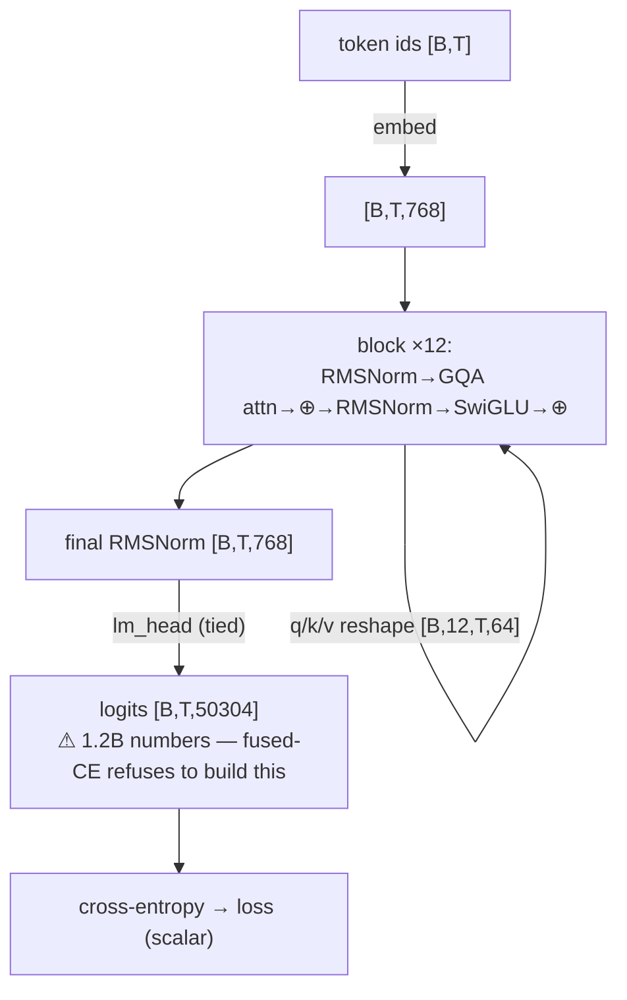

# 10 — Math Foundations and Tensor Shapes (worked examples)

Files 01–09 told you *what* happens. This file makes you able to *trace the numbers* — the actual
tensor shapes flowing through your nanolab model, a hand-computed attention example, and the dot
products / matmuls underneath. If you can follow the shapes, nothing in a transformer is mysterious.

We'll use your real **`phase1` config**: `d_model=768, n_layer=12, n_head=12, head_dim=64,
n_kv_head` (GQA), `block_size=1024, vocab_size=50304, batch_size B`.

---

## 10.1 The three numbers that define every tensor

Almost every tensor in training has shape **`[B, T, C]`**:

- **B** = batch size — how many independent sequences we process at once (`phase1`: 24).
- **T** = time / sequence length — tokens per sequence (`block_size`, e.g. 1024).
- **C** = channels / features — the vector width per token (`d_model`, 768).

Read `[B, T, C]` as: "B sequences, each T tokens long, each token a C-dimensional vector." Hold
this in your head and the whole forward pass is just reshaping and matmul-ing this block.

```
  one batch of activations:   [B=24, T=1024, C=768]
                               └ 24 × 1024 × 768 = ~18.9 million numbers, one snapshot
```

This is *why* memory explodes (file 06): you hold one such tensor **per layer** (12 of them)
unless you use gradient checkpointing.

---

## 10.2 The dot product — the atom of everything

Two vectors `a, b` of length d. Their dot product is one number:

```
  a · b = a₁b₁ + a₂b₂ + ... + a_d b_d
```

It measures **alignment**: large positive if a and b point the same way, ~0 if perpendicular,
negative if opposed. *Attention's Q·K is literally asking "how aligned is this query with this
key?"* Every "similarity" in a neural net is a dot product.

Worked tiny example (d=3):
```
  q = [1, 0, 2]   k = [0.5, 1, 1]
  q·k = 1×0.5 + 0×1 + 2×1 = 0.5 + 0 + 2 = 2.5
```

---

## 10.3 Matrix multiply — a batch of dot products

A `Linear` layer (`nn.Linear(in, out)`) holds a weight matrix `W` of shape `[out, in]`. Applying
it to `x` (`[..., in]`) gives `[..., out]`, where **each output number is a dot product of x with
one row of W**. That's it. A `[T, in] × [in, out]` matmul is `T×out` dot products.

```
  x: [1024, 768]   @   Wᵀ: [768, 3072]   =   [1024, 3072]
  (1024 tokens)        (the up-projection)    (each token now 3072-wide)
```

FLOPs for that matmul ≈ `2 × 1024 × 768 × 3072` ≈ 4.8 GFLOPs — *for one linear, one layer, one
batch element.* Multiply by layers × batch × steps and you see why GPUs and MFU (file 06) matter.

---

## 10.4 Walk the forward pass, shape by shape

This is your `nanolab` model from token ids to loss. Follow the right column.

```
  step                                          tensor shape          what it is
  ────                                          ────────────          ──────────
  input token ids                               [B, T]                integers 0..50303
  embedding lookup  (wte[ids])                  [B, T, 768]           each id → 768-vec
  ── enter block 1 (× 12 blocks) ──
    RMSNorm(x)                                  [B, T, 768]           normalized copy
    q_proj(x)                                   [B, T, 768]  → view → [B, T, 12, 64]   12 heads
    k_proj(x), v_proj(x)  (GQA: fewer KV heads) [B, T, n_kv, 64]      GQA shrinks these
    transpose to                                [B, 12, T, 64]        heads as a batch dim
    GQA repeat_interleave KV heads              [B, 12, T, 64]        match query heads
    scaled_dot_product_attention(q,k,v)         [B, 12, T, 64]        the attention itself
    merge heads + out_proj                      [B, T, 768]           back to model width
    x = x + (gate ⊙ attn_out)                   [B, T, 768]           residual add
    RMSNorm(x); SwiGLU                           [B, T, 768]          FFN
    x = x + ffn_out                             [B, T, 768]           residual add
  ── exit blocks ──
  final RMSNorm                                 [B, T, 768]
  lm_head (tied to wte)                         [B, T, 50304]         logits over vocab
  cross_entropy vs targets [B, T]               scalar                the loss
```

As a flow (shapes on the edges):



Three things to notice:
- **Heads become a batch dimension.** `[B, T, 768]` → `[B, 12, T, 64]` means the 12 heads run as
  parallel little attentions; `768 = 12 × 64`. This reshape *is* multi-head attention.
- **GQA saves only on K and V.** `q_proj` always outputs full `768`; `k_proj/v_proj` output
  `n_kv_head × 64`. With 4 KV heads that's `256` instead of `768` — a 3× shrink on the KV path,
  then `repeat_interleave` copies each KV head to serve 3 query heads (your code, mixers.py:136).
- **The logits tensor `[B, T, 50304]` is enormous** — at B=24, T=1024 that's 1.2 *billion* numbers.
  This single tensor is exactly what **fused cross-entropy** (file 06) refuses to materialize.

---

## 10.5 Attention, fully hand-computed (3 tokens, 1 head, d=2)

Let's do the entire `softmax(Q·Kᵀ/√d)·V` by hand so it's never abstract. Sequence "A B C",
head_dim d=2, causal.

```
  Q = [[1, 0],     K = [[1, 0],     V = [[1, 0],
       [0, 1],          [1, 1],          [0, 2],
       [1, 1]]          [0, 1]]          [1, 1]]
       (qA,qB,qC)       (kA,kB,kC)       (vA,vB,vC)
```

**Step 1 — scores S = Q·Kᵀ** (each query dotted with each key):
```
  S[B-row] = qB · each k = [ [0,1]·[1,0],  [0,1]·[1,1],  [0,1]·[0,1] ] = [0, 1, 1]
```
Full S (rows = query, cols = key):
```
        kA   kB   kC
  qA  [ 1    1    0 ]
  qB  [ 0    1    1 ]
  qC  [ 1    2    1 ]
```

**Step 2 — scale by √d = √2 ≈ 1.414:**
```
  qC row → [0.707, 1.414, 0.707]
```

**Step 3 — causal mask** (token i can't see j>i): set upper triangle to −∞:
```
  qA  [ 0.707,  −∞,    −∞   ]
  qB  [ 0,      0.707, −∞   ]
  qC  [ 0.707,  1.414, 0.707]
```

**Step 4 — softmax each row** (exp, then normalize so the row sums to 1). For qC:
```
  exp([0.707, 1.414, 0.707]) = [2.03, 4.11, 2.03];  sum = 8.17
  A[qC] = [0.248, 0.503, 0.248]    ← qC attends ~50% to B, ~25% each to A and C
```

**Step 5 — output = A·V** (weighted average of value vectors). For qC:
```
  out_C = 0.248·[1,0] + 0.503·[0,2] + 0.248·[1,1]
        = [0.248+0+0.248,  0+1.006+0.248] = [0.496, 1.254]
```

That `[0.496, 1.254]` is token C's attention output — a blend dominated by B's value. **That is
the entire attention mechanism**, scaled up to `[B, 12, 1024, 64]` and run on tensor cores. The
√d division (step 2) is what keeps those exp() inputs from exploding; QK-norm (file 03) does the
same job more robustly.

---

## 10.6 Cross-entropy, hand-computed

Suppose the true next token is id 5, and the model's logits over a tiny 4-token vocab are
`[2.0, 1.0, 0.1, 3.0]` (ids 0..3; pretend true id = 3):

```
  softmax: exp([2,1,0.1,3]) = [7.39, 2.72, 1.11, 20.09];  sum = 31.31
  probs   = [0.236, 0.087, 0.035, 0.642]
  loss    = −log(P[true=3]) = −log(0.642) = 0.443 nats
```

If the true token had been id 2 (prob 0.035): loss = −log(0.035) = **3.35 nats** — the model was
much more surprised. Average this over all `B×T` positions and you get the loss your `train.py`
logs. Convert to bits (`/ln 2`) and per-byte and it's your **BPB**.

---

## 10.7 Parameter counting (where your 124M lives)

For `d=768, L=12, V=50304`, per component:
```
  embedding (tied, counted once):  V × d        = 50304 × 768   ≈ 38.6M
  attention per layer:  q,k,v,o ≈ 4 × d × d     = 4 × 768²       ≈ 2.36M  → ×12 ≈ 28.3M
  SwiGLU per layer:     3 × d × (≈2.67d)         ≈ 4.7M          → ×12 ≈ 56.6M
  norms, biases:        tiny
  ──────────────────────────────────────────────────────────────────────
  total ≈ 124M  (embeddings + ~85M transformer)
```

Your actual `phase1`/`scale` runs log **123,699,612 params** at startup (`"params"` in
`metrics.jsonl`). Where they sit, as a bar:

```
  FFN (SwiGLU ×12)    ███████████████████████  ~56.6M (46%)  ← most "knowledge" lives here
  embeddings (tied)   ████████████████          ~38.6M (31%)  ← ~⅓! why slim vocab is a huge lever
  attention (×12)     ████████████              ~28.3M (23%)  ← the cheaper "routing"
  norms / biases      ▏                          <0.1M         negligible
                      └ total ≈ 123.7M
```

Two takeaways you used directly:
- **Embeddings are ~⅓ of the model** at d=768/V=50304 — which is *exactly* why shrinking the vocab
  to 1024 (Parameter Golf champion) is such a big lever, and why **tying** input/output embeddings
  matters.
- **The FFN holds more params than attention** (56M vs 28M). The FFN is where "knowledge" lives;
  attention is the cheaper "routing." MoE (file 14) scales the FFN part sparsely.

`nanolab`'s `config.py` has an `est_params()` doing exactly this arithmetic so you see the count
before you launch.

**Next:** [`11-tokenization-deep-dive.md`](11-tokenization-deep-dive.md) — how text becomes those
token ids in the first place.
