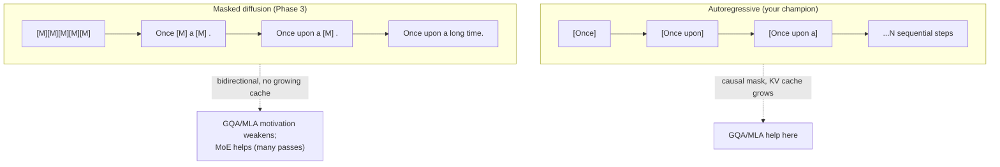

# 15 — Diffusion Language Models

Every model so far is **autoregressive** (AR): predict the next token, left to right, causal mask.
Your Phase 3 experiment (`nanolab/diffusion.py`) throws that out and builds a **masked-diffusion
LM** — predict *all* masked tokens at once, bidirectionally, refining over several rounds. This is
the single biggest conceptual departure in the workspace, and you got it working (val perplexity
**19.5 → 8.2** in ~7 minutes). Here's how and why.

---

## 15.1 The core idea: denoising instead of continuing

Image diffusion models start from noise and iteratively denoise into a picture. **Text diffusion**
does the discrete analog: start from an all-`[MASK]` sequence and iteratively *reveal* tokens.

```
  Autoregressive:                          Masked diffusion:
  ───────────────                          ─────────────────
  "Once" → "upon" → "a" → "time"           [M][M][M][M][M][M]
  one token at a time, left→right          → "Once"[M]"a"[M][M]"."     (round 1: fill confident ones)
  causal mask (can't see future)           → "Once upon a"[M]"time."    (round 2: fill more)
  N tokens = N sequential steps            → "Once upon a long time."   (round 3: done)
                                           bidirectional, a few parallel rounds
```

- **AR** factorizes `P(text) = Π P(token_t | tokens_<t)` — strictly left-to-right.
- **Diffusion** learns to fill arbitrary masked positions given *both-side* context — so it can
  generate in any order and revise.



---

## 15.2 The training objective (and the bug that taught you everything)

The "noise" is masking. Pick a noise level `t ∈ (0,1)`, replace each token with `[MASK]` with
probability `t`, and train the model to **recover the originals** from the corrupted sequence.
Your `diffusion.py`:

```
  x_noised = mask_tokens(x_clean, t)        # each token → [MASK] w.p. t   (MASK_ID = 50257)
  logits   = model(x_noised)                # bidirectional now
  loss     = cross_entropy(logits[masked], x_clean[masked]) × (1/t)   # only at masked positions
```

Two critical details, both load-bearing:

- **`MASK_ID = 50257`** — reused the first *padding* slot of the 50304-padded vocab (file 11) as
  the absorbing `[MASK]` state. No new embedding row needed.
- **1/t reweighting** — at low noise (few masks) each prediction is easy and abundant; at high
  noise it's hard and rare. Reweighting by `1/t` balances the gradient across noise levels so the
  hard, high-mask cases aren't drowned out.

> **THE BUG (your notes, and a perfect lesson):** the loss target must be the **clean** tokens, not
> the masked input. If you accidentally target the masked input, the model trivially learns to
> "predict `[MASK]` where it sees `[MASK]`" and **the loss collapses to 0.** You caught it
> *instantly* because the logged **loss and grad-norm both read 0** (file 16). A loss of exactly 0
> is never good news — it means the task became trivial. This is *why* you log from step one.

---

## 15.3 Turning an AR model into a diffusion model — the conversion

The elegant part: you **reused the same 128M architecture** (file 03's modern stack) and only
changed three things. From `diffusion.py`:

1. **Remove causal masking → bidirectional attention.** `GPT.set_causal(False)` flips the
   `Attention.causal` flag so every token attends to *all* positions, not just the past. A masked
   token must see *future* context to be filled in.
2. **Anneal, don't flip.** Rather than going causal→bidirectional instantly (which would shock the
   pretrained weights), the attention mask is **annealed** over `anneal_steps` — a gentle
   transition that preserves what the AR model already learned.
3. **All-position logits.** AR training only needs the last position; diffusion needs logits at
   *every* masked position, so it uses a `forward_hidden()` path that returns all-position outputs.

That's it — RoPE, RMSNorm, QK-norm, SwiGLU all transfer unchanged (guide §2.4). You're not
relearning the language, just the *decoding scheme*. Which is why it adapted in ~7 minutes from a
phase0 checkpoint.

---

## 15.4 Generation: confidence-based parallel decoding

```
  start: all [MASK]
  for round in 1..steps:
     logits = model(current)                 # bidirectional pass over the whole sequence
     logits[:, MASK_ID] = -inf                # never predict [MASK] itself (diffusion.py:201)
     for each masked position: prob, pred = softmax(logits).max()
     REVEAL the highest-confidence positions (unmask them), leave the rest masked
  until nothing is masked
```

Each round commits the tokens the model is *most sure* about and leaves the uncertain ones for
later rounds (when they'll have more revealed context). This is **confidence-based parallel
decoding** — the discrete analog of denoising. The `complementary` masking option ensures the
masked/unmasked split is consistent across the pair.

---

## 15.5 AR vs diffusion — the trade-off table

| | Autoregressive | Masked diffusion |
|---|---|---|
| Attention | causal (one-directional) | bidirectional |
| Generation | N sequential steps | a few parallel rounds (revise) |
| KV cache | grows with length (GQA/MLA help) | **no growing cache** → GQA/MLA motivation weakens |
| Can revise? | no — committed left-to-right | **yes** — re-evaluate positions each round |
| Parallelism | low (sequential) | high (fill many at once) |
| Maturity | dominant, best-tested | newer; strong for parallel/infilling, MoE-friendly |

The two rows that connect back to your other notes:
- **No growing KV cache** is exactly why the guide (§2.4) says re-evaluate GQA/MLA for diffusion
  (file 02, file 12) — their whole reason to exist is shrinking that AR cache.
- **MoE-friendly** (file 14): diffusion runs many forward passes per sequence, so cheap-per-pass
  high-capacity MoE compute pays off especially well — hence DiffusionGemma is an MoE.

---

## 15.6 The real convergence curve (your run)

From `nanolab/out/diffusion_phase0/metrics.jsonl` — validation perplexity as the adapted model
learns to denoise (lower = better; bar length ∝ perplexity):

```
 step   val ppl
  300   19.49  ████████████████████████████████████████   ← fresh from AR→diffusion conversion
  600   13.03  ██████████████████████████▋
  900   10.62  █████████████████████▊
 1200    9.16  ██████████████████▊                          (continues toward ~8.2 with more steps)
         └ perplexity more than HALVED in ~7 min of adaptation — the conversion works.
```

Read it: perplexity 19.5 means the model is as confused as choosing among ~19 tokens; by step 1200
that's down to ~9. The model is learning to fill masked positions from bidirectional context — and
it's doing so on a checkpoint that was *pretrained autoregressively*, proving the modern stack
transfers across decoding paradigms.

## 15.7 Why this experiment mattered

It proves you understand the base model deeply enough to *re-purpose* it: same weights, same
modern stack, swap the decoding paradigm, and it works (ppl 19.5→8.2). It also delivered the
project's cleanest debugging lesson (the loss-collapse → logged 0 → instant catch). Diffusion LMs
(LLaDA, DiffuGPT, DiffusionGemma) are a live 2025–2026 research frontier; you have a working,
from-scratch one on a laptop.

**Next:** [`16-debugging-and-failure-modes.md`](16-debugging-and-failure-modes.md) — a field guide
to everything that broke, and how the logs told you.
