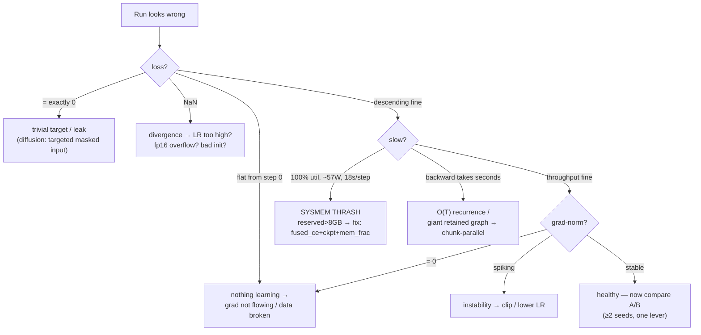

# 16 — Debugging and Failure Modes: A Field Guide

Theory tells you how things *should* work. This file is the opposite: everything that **broke** in
your project, the **logged signal** that exposed it, and the fix. It's organized as symptom →
diagnosis → fix, because that's how you'll actually use it. Every entry is a real event from your
runs — this is the most practically valuable file in the set.

> **The meta-lesson, stated once:** every bug below was caught by a *logged number looking wrong*,
> not by reading code. The loss, grad-norm, tok/s, power draw, and reserved-memory lines are your
> instruments. A trainer that doesn't log these is flying blind. nanolab logs all of them from
> step one — that is not decoration, it's the debugging strategy.

---

## 16.0 The diagnosis flowchart (start here when a run looks wrong)



## 16.1 The numbers to watch, and what each one screams

| Logged signal | Healthy | What a bad value means |
|---|---|---|
| **loss** | descends, noisy | flat from step 0 = nothing's learning; **exactly 0** = trivial task (bug); NaN = divergence |
| **val loss** | tracks train, small gap | rising while train falls = overfitting; flat = underfitting/bug |
| **grad-norm** | small, stable | spiking = instability; **0** = no gradient reaching weights (bug); NaN = exploded |
| **lr** | follows the schedule | wrong shape = schedule misconfigured |
| **tok/s** | steady, high | dropping = memory thrash or input stall |
| **MFU** | near your ceiling (~25%) | low = GPU idle (memory/launch bound) |
| **power draw** (nvidia-smi) | ~130 W (3070 Ti) | **~57 W at 100% util = sysmem thrash** |
| **reserved mem** | < 8192 MiB | creeping past 8 GB = about to spill to host RAM |

---

## 16.2 Failure: loss collapses to exactly 0 (the diffusion bug)

- **Symptom:** loss and grad-norm both log **0** almost immediately.
- **Diagnosis:** the task became *trivial*. In your diffusion run, the loss targeted the **masked
  input** instead of the **clean tokens**, so the model just learned "output `[MASK]` where you see
  `[MASK]`" — a perfect, useless score.
- **Fix:** target the clean tokens (`diffusion_loss(..., x_clean, ...)`, file 15).
- **General rule:** **a loss of exactly 0 is never a success.** It means a leak, a trivial target,
  or a label/identity shortcut. Be *more* suspicious of a too-good number than a bad one.

---

## 16.3 Failure: 100% GPU util but it crawls (the sysmem thrash)

- **Symptom:** `nvidia-smi` shows **100% utilization** but only **~57 W** (vs ~130 W healthy), and
  steps take **~18 seconds**. Looks like a hang or a busy GPU — it's neither.
- **Diagnosis:** the allocation exceeded 8 GB and the **Windows/WDDM driver silently spilled VRAM
  to host RAM over PCIe (~25× slower)** instead of throwing OOM. The tell: `reserved` memory creeps
  past 8192 MiB. The low power proves the cores are *stalling on transfers*, not computing.
- **Fix (stack, file 06):** `fused_ce=True` (chunks=16), `grad_checkpoint=True`, and
  `set_per_process_memory_fraction(0.92)` so over-budget configs **OOM cleanly in ms** instead of
  thrashing for minutes. Result: 14% → 25.5% MFU, 13.7K tok/s.
- **General rule:** on Windows/8 GB, **watch power draw and reserved memory, not just utilization.**
  Util can be 100% while the GPU does almost nothing useful.

---

## 16.4 Failure: custom kernel is correct on CPU, wrong on GPU (the fp32 scan)

- **Symptom:** the chunk-parallel GDN/SSD scan passed a CPU test but drifted on GPU.
- **Diagnosis:** under bf16 autocast, the **recurrence accumulated rounding error** over the
  sequence. CPU ran fp32 by default, so the CPU test never exercised the bug. Specifically the
  backward's `grad_y` came in as bf16.
- **Fix:** force **fp32 inside the scan** (disable autocast in fwd/bwd, cast `grad_y` to fp32 —
  mixers.py:394). Verified exact vs the sequential reference, including non-divisible-T padding.
- **General rules:**
  1. **Accumulation wants more precision than pointwise ops** (file 06) — recurrences, softmax
     sums, optimizer state stay fp32.
  2. **Always verify a custom kernel against a brute-force reference** (`verify_scan.py`,
     `verify_gdn*.py` to 1e-5). A fast kernel you haven't verified is a fast way to be wrong.
  3. **CPU tests miss precision bugs** — test on the device and dtype you'll actually run.

---

## 16.5 Failure: recurrent mixer is unusably slow (the O(T) trap)

- **Symptom:** mamba2 at **333 tok/s**, gdn at **238 tok/s** — 24–33× slower than attention; gdn's
  backward pass alone took **12.5 seconds**. 0.4–0.6% MFU.
- **Diagnosis:** the naive recurrence is a Python `for t in range(T)` loop — sequential, and it
  builds a T-deep autograd graph that the backward must traverse.
- **Fix:** **chunk-parallel scanning** (file 04): SSD 333→3224 tok/s (9.7×), GDN 238→482 (2×), and
  it made ctx1024 trainable at all. Store only T/C small carries, not a T-deep graph.
- **General rule:** if a backward pass takes seconds, you have a **sequential dependency or a giant
  retained graph.** Vectorize the recurrence (parallel/associative scan) or checkpoint it.

---

## 16.6 Failure: a "better" hyperparameter quietly hurts (LR sensitivity)

- **Symptom:** bumping Muon LR 0.025 → 0.027 (an 8% change) raised BPB 2.093 → 2.100. `recur_2x3`
  weight-sharing tanked BPB to 2.851. Gated attention *alone* (2.089) was worse than plain value
  residual (1.987).
- **Diagnosis:** not bugs — **the optimum is narrow and effects interact.** A change that "should"
  help can hurt, and a trick that helps in combination can hurt alone (file 03).
- **Fix:** the **ablation ladder methodology** — change **one variable per run**, fixed seed +
  tokens, **multiple seeds** at the long stage (1337 + 42) to separate signal from noise, and a
  staged short→mid→long funnel so you don't pay for long runs on bad candidates.
- **General rule:** **trust measured A/B over intuition**, run ≥2 seeds before believing a small
  gap, and always re-test the *combination*, not just each piece.

---

## 16.7 Failure: the process segfaults on startup (Windows data stack)

- **Symptom:** the trainer segfaults when loading data — no Python traceback, just a native crash.
- **Diagnosis:** **torch + pyarrow/`datasets` in one process clash at the native-DLL level** on
  Windows; HF streaming parquet also segfaults alone.
- **Fix:** tokenize in a **dedicated torch-free process** (`prep_fineweb.py`) that writes `.bin`
  files; the trainer's `get_dataset` checks for existing `.bin`s **before importing any native data
  stack**, so torch and pyarrow never co-load (file 11).
- **General rule:** a crash with **no Python traceback** is a native/DLL conflict — isolate the
  conflicting libraries into separate processes.

---

## 16.8 The general debugging workflow you converged on

```
  1. LOG everything from step 1 (loss, val, grad-norm, lr, tok/s, MFU, + nvidia-smi power/mem).
  2. A weird NUMBER is the entry point — 0 loss, 0 grad-norm, 57 W, 18 s/step, reserved > 8 GB.
  3. ISOLATE: change one variable; reproduce on the real device + dtype (not CPU).
  4. VERIFY custom math against a brute-force reference to 1e-5.
  5. For "is this real?" — ≥2 seeds, staged short→long, fixed tokens.
  6. Distrust too-good numbers (0 loss, val ≪ train) more than bad ones.
```

This is the actual scientific method applied to training. Most of your real findings — the
crossover, the champion, the kernel speedups, the MFU win — exist because the harness made step 3
cheap and the logs made step 2 possible.

**Next:** [`17-scaling-laws-and-competition-strategy.md`](17-scaling-laws-and-competition-strategy.md)
— zooming out to why the whole competition is shaped the way it is.
