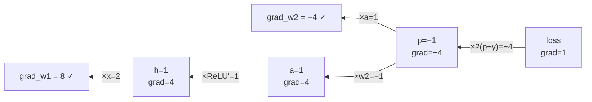

# 18 — Backpropagation, By Hand

File 01 said backprop is "the chain rule applied automatically." This file *does* it — a complete
forward and backward pass through a tiny network with real numbers, so `loss.backward()` is never
magic again. If you can follow this, you understand the engine under every training run you did.

---

## 18.1 The one rule: the chain rule

If `loss` depends on `a`, and `a` depends on `w`, then:

```
  d loss / d w  =  (d loss / d a) × (d a / d w)
```

"How much does the loss change if I nudge `w`?" = "how much does the loss change per unit of `a`"
× "how much does `a` change per unit of `w`." Backprop chains this from the loss backward to every
weight. The gradient of each weight is what the optimizer (file 05) uses to update it.

---

## 18.2 A tiny network we can do entirely by hand

One input, two weights, a ReLU, an MSE loss against a target. (Same mechanics as a transformer —
just fewer numbers.)

```
  x = 2.0   (input)
  w1 = 0.5,  w2 = -1.0   (weights to learn)
  target y = 1.0

  forward:
    h = w1 · x          = 0.5 · 2.0      = 1.0
    a = ReLU(h)         = max(0, 1.0)    = 1.0
    p = w2 · a          = -1.0 · 1.0     = -1.0     (prediction)
    loss = (p − y)²     = (−1.0 − 1.0)²  = 4.0
```

Computational graph (each arrow is an operation we'll differentiate):

```
  x ──×w1──▶ h ──ReLU──▶ a ──×w2──▶ p ──(·−y)²──▶ loss
       ▲                      ▲
       w1                     w2
```

---

## 18.3 The backward pass — propagate the gradient right to left

Start at the output (`d loss / d loss = 1`) and walk backward, multiplying local derivatives.

**Loss node:** `loss = (p − y)²` → `d loss / d p = 2(p − y) = 2(−1 − 1) = −4.0`
```
  grad_p = −4.0
```

**`p = w2 · a` node** (a multiply has two inputs, so the gradient splits):
```
  d p / d w2 = a = 1.0    →  grad_w2 = grad_p × a = −4.0 × 1.0 = −4.0   ← gradient for w2 ✓
  d p / d a  = w2 = −1.0  →  grad_a  = grad_p × w2 = −4.0 × −1.0 = 4.0
```

**`a = ReLU(h)` node:** ReLU's derivative is 1 if `h > 0`, else 0. Here `h = 1.0 > 0`:
```
  d a / d h = 1   →  grad_h = grad_a × 1 = 4.0
```
(This is the famous ReLU property: it passes gradient through where active, **blocks it where
dead** — the source of "dying ReLU." It's also why ReLU² and SiLU/SwiGLU, file 03, have smoother
gradients.)

**`h = w1 · x` node:**
```
  d h / d w1 = x = 2.0  →  grad_w1 = grad_h × x = 4.0 × 2.0 = 8.0   ← gradient for w1 ✓
```

**Result:** `grad_w1 = 8.0`, `grad_w2 = −4.0`.

Gradients flowing right-to-left (each node multiplies the incoming gradient by its local derivative):



---

## 18.4 One optimizer step (SGD, lr = 0.1)

```
  w1 ← w1 − lr · grad_w1 = 0.5  − 0.1 · 8.0  = −0.3
  w2 ← w2 − lr · grad_w2 = −1.0 − 0.1 · −4.0 = −0.6
```

Check it worked — recompute the loss with the new weights:
```
  h = −0.3 · 2.0 = −0.6 ; a = ReLU(−0.6) = 0 ; p = −0.6 · 0 = 0 ; loss = (0 − 1)² = 1.0
```
Loss fell from **4.0 → 1.0** in one step. That's learning. (Note: `a` went to 0, so on the *next*
step `grad_w1` would be 0 — the ReLU died for this input. Real nets avoid this with better init
(file 13) and smoother activations.)

---

## 18.5 Why this scales to 124M parameters

Nothing changes except the bookkeeping:

- **Vectors/matrices instead of scalars.** `grad_w1 = grad_h × x` becomes an outer product;
  `grad_a = grad_p × w2` becomes a matmul with `W2ᵀ`. The pattern "**local derivative × incoming
  gradient**" is identical.
- **Autograd builds the graph for you.** Every PyTorch op records its inputs; `.backward()` walks
  the recorded graph in reverse, applying each op's known local derivative. You never write the
  backward by hand — *except* when you write a custom `autograd.Function` (your chunk-parallel
  GDN/SSD kernels, file 04), where you **must** supply the backward yourself. That's exactly why
  the fp32-in-backward bug (file 16) was possible: you hand-wrote that gradient.
- **The retained graph is the memory cost.** Every intermediate (`h`, `a`, …) must be kept for the
  backward — that's the activation memory **gradient checkpointing** (file 06) trades away by
  recomputing them. And a `for t in range(T)` recurrence builds a **T-deep** graph (file 16's
  12.5-second GDN backward) — the reason chunk-parallel scanning matters.

---

## 18.6 Connecting to things you logged

- **grad-norm** (file 16) = the length of the *full* gradient vector — `sqrt(grad_w1² + grad_w2² +
  …)` over all parameters = `sqrt(8² + 4²) = 8.94` in our toy. Clipping (file 05) rescales the
  whole vector if this exceeds the threshold.
- **grad-norm = 0** means *every* `grad_w` came out 0 — the gradient never reached the weights
  (a detached graph, a dead path, or a trivial loss). Exactly the diffusion-collapse signature.
- **Vanishing/exploding gradients** = the chained product of local derivatives shrinking toward 0
  or growing without bound across many layers — what RMSNorm, residual connections, and zero-init
  (file 13) exist to control.

Backprop is the whole reason any of the architecture or optimizer choices matter: they all shape
how cleanly this gradient flows from the loss back to every weight.

**Next:** [`19-muon-newton-schulz-numerics.md`](19-muon-newton-schulz-numerics.md) — what your
optimizer *does* to that gradient before applying it.
